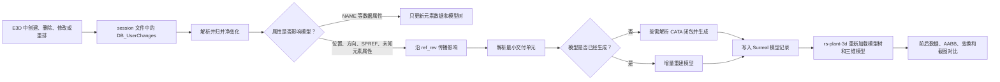

# core.dll 对齐的增量模型测试报告

日期：2026-07-24  
项目：`D:\work\plant-code\old\gen-model`  
数据库程序：`D:\work\plant-code\old\gen-model\bin\surreal.exe`  
验证数据库：`AvevaMarineSample`，`dbnum=7997`  
三维验证端：`D:\work\plant-code\rs-plant3-d`

## 1. 结论

当前实现已经覆盖并通过 `core.dll` 处理链中最重要的增量场景：

- 创建、删除、属性修改和子元素顺序变化可归并为交付单元级模型更新。
- `NAME` 等非几何属性只更新数据和模型树，不会误触发模型重建。
- 位置、方向、等级库引用和未知元素属性会触发保守的模型更新。
- `SPRE/SPREF/PSPREF/FSPREF` 及共享 `SPEC/SPCO` 通过反向引用传播到受影响的交付单元。
- `BRAN` 下的 `TUBI/FTUB` 不再被当成独立最小交付单元。
- 缺失模型可按需解析 CATA 依赖并生成；7997 中的 `HANG 24381/177948` 已完成实库验证。
- 7997 中的 `EQUI` 移动和 `BRAN` 更新已由 `rs-plant-3d` 加载并保留三维截图。

核心相关自动化测试共 **71 项通过**；另有 **1 项 7997 实库按需生成测试通过**。当前结论是“主要增量链路通过，但仍有明确的端到端覆盖缺口”，不能表述为所有几何 noun、所有共享等级库传播场景均已完成实库验证。

## 2. 验证口径

本报告把证据分成三层，结论不能跨层替代：

| 层级 | 证明内容 | 证据 |
|---|---|---|
| A：内核行为 | E3D 内核如何记录变化、维护反向引用、判断几何影响和刷新显示 | `core.dll` IDA 逆向记录、ADR |
| B：离线实现 | `gen-model` 是否把变化归并、传播并解析为正确交付单元 | Rust 单元测试 |
| C：端到端行为 | 真实 E3D 数据修改后，Surreal 数据、模型树和三维模型是否更新 | dbnum 7997、手工更新接口、`rs-plant-3d` 截图 |

### 2.1 core.dll 样本

- 文件：`D:\AVEVA\Everything3D3.1\core.dll`
- 大小：`50,071,544` 字节
- SHA-256：`3c1f52da4e893d939ed646b8ad91db7dabbd8307bfce66ab7f4d5ae5a419417d`

不得用另一个同名 DLL 的结果代替本报告样本。仓库外还发现
`D:\work\plant-code\cad\pid-parse\dlls\core.dll`，其 SHA-256 为
`ab4986699a1cacb4f6a7a12b503a881402e365865e27f5b2586dc758293304df`，
与本报告样本不同。

### 2.2 数据库状态

- SurrealDB：`ws://127.0.0.1:8009`
- namespace：`1516`
- database：`AvevaMarineSample`
- 7997 文件：`D:/AVEVA/Projects/E3D3.1\AvevaMarineSample\ams000\ams7997_0001`
- 当前 `applied_sesno=82`
- 当前 `file_latest_sesno=82`
- `db_type=DESI`

## 3. core.dll 处理链与本项目映射



| core.dll 行为 | 逆向证据 | `gen-model` 对应实现 | 验证状态 |
|---|---|---|---|
| 五类用户变化 | `DB_UserChanges`：created、deleted、attributeModified、included、reordered | `manual_update.rs` 净变化归并 | 自动测试通过；`included` 不属于离线文件主流程 |
| 按 schema 判断几何影响 | `primitive #659518`、`geomset #859903`、`extrusion #663225`、`graphicsBehaviour #5099119` | `model_impact.rs` + dabacon noun 分类 | 分类器和路由清单测试通过 |
| DCHC 变化码 | per-(noun, attr) 码位于 E3D 字典；DLL 内只能静态确认 forced `REDRAW=4`、`INTUBE=1` | 保留可确认的 forced code，其余使用效果分类 | 自动测试通过；不宣称逐码完全一致 |
| 引用列表维护反向引用 | `DB_ElementChangesPlugger::PostSetRefListAttribute` | Surreal `ref_rev` + 反向级联 | 单元测试通过；7997 实库已确认存在 SPEC/SPCO 反向边 |
| 引用表按属性失效 | `DB_RefTabDatabasesPostSetAttr::PostSetAttribute(0x59fbd00)` → `DB_RefTableDatabases::invalidate(0x59fbfe0)` | 变更属性驱动影响判断和级联 | 自动测试通过 |
| 元素段重建 | `FZ3SGL`，`sub_5297141` | 对受影响交付单元重新生成模型 | EQUI、BRAN 和 HANG 实库验证通过 |
| 显示刷新 | `FZXUPD(0x5294555)` → `FUPALL(0x52f1f82)` → `GLUPDA(0x5aa90d0)` | 写入更新后由 `rs-plant-3d` 重新取数、刷新场景 | EQUI、BRAN 有截图；HANG 截图受桌面捕获故障影响 |

离线生成器与 E3D 在线内核的职责并不完全相同：内核可以按元素段重建并进行全局显示
flush；离线生成器还必须额外把变化元素归并为可独立生成、存储和加载的最小交付单元。

## 4. 自动化测试结果

### 4.1 执行命令

```powershell
rtk cargo test data_interface::model_impact::tests:: --lib
rtk cargo test data_interface::manual_update::tests:: --lib
rtk cargo test data_interface::model_refresh::tests:: --lib
rtk cargo test -p parse_pdms_db dict::tests:: -- --nocapture
```

关键字典测试又分别单独复跑：

```powershell
rtk cargo test -p parse_pdms_db routing_lists_are_dict_validated -- --nocapture
rtk cargo test -p parse_pdms_db default_classifier_loads_and_spot_checks -- --nocapture
```

### 4.2 结果汇总

| 测试模块 | 结果 | 主要覆盖 |
|---|---:|---|
| `model_impact::tests` | 9 passed | 属性影响、DCHC、保守级联 |
| `manual_update::tests` | 54 passed | 净变化、交付单元、删除前态、owner 变化、反向级联 |
| `model_refresh::tests` | 2 passed | 数据更新和模型刷新计划分离 |
| `parse_pdms_db::dict::tests` | 6 passed，6 ignored | dabacon noun 分类与诊断项 |
| 合计（去除重复复跑） | **71 passed** | 核心离线增量逻辑 |

`ignored` 的 6 项是需要外部数据或用于诊断的字典测试，不计为失败，也不能计为已覆盖。

## 5. 场景测试矩阵

| 场景 | 预期 | 自动测试 | 7997 实库/三维 | 结论 |
|---|---|---|---|---|
| 新建交付单元 | 新增数据并生成模型 | 通过 | 未做真实新建截图 | 部分通过 |
| 删除交付单元 | 使用删除前态定位旧模型并清理 | 通过 | 未做真实删除截图 | 部分通过 |
| 同一元素多次修改 | 合并为一次净更新 | 通过 | EQUI/BRAN 间接覆盖 | 通过 |
| 新建后删除 | 净变化抵消，不生成残留模型 | 通过 | 未做实库 | 逻辑通过 |
| `NAME` 修改 | 更新数据和模型树，不重建几何 | 通过 | DAMP session 82：模型刷新数为 0 | 通过 |
| `POS/ORI` 修改 | 重建几何，变换和 AABB 改变 | 通过 | EQUI session 80 有三维截图 | 通过 |
| `SPRE/SPREF/PSPREF/FSPREF` | 触发自身或引用者级联重建 | 通过 | 已确认反向边，尚未真实修改共享 SPEC | 部分通过 |
| 未识别的 ELEMENT 属性 | 保守升级为级联，避免漏更 | 通过 | 未做实库 | 逻辑通过 |
| `REDRAW/INTUBE` | 保留 forced DCHC 4/1 | 通过 | 未直接读取活字典逐码对比 | 逻辑通过 |
| owner 在同一交付单元内变化 | 重建当前交付单元 | 通过 | 未做实库 | 逻辑通过 |
| owner 跨交付单元移动 | 旧、新两个交付单元都重建 | 通过 | 未做实库 | 逻辑通过 |
| children reorder | 父交付单元结构性重建 | 通过 | 未做实库 | 逻辑通过 |
| BRAN 下 `TUBI/FTUB` | 向上归并为 BRAN，不独立交付 | 通过 | BRAN session 81 有三维截图 | 通过 |
| 共享 `SPEC/SPCO` | 沿 `ref_rev` 传播到所有使用者 | 通过，含传递和环安全 | 7997 已确认边存在，未修改源节点 | 部分通过 |
| 缺失模型按需生成 | 解析 CATA 闭包后生成 | 通过 | HANG `24381/177948` 通过 | 通过 |
| `SUPPO` | 作为另一类支吊架交付单元验证 | 有路由逻辑 | 7997 中数量为 0 | 不适用，需换库 |
| 全部直接几何 noun | 应按 dabacon 分类进入生成 | 分类测试通过 | 未逐 noun 运行生成器 | 待扩展 |

## 6. dbnum 7997 实库证据

### 6.1 数据类型分布

当前用于挑选测试样本的交付单元计数：

| noun | 数量 |
|---|---:|
| `EQUI` | 813 |
| `BRAN` | 666 |
| `HANG` | 83 |
| `SUPPO` | 0 |

因此 `SUPPO` 不能在 7997 中作为实库通过项；跳过不等于通过。

### 6.2 EQUI 移动

- 元素：`EQUI 24381/100677`
- 名称：`/-RX-CUP-001FA`
- E3D session：80
- 预期：元素位置变化，数据、世界变换、AABB 和三维显示同步更新。
- 结果：增量模型生成成功，`rs-plant-3d` 能加载更新后的三维模型。

更新后截图：


### 6.3 BRAN 更新

- 元素：`BRAN 24381/100817`
- 名称：`/-CUP-S-3-M-1201`
- E3D session：81
- 预期：BRAN 作为最小交付单元重建；其下 `TUBI/FTUB` 不创建独立交付结果。
- 结果：增量生成成功，`rs-plant-3d` 能加载更新后的管道模型。

更新后截图：


### 6.4 非几何 NAME 修改

- 元素：`DAMP 24381/100823`
- 更新后名称：`/1CUP002VAI_INC`
- E3D session：82
- 预期：Surreal 元素数据和模型树名称更新，三维几何不重新生成。
- 结果：数据更新成功，模型刷新计划为 0。

此项验证了“数据增量”和“几何增量”必须分开：不影响几何的属性修改不能因为模型树变化而误生成模型。

### 6.5 HANG 缺失模型按需生成

- 交付单元：`HANG 24381/177947`
- 子元素：`PCLA 24381/177948`
- 按需测试参考号：`24381/177948`
- 结果：从子元素解析到 HANG 交付单元，按需解析 59 个 catalogue 引用，缺失数 0。
- 模型结果：`generic=HANG`、`solid=true`，生成一个 `inst_relate` 模型记录。
- 性能记录：布尔运算约 219 ms，模型生成总计约 1449 ms。

复现命令：

```cmd
rtk cmd /d /c "set AIOS_ON_DEMAND_TEST_REFNO=24381/177948&& cargo test live_generates_a_missing_model --lib -- --ignored --nocapture"
```

结果：`1 passed`。

本项已证明服务端缺失模型按需生成，但没有计入 `rs-plant-3d` 截图通过项。截图时桌面捕获接口返回
`IGraphicsCaptureItemInterop.CreateForMonitor failed (0x80070057)`；模型数据生成成功与三维截图证据必须分开记录。

### 6.6 7997 中的共享等级库反向边

`BRAN 24381/100817` 当前能查到以下反向关联：

- `SPCO 23274/295421`，名称 `/CADCHVACSPEC/HRTUBEA`
- `SPEC 23274/295406`，名称 `/CADCHVACSPEC`
- `SPEC 23274/295635`，名称 `/CADCHVACISPEC`

已执行全量反向索引重建：扫描 `274215` 个当前元素，写入 `46244` 条去重边。
共享 `SPCO 23274/295504`（`/CADCHVACSPEC/RVCD`）的正向 DAMP 消费者为 `72`，
`ref_rev` 反向边也为 `72`，不存在遗漏。该证据证明使用者集合完整，但尚未完成
“在 E3D 中修改共享 SPCO/SPEC → 72 个使用者所属交付单元全部重新生成 →
三维前后对比”的端到端测试。

### 6.7 DAMP 位移与 BRAN 增量重建

- E3D 元件：`DAMP 24381/100819`（`/1CUP001VAR`）
- 操作：`BY E 500`，`SAVEWORK`
- session：`82 → 83`
- 数据：`POS.x -6654.58984375 → -6154.58984375`
- 模型：`world_trans` 和 AABB 均生成新记录，`model_update_pending` 已清空
- 截图：
  `D:\work\plant-code\rs-plant3-d\screenshots\model-update-comparison\24381_100817-before.png`
  与
  `D:\work\plant-code\rs-plant3-d\screenshots\model-update-comparison\24381_100817-after.png`

数据和模型持久化通过，但更新后截图暴露查看器场景残留：数据库中仅有 2 个 DAMP、
各 5 个几何实例，场景却保留了 BRAN/TUBI 旧子网格。根因位于
`fetch_e3d_insts_system` 的 BRAN refresh 分支仍删除父实体；普通几何分支已经采用
“保留父实体、清理子网格”的正确方式。现已统一复用
`clear_model_children_for_refresh`，聚焦测试通过；查看器使用
`cargo build --features auto_gen --bin rs-plant` 构建成功（0 error），确保手动更新
界面和 `aios-database` 链路实际进入二进制。
因此该用例当前判定为：**数据和模型通过，原截图失败，修复后二次截图待执行**。

## 7. 仍需补充的测试

按风险排序，后续测试建议如下：

1. **真实删除交付单元**：在 E3D 删除一个可恢复的测试元素，确认 Surreal 元素、`inst_relate`、模型树节点和三维实体都被清理。
2. **跨交付单元移动子树**：修改 owner，把子元素从一个 BRAN/EQUI 移到另一个交付单元，确认旧、新双方都刷新。
3. **共享等级库变更**：修改一个被多个 BRAN 使用的 SPCO/SPEC 几何参数，确认 `ref_rev` 传播到全部使用者。
4. **顺序变化**：调整有顺序语义的 children，确认结构变化可以触发父交付单元重建。
5. **SUPPO**：改用包含 SUPPO 的 dbnum；7997 没有样本，不能强行构造通过结论。
6. **几何 noun 扫描**：当前 dabacon 分类器识别约 355 个直接几何 noun，但尚未对每个 noun 执行一次真实生成。
7. **活字典 DCHC 对照**：如要求逐 `(noun, attr)` 码一致，需要从运行中 E3D 字典导出，不能仅从 `core.dll` 静态推断。
8. **深层级生成根**：构造超过 6 层的 owner 链，确认手动、自动和补偿路径选出同一个根。当前
   `generation_root.rs` 的公共策略与 `model_refresh.rs` 的局部根解析尚未完全归一。
9. **水位崩溃注入**：在 `applied_sesno` 前进后、持久化模型副作用任务建立前强制终止进程，重启后确认模型任务不会永久丢失。
10. **重试等价性**：对同一失败模型任务分别走手动更新和自动 watcher，确认两条路径最终生成相同根集合；当前手动路径按
    `(dbnum, root)` 重试，自动补偿按 `(kind, dbnum, end_sesno)` 批次重试。
11. **反向索引重建**：清空测试库的 `ref_rev` 后从正向引用重建，确认共享 SPEC/SPCO 使用者集合和增量维护结果一致。

## 8. 已知限制和判定边界

- `core.dll` 的 IDA 结果说明内核机制，不直接证明 Rust 实现正确；正确性由单元测试和实库测试补充。
- 单元测试通过说明影响计算和交付单元归并符合当前规则，不说明 E3D、Surreal、生成器、查看器整链均已通过。
- `elementIncluded` 是 E3D 在线 UI/数据库变化类型之一，不是当前 session 文件离线增量的主要输入，不应伪造一个离线通过项。
- DCHC 的 per-(noun, attr) 精确码在 E3D 字典中；当前实现只对可确认的 forced code 做精确对齐。
- `ADR-006-generation-coverage-align-core-dll.md` 仍是 proposed 状态；分类范围扩大不等于所有对应生成器都已完成实库验证。
- `output/increment-test/README.md` 记录的是早期 dbnum 8000/FTUB 试验，不能作为本报告 7997 最小交付单元结论的主证据。
- HANG 的按需生成已通过，但本轮没有可靠的查看器截图，因此不宣称其三维前后截图通过。
- 生成根尚未成为所有生产路径唯一调用的权威实现：`generation_root.rs` 与 `model_refresh.rs` 仍有深度和术语不同的解析逻辑。
- 数据水位前进和持久化模型任务登记不在同一原子边界内，进程在二者之间退出时存在“数据已应用但模型任务未登记”的窗口。
- 手动更新和自动补偿使用不同的重试键与重试粒度；已有测试证明各自行为，不等于证明两条路径完全等价。
- 反向索引的生产逻辑仍位于 `manual_update.rs`，而 watcher、补偿和模型刷新都会消费它；这是职责边界风险，也需要重建一致性测试保护。

## 9. 验收判定

### 已证明

- core.dll 对齐的属性影响、反向引用、交付单元归并和刷新计划已有自动化保护。
- 7997 的 EQUI、BRAN、NAME 非几何更新和 HANG 缺失模型按需生成已分别验证。
- `rs-plant-3d` 已加载 EQUI 和 BRAN 的增量模型，存在可检查的三维截图。
- FTUB 作为 BRAN 子元素，不再作为独立最小交付单元测试对象。

### 尚未证明

- 实库删除、跨 owner 移动、children reorder 的三维端到端正确性。
- 共享 SPEC/SPCO 修改后所有使用者的实际重建结果。
- SUPPO 及全部直接几何 noun 的逐类型生成能力。
- 所有 HANG/SUPPO 类型的查看器前后截图。
- 与 E3D 活字典逐项一致的完整 DCHC 码表。

因此本轮验收状态为：**核心增量路径通过，扩展类型与高风险结构变化需要继续执行端到端矩阵。**

## 10. 关联资料

- `docs/adr/ADR-002-core-dll-authority-scope.md`
- `docs/adr/ADR-003-reverse-cascade-index.md`
- `docs/adr/ADR-006-generation-coverage-align-core-dll.md`
- `docs/plans/core-dll-aligned-incremental-gen.md`
- `teach/learning-records/0002-core-dll-model-update-logic.md`
- `teach/learning-records/0003-db-noun-schema-fields-dabacon.md`
- `src/data_interface/model_impact.rs`
- `src/data_interface/manual_update.rs`
- `src/data_interface/model_refresh.rs`
- `src/data_interface/generation_root.rs`
- `vendor/aios-parse-pdms/src/dict.rs`
