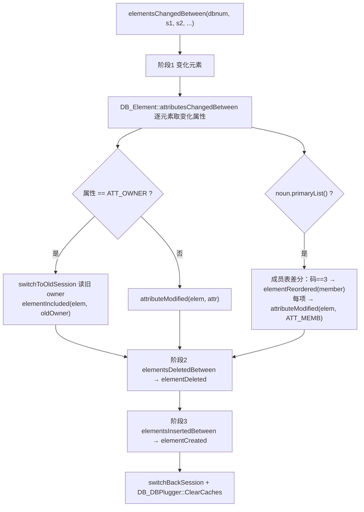

# core.dll 模型更新完整类型矩阵与测试计划（v2）

日期：2026-07-25
项目：`D:\work\plant-code\old\gen-model`
逆向样本：`D:\AVEVA\Everything3D3.1\core.dll`（SHA-256 `3c1f52da4e893d939ed646b8ad91db7dabbd8307bfce66ab7f4d5ae5a419417d`），IDA 会话 `core31-retrace`
字典样本：`D:\AVEVA\Everything3D3.1\attlib.dat`（5,840,896 字节，1931 noun / 93 field）
数据库程序：`bin\surreal.exe`，实库 `AvevaMarineSample`，优先 `dbnum=7997`
三维验证端：`D:\work\plant-code\old\rs-plant-3d`

本文取代 `2026-07-25_test-plan-core-dll-model-update-complete-matrix.md` 的第 4、5、6 节。
v1 的类型全集是「3 个几何 flag + 6 类变化事件」，本轮把 `DB_Noun` 的 **31 个能力字段**、
`DB_UserChanges` 的 **6 个变化桶**、以及 core.dll 自己的 **25 个 noun 变化等价类** 全部落到实测数据上，
并据此重排测试。

---

## 1. 本轮新增的权威证据

### 1.1 会话区间差分的真实算法

`DB_DB::elementsChangedSince(dbnum, sesno, out)` = `elementsChangedBetween(dbnum, sesno, 0, 0, out)`
（`0x5900230` → `0x58ffc50`）。这是离线 session 增量解析在内核里的对应物，执行顺序固定：



三条与 v1 计划**矛盾**的结论：

| 事实 | v1 计划的说法 | 实际二进制行为 |
|---|---|---|
| `OWNER` 变化 | 归入 `StructuralMembership` 普通属性 | **不走 `attributeModified`**，走 `elementIncluded`，且先 `switchToOldSession` 读旧 owner |
| `elementIncluded` | 「在线 UI 语义，离线不适用」（EVT-12 记为 N/A） | 它**就是**会话区间差分里表达 move 的唯一手段，离线必须实现 |
| 成员/顺序变化 | 无条件按 children 变化处理 | 仅当 `DB_Noun::primaryList(noun)` 为真才做成员差分，且顺序变化码固定为 `3` |

### 1.2 变化桶布局（`DB_UserChanges` 对象偏移）

| 偏移 | 桶 | 读取接口 | 谁往里写 |
|---:|---|---|---|
| +0 | Created | `ElementsCreated` | `elementCreated(elem)`；`elementIncluded` 中新 owner 本身也是新建时，元素记 Created |
| +8 | Deleted | `ElementsDeleted` | `elementDeleted(elem)` |
| +16 | Moved | `ElementsMoved` | `elementIncluded(elem, owner)` |
| +24 | MemberChanged | `ElementsMemberChanged` | `elementCreated` 写**其 owner**；`elementIncluded` 写**新旧两个 owner**；`elementReordered` 写 owner |
| +32 | Reordered | `ElementsReordered` | `elementReordered(elem)` |
| +40 | Modified | `ElementsModified` / `AttributesModified` / `AttributesQualsModified` | `attributeModified(elem, attr, qualifier)` |

由此得到两条可直接写成断言的规则：

- **新建一个元素 ⇒ 其 owner 必须进 MemberChanged。**（`elementCreated` 反汇编：`sub_5986450(this+0)` 写元素、`sub_5986450(this+24)` 写 owner）
- **移动一个元素 ⇒ 元素进 Moved，旧 owner 和新 owner 都进 MemberChanged。**（`elementIncluded` 反汇编 `0x5987f27` 的 `lea ecx,[edi+18h]`、`0x5987f3c` 的 `lea ecx,[edi+10h]`、`0x5987f6b` 的 `lea ecx,[edi+18h]`）

### 1.3 属性变化带 Qualifier

`attributeModified(elem, attr)`（`0x5987010`）只是 `attributeModified(elem, attr, DB_Qualifier{})`（`0x5987090`）的默认参数包装。
消费侧同时提供 `AttributesModified`（只给属性）和 `AttributesQualsModified`（给 `(属性, qualifier)` 对）。
即：**内核的属性变化粒度是 `(attribute, qualifier)`，数组类属性可以只有某个下标变了。**
当前 `ModifiedElement` 用 `HashMap<String, ...>` 按属性名聚合，qualifier 维度整体丢失。

### 1.4 依赖订阅按 (noun, attribute) 建键

`DB_UserChangesDependency::addSubsciber(const DB_Noun*, const DB_Attribute*, DB_DependencyBase*)`（`0x59a1140`）。
反查是 `getDependencies(elem, attr, out)`（`0x59a11a0`）。
说明反向级联索引的正确键是 `(noun, attribute)` 二元组，而不是只按属性名。
当前 `ref_rev` 只按 refno 建边，属性维度在传播时被抹平——这不是错误，但**级联范围会偏大**，
需要一条「传播范围不小于 core.dll，且不无限放大」的测试来守住边界。

---

## 2. noun 能力全集：31 字段实测矩阵

`DB_Noun` 的能力访问器全部落到 dabacon 字段号（`internalGetField` / `ReadData` / `ReadDataDab`）。
下表 field 列是实测字段号，计数来自 `attlib.dat` 全量 1931 noun。

复现命令：

```powershell
python gm_noun_caps_probe.py D:\AVEVA\Everything3D3.1\attlib.dat noun_flags.json output/noun_caps_full.json
```

| 访问器 | 字段号 | 类型 | 实测计数 | 当前 Rust dict | 与模型更新的关系 |
|---|---:|---|---:|:---:|---|
| `primitive` | 659518 | bool | 347 | 有 | 直接几何能力 |
| `geomset` | 859903 | bool | 44 | 有 | 直接几何能力 |
| `extrusion` | 663225 | bool | 38 | 有 | 直接几何能力 |
| `isPointsetPoint` | 290555737 | bool | 4 | 有 | `PPOS/PPPT/REFPOS/WPOS` |
| `graphicsBehaviour` | 5099119 | int | 279 非零（值域 `{1,2,3}`） | 有 | 显示行为分类 |
| **`point`** | **661624** | bool | **44** | **缺** | **LOOP/PLOO/PAVE/VERT/SPINE… 顶点容器权威名单** |
| **`positiveEquivalent`** | **778791** | noun | **12** | **缺** | **负体 → 正体映射，布尔减运算的权威来源** |
| **`primaryList`** | 297853135 | int | **不在字典**（走 `db_get_element_info`） | 缺 | **成员/顺序差分的开关** |
| **`changeType`** | **76272573** | noun | **117 非零 / 25 个类** | **缺** | **core.dll 自己的变化等价类** |
| `spatialMap` | 847458 | int | 527 非零（值域 `{1,2,3,5,7}`） | 缺 | 空间索引/AABB 参与方式 |
| `secondaryHierarchy` | 65664829 | int | 26 非零（值域 `{1,2}`） | 缺 | 次层级（owner 链之外的第二父子关系） |
| `visible` | 722704 | bool | 1813 | 缺 | 可见性 |
| `toplevel` | 661628 | bool | 211 | 缺 | 顶层类型 |
| `pickable` | 750400 | bool | 374 | 缺 | 可拾取 |
| `world` | 843594 | bool | 119 | 缺 | 世界级类型 |
| `defaultVolumeQuery` | 89369995 | bool | 102 | 缺 | 体查询默认参与 |
| `clasherWithin` | 206078421 | bool | 9 | 缺 | 碰撞检查参与 |
| `clasherSection` | 46622793 | bool | 30 | 缺 | 碰撞剖切参与 |
| `modifiable` | 621476 | bool | 1896 | 缺 | 可修改 |
| `statusEligible` | 204468292 | bool | 1929 | 缺 | 状态管理适用 |
| `isCloneable` | 3475470 | bool | 29 | 缺 | 可克隆 |
| `defined` | 713101 | int | `1`×1921 / `4`×10 | 缺 | `==4` 即 `isPseudo`（10 个伪类型） |
| `validc` | 45889870 | int | 127 非零（值域 `{1,2}`） | 缺 | 校验分类 |
| `requiresMarine` | 259611633 | bool | 24 | 缺 | 仅 Marine 模块 |
| `isProtected` | 212119090 | bool | 21 | 缺 | 受保护 |
| `deleteMemberOnCopy` | 193546290 | bool | 23 | 缺 | 复制时删除成员 |
| `spoolerModifiable` | 208122411 | bool | 5 | 缺 | 预制模块可改 |
| `psOwner` / `psNext` / `psFirstMember` | 266716114 / 300373315 / 297966157 | int | 117 / 216 / 8 | 缺 | pointset 遍历链 |

`primitive ∪ geomset ∪ extrusion = 395`（与 v1 一致，且 395 个全部有名字）。

### 2.1 负体映射（`positiveEquivalent`，12 对）

```text
NSLC→SLCY  NCYL→CYLI  NCON→CONE  NSNO→SNOU  NCTO→CTOR  NRTO→RTOR
NXTR→EXTR  NPYR→PYRA  NDIS→DISH  NREV→EXTR  NBOX→BOX   NPOLYH→POLYHE
```

395 个几何 noun 里叫 `N*` 的远不止 12 个（`NLCY/NLPY/NLSN/NSBO/NSCO/NSCT/NSCY/NSDS/NSEX/NSRE/NSRT/NSSL/NSSP/NTUB` 等），
但只有上面 12 个在字典里登记了正体等价类型。**布尔减法测试必须以这 12 对为准，不能按名字前缀 `N` 猜。**

### 2.2 顶点/点容器（`point==true`，44 个）

```text
AIDTEX, BPFEAT, BPOPEN, CURVE, DIMPLI, DIMPOS, DIMPPT, EXTGEO, FCUTPL, HATTA,
HNODE, HRFEAT, HRGATE, HTFEAT, IPOI, JNODE, KSUSVE, LOOP, LOOPTS, PAVE, PLOO,
POGO, POIN, POINSP, POINTR, POLFAC, POLOOP, POLPTL, PULLN, RLCAGE, RLGATE,
RNODE, RPATH, RSECT, SLRAIL, SPINE, TANP, TATTA, VERT, WLFEAT, WLOPEN, XCELL,
XCELS, XCLTN
```

当前 `is_loop_container_noun` 用手写的 `TOTAL_LOOP_NOUN_NAMES` / `TOTAL_VERT_NOUN_NAMES`。
这 44 个是字典权威名单，手写名单必须是它的子集，否则「loop 容器不能当生成根」的规则就有漏网类型。

### 2.3 变化等价类（`changeType`，25 类覆盖 117 noun）

`changeType` 存的是**另一个 noun 的 hash**：该 noun 发生变化时，按目标类型的规则处理。
`ReadData` 里若字典值为 0 则回填自身 hash，即「自己就是自己的类」。
25 个类里有 4 个目标是抽象类（不在 noun 索引中，由 `db1_dehash` 还原）：

| 变化类 | 成员数 | 成员 |
|---|---:|---|
| `ATTA` | 17 | ATTA, HACC, HSAD, HVBRCO, HVFLAN, HVHACC, HVIDAM, HVSADD, HVSKIR, HVSPLR, HVSTIF, HVTPPO, IDAM, SKIR, SPLR, STIF, TP |
| `HELE` | 13 | CLEV, EYNT, EYRD, HELE, HNUT, HPIN, HROD, RCPL, SNUB, SWBR, TRNB, VSPR, WASH |
| `LINEAR`（抽象） | 10 | DUCT, FTUB, OFST, PLAT, PLEN, REDU, STRT, TAPE, TRNS, TRREDU |
| `MULTC`（抽象） | 9 | AHU, BATT, DAMP, HFAN, INST, PCOM, SHU, SILE, VFWA |
| `PCONN`（抽象） | 9 | COUP, FBLI, FLAN, GASK, LJSE, LUANCI, TRANCI, UNIO, WELD |
| `SCLA` | 8 | BBLT, BWLD, SCLA, SLUG, SOST, SPAC, STLS, WPAD |
| `PCLA` | 7 | PCLA, PCLI, PLUG, POST, SHOE, TRNN, UBOL |
| `TEE` | 6 | BRCO, CROS, OLET, PTAP, TEE, THRE |
| `CAP` | 6 | CAP, CLOS, COWL, GRIL, MESH, VENT |
| `INLINE`（抽象） | 4 | FILT, TRAP, VALV, VTWA |
| `ELFITT` | 4 | ELFITT, FPFITT, HVACFI, INFITT |
| `SUPC` | 3 | LUG, SUPC, TRUNNI |
| `BEND` | 3 | BEND, ELBO, FLEX |
| `PANE` | 3 | FLOOR, GWALL, SCREED |
| `PIPE` | 2 | HVAC, PIPE |
| `GENSEC` | 2 | GENSEC, WALL |
| `SCTN` | 2 | SCTN, STWALL |
| `SUPPO` | 2 | REST, SUPPO |
| 单元素类 | 各 1 | ANCI, MFIX→FIXING, HANCI, SCHVAC→SCPLIN, STRLNG, SCHVFI→SCFITT, SCDUCT→SCTUB |

这张表直接给出**结构专业测试的等价类**：`FLOOR`/`GWALL`/`SCREED` 同属 `PANE` 类，
`WALL` 与 `GENSEC` 同类，`STWALL` 与 `SCTN` 同类，`REST` 与 `SUPPO` 同类。
测试只要在每个类里取 1 个代表跑通，就能覆盖整类；反过来，
**如果一个类里的两个 noun 在我们的实现里走了不同代码路径，那一定是 bug。**

### 2.4 伪类型（`defined==4`，10 个）

```text
ALLP, DESEL, DRAEL, INSU, PADEL, PRMF, PRTYPE, ROD, TRAC, TUBI
```

`TUBI` 在列表里，与「`BRAN` 下 `TUBI/FTUB` 不是独立交付单元」的现有结论一致，
但现在有了字典级依据：`TUBI` 根本就是伪类型。`INSU`、`TRAC` 同理。

---

## 3. 与当前实现的差距清单

| # | 差距 | 证据 | 影响 | 修复位置 |
|---|---|---|---|---|
| G1 | `OWNER` 变化按普通结构属性处理，未建模 Moved 语义 | §1.1、§1.2 | 旧 owner 侧可能漏刷新 | `model_impact.rs` / `manual_update.rs` |
| G2 | 新建元素未显式把 owner 记为 MemberChanged | §1.2 | 新建于非交付单元 owner 下时，父根可能不刷新 | `manual_update.rs` |
| G3 | 成员/顺序差分未按 `primaryList` 门控，也未区分「重排」与「增删成员」 | §1.1 | 对非 primaryList 类型多算；重排/增删无法分别验证 | `manual_update.rs` |
| G4 | 属性变化丢失 qualifier 维度 | §1.3 | 数组属性按整体重算，无法验证「只改某下标」 | `plant-io` 的 `ModifiedElement` |
| G5 | dict 只读 5 个字段，缺 26 个 | §2 | `point`/`positiveEquivalent`/`changeType` 等权威名单没被使用 | `vendor/aios-parse-pdms/src/dict.rs` |
| G6 | `is_loop_container_noun` 用手写名单 | §2.2 | 可能漏 loop 类型 | `model_impact.rs` |
| G7 | 负体正体映射未使用字典 | §2.1 | 布尔减法覆盖靠猜 | `fast_model/manifold_bool.rs` |
| G8 | 反向级联索引不带属性维度 | §1.4 | 传播范围偏大，无上界断言 | `manual_update.rs` / `ref_rev` |
| G9 | 变化等价类未使用 | §2.3 | 测试覆盖靠逐 noun 枚举，无法收敛 | 新增分类器 |
| G10 | `DCHC` 仍只有 `REDRAW=4`/`INTUBE=1` | v1 §5.7 | 无法逐 `(noun, attr)` 对齐 | 需活字典导出，不在本轮 |

---

## 4. 测试计划

分四批。每批都有**准入**（依赖哪个 G 修完）和**退出**（断言全绿 + 证据齐全）。

### 批次 A：字典能力矩阵（单元层，无需实库）

准入：G5 修完（dict 暴露全部 31 字段）。

| ID | 位置 | 断言 |
|---|---|---|
| A-DICT-01 | `parse_pdms_db::dict` | 31 个字段全部能从 `attlib.dat` 读出；`primaryList` 明确标记为「字典不可得」 |
| A-DICT-02 | `parse_pdms_db::dict` | 计数快照不漂移：1931 noun / 347 primitive / 44 geomset / 38 extrusion / 395 并集 / 44 point / 12 positiveEquivalent / 117 changeType / 10 pseudo |
| A-DICT-03 | `parse_pdms_db::dict` | `positiveEquivalent` 精确等于 §2.1 的 12 对 |
| A-DICT-04 | `parse_pdms_db::dict` | `changeType` 等价类精确等于 §2.3 的 25 类；4 个抽象类名由 `db1_dehash` 还原为 `MULTC/INLINE/LINEAR/PCONN` |
| A-DICT-05 | `model_impact` | 手写 `TOTAL_LOOP_NOUN_NAMES ∪ TOTAL_VERT_NOUN_NAMES` ⊆ 字典 `point==true`（44 个） |
| A-DICT-06 | `parse_pdms_db::dict` | `graphicsBehaviour ∈ {0,1,2,3}`、`spatialMap ∈ {0,1,2,3,5,7}`、`secondaryHierarchy ∈ {0,1,2}`、`defined ∈ {1,4}`、`validc ∈ {0,1,2}` |

退出：6 项全绿，`output/noun_caps_full.json` 作为快照入库。

### 批次 B：变化类型语义对齐（单元层）

准入：G1、G2、G3 修完。

| ID | 位置 | 断言 |
|---|---|---|
| B-EVT-01 | `manual_update` | `OWNER` 变化产生 Moved 语义：元素记 moved，**旧 owner 与新 owner 都记 member-changed** |
| B-EVT-02 | `manual_update` | 新建元素时其 owner 记 member-changed |
| B-EVT-03 | `manual_update` | 成员差分只对 `primaryList` 类型执行；非 primaryList 类型的 children 差异不产生 reorder |
| B-EVT-04 | `manual_update` | 「同集合换顺序」判为 Reordered；「集合增删」判为 MemberChanged；两者都刷新父生成根，但事件类型不同 |
| B-EVT-05 | `manual_update` | 差分执行顺序为 修改 → 删除 → 新建；同一 refno 在一个窗口内先删后建时净结果为 Added |
| B-EVT-06 | `manual_update` | 移动进入「本窗口内新建的 owner」时，元素本身记 Created（对齐 `elementIncluded` 的 `isElementCreated` 分支） |
| B-EVT-07 | `model_impact` | 6 个变化桶（Created/Deleted/Moved/MemberChanged/Reordered/Modified）与本地 `NetOp` 的映射表是全映射且无歧义 |

退出：7 项全绿；`docs/adr` 补一条 ADR 记录「OWNER 走 Moved 而非 attributeModified」。

### 批次 C：属性效果与级联（单元层 + 轻量实库）

准入：G4、G8 修完（G4 若改不动上游解析，则本批 C-ATTR-03 记为「阻塞」，不得记通过）。

| ID | 位置 | 断言 |
|---|---|---|
| C-ATTR-01 | `model_impact` | 四张显式属性表逐项映射到声明 effect；全部 schema 属性可分类；引用类属性不落 `Unknown` |
| C-ATTR-02 | `model_impact` | `added_attrs` / `deleted_attrs` / `modified_attrs` 三类都参与分类：**删除 `SPREF` 与修改 `SPREF` 产生同一 effect** |
| C-ATTR-03 | `plant-io` + `model_impact` | qualifier 维度：数组属性只改某下标时，变化明细能定位到下标 |
| C-ATTR-04 | `model_impact` | `Data+Transform+Geometry` 混合时 Regen 优先；`UDA:<id>` 保守 Regen |
| C-REF-01 | `manual_update` | `referenced → referrer` 边去重、排除 self、传递级联、环安全 |
| C-REF-02 | `manual_update` | 级联范围**下界**：core.dll `getDependencies` 语义要求的使用者一个不少 |
| C-REF-03 | `manual_update` | 级联范围**上界**：不因属性维度缺失而把无关 noun 拉进来（用 `(noun, attribute)` 期望集合比对） |
| C-REF-04 | `increment_pipeline` | 删除清理 `ref_rev`；`None` 不写索引；`ref_rev` 从正向引用重建后与增量维护结果一致 |

退出：C-ATTR-03 之外全绿；C-ATTR-03 通过或明确记为阻塞项。

### 批次 D：端到端（实库 + 三维）

准入：批次 B 通过。统一链路
`E3D 修改 → session 增量解析 → surreal.exe → 模型生成/清理 → rs-plant-3d → 前后数据与截图对比`。

按 §2.3 的变化等价类选代表，而不是逐 noun 枚举。

| ID | 操作 | 等价类覆盖 | 数据断言 | 模型断言 | 视觉断言 |
|---|---|---|---|---|---|
| D-01 | 修改共享 `SPCO/SPEC` 的几何参数 | `PCONN`/`INLINE` | `ref_rev` 使用者完整 | 所有使用根都刷新 | 多个管道同步变化 |
| D-02 | 子元件跨 `BRAN`/`EQUI` 移动 owner | Moved + MemberChanged | 新旧 owner 正确 | 旧、新根都刷新 | 两处前后对比 |
| D-03 | 删除可恢复测试元件 | Deleted | pe/引用边清理 | inst/mesh/旧根无残留 | 实体消失 |
| D-04 | 在非交付单元 owner 下新建子元件 | Created + owner MemberChanged | owner 的成员表更新 | 父交付单元刷新 | 实体出现 |
| D-05 | `FLOOR` 子构件修改 | `PANE` 类（代表 FLOOR，兼证 GWALL/SCREED） | 子构件属性变化 | `CFLOOR` 刷新 | 外形变化 |
| D-06 | `WALL`/`GENSEC` 修改 | `GENSEC` 类 | profile/sweep 变化 | `CWALL`/`SUPPO` 刷新 | 型材扫掠变化 |
| D-07 | `REST`/`SUPPO` 修改 | `SUPPO` 类 | 支吊架参数变化 | `SUPPO` 根刷新 | 支架变化 |
| D-08 | 含负体（`NBOX`/`NCYL`…）的元件改尺寸 | §2.1 的 12 对 | 负体参数变化 | 布尔减法结果变化 | 开孔/凹槽变化 |
| D-09 | 调整 `primaryList` 类型的有序 children | Reordered | 顺序变化 | 父根重新生成 | 顺序语义正确 |
| D-10 | 只改 `NAME` | DataOnly | 名称变化 | mesh/hash 不变 | 树名变，几何不变 |
| D-11 | 只改 `POS/ORI` | TransformOnly | transform 变化 | mesh 不变，world/AABB 变 | 元件移动/旋转 |
| D-12 | 缺失 CATA 的首次请求 | 按需闭包 | 闭包落库 | 首次请求生成模型 | 能加载 |
| D-13 | 反向索引查询失败注入 | 失败恢复 | 数据仍可应用 | `CascadeExpand` 持久化并重试 | 最终收敛 |
| D-14 | 水位推进窗口注入进程退出 | 崩溃恢复 | 重启水位一致 | 模型任务不丢失 | 最终收敛 |
| D-15 | 同一 session 范围重复执行 | 幂等 | 无重复副作用 | 工作项与模型幂等 | 画面不抖动 |

每个视觉用例必须保存修改前/后的全景与近景截图（相同相机），以及
refno / noun / owner / 关键属性 / 模型记录 / AABB / world transform 的前后 JSON。
截图只接受来自 `rs-plant-3d`，不接受 `plant3d-web` 或数据库记录截图。

`SUPPO` 在 7997 中数量为 0，D-07 必须换库，不得跳过后记为通过。

---

## 5. 排期

| 阶段 | 内容 | 前置 | 产出 |
|---|---|---|---|
| P1 | G5 扩字典字段 + 批次 A | 无 | `noun_caps_full.json` 快照 + 6 项单测 |
| P2 | G1/G2/G3 变化语义对齐 + 批次 B | P1（A-DICT-02 提供 `primaryList` 结论） | 7 项单测 + 1 条 ADR |
| P3 | G6/G7/G9 使用字典名单 + 回归批次 A/B | P2 | loop 名单、负体映射、等价类分类器 |
| P4 | G4/G8 + 批次 C | P3 | 8 项单测（含 1 项可能阻塞） |
| P5 | 批次 D 的 D-01…D-04（高风险变化语义） | P2 | 4 组前后截图 + JSON |
| P6 | 批次 D 的 D-05…D-09（结构与几何等价类） | P3、换含 SUPPO 的库 | 5 组前后截图 + JSON |
| P7 | 批次 D 的 D-10…D-15（回归与鲁棒性） | P4 | 6 组证据 |
| P8 | G10 活字典 DCHC 导出 | 需运行中的 E3D 会话 | 逐 `(noun, attr)` 码表 |

P1–P4 可以全部离线做完；P5 起必须占用 E3D 与 7997（或替代库）。
P8 单独立项，不阻塞 P1–P7。

---

## 6. 验收口径

### 可以宣称通过的

- 批次 A 全绿 ⇒ 「noun 能力矩阵与 core.dll 字典一致」。
- 批次 B 全绿 ⇒ 「变化类型语义与 `DB_UserChanges` 一致」。
- 批次 C 全绿 ⇒ 「属性效果与级联范围有上下界保护」。
- 批次 D 某一行全绿 ⇒ 「该变化等价类的端到端链路通过」。

### 不能宣称的

- 单元测试全绿 **不等于** 395 个几何 noun 都能产出正确网格。批次 D 用等价类抽样，
  未被抽到的 noun 只享有「同类推定」，不是实测通过。
- `changeType` 等价类是 core.dll 的**变化处理**分类，不是**几何生成**分类。
  同类 noun 走同一变化路径，不代表共用同一生成器。
- `DCHC` 在 P8 完成前，只有 `REDRAW=4` / `INTUBE=1` 两个码是确定的，
  其余一律按效果分类处理，不得伪造码值。
- 桌面捕获若继续报 `IGraphicsCaptureItemInterop.CreateForMonitor failed (0x80070057)`，
  相关用例记为「视觉证据阻塞」，数据成功不能顶替截图成功。

---

## 7. 复现与产物

| 产物 | 路径 |
|---|---|
| noun 能力提取脚本 | `gm_noun_caps_probe.py` |
| 31 字段全量矩阵 | `output/noun_caps_full.json` |
| `DB_Noun` 访问器反编译 | `.ida_scratch/analysis/db_noun_caps.c` |
| `DB_UserChanges` 反编译 | `.ida_scratch/analysis/db_userchanges.c` |
| `DB_Noun` 成员清单 | `.ida_scratch/db_noun_members.txt` |

IDA 侧复现（JSON-RPC over HTTP，`http://127.0.0.1:13338/mcp`，会话 `core31-retrace`）：

```powershell
# 例：取 DB_Noun::primitive 的字段号
$body = @{ jsonrpc='2.0'; id=1; method='tools/call'; params=@{
  name='decompile'; arguments=@{ addr='0x58da280'; include_addresses=$false } } } |
  ConvertTo-Json -Compress -Depth 12
Invoke-WebRequest -Uri 'http://127.0.0.1:13338/mcp' -Method Post -Body $body `
  -ContentType 'application/json' -Headers @{ Accept='application/json, text/event-stream' } `
  -UseBasicParsing | Select-Object -ExpandProperty Content
```

关键地址：

| 符号 | 地址 |
|---|---:|
| `DB_DB::elementsChangedBetween` | `0x58ffc50` |
| `DB_DB::elementsChangedSince` | `0x5900230` |
| `DB_UserChanges::elementIncluded` | `0x5987ea0` |
| `DB_UserChanges::elementCreated` | `0x5987a90` |
| `DB_UserChanges::elementDeleted` | `0x5987b70` |
| `DB_UserChanges::elementReordered` | `0x5988040` |
| `DB_UserChanges::attributeModified(elem,attr,qual)` | `0x5987090` |
| `DB_UserChanges::combine` | `0x5987520` |
| `DB_UserChangesDependency::addSubsciber` | `0x59a1140` |
| `DB_UserChangesDependency::getDependencies` | `0x59a11a0` |
| `DB_Noun::ReadData` | `0x58d6d20` |
| `DB_Noun::ReadDataDab` | `0x58d7100` |
| `DB_Noun::changeType` | `0x58d7630` |
| `DB_Noun::point` | `0x58da1c0` |
| `DB_Noun::positiveEquivalent` | `0x58da1e0` |
| `DB_Noun::primaryList` | `0x58da260` |
