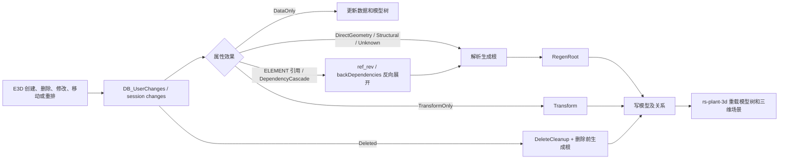

# core.dll 图形更新机制与完整模型更新测试计划

日期：2026-07-25  
项目：`D:\work\plant-code\old\gen-model`  
数据库程序：`D:\work\plant-code\old\gen-model\bin\surreal.exe`  
三维验证端：`D:\work\plant-code\rs-plant3-d`  
默认实库：`AvevaMarineSample`，优先 `dbnum=7997`

## 1. 目标和结论口径

本文定义：

1. `core.dll` 如何记录变化、传播引用依赖、识别 noun 几何能力并刷新显示。
2. `aios-database/gen-model` 必须处理的完整变化类型、属性效果和 noun 能力集合。
3. 可自动执行的单元测试，以及必须由 E3D、SurrealDB、生成器和
   `rs-plant-3d` 联合完成的端到端测试。

“完整类型”不是一张手工 noun 白名单。`core.dll` 的真实口径是：

- 变化类型由 `DB_UserChanges` 记录。
- 属性影响由 schema、DCHC 和引用元数据决定。
- noun 是否具有几何能力由 dabacon 字典的逐 noun flag 决定。
- 变化元素最终归并到可独立生成、保存和加载的生成根。

因此本文同时冻结“规则全集”和当前 dabacon 快照的“数据全集”。单元测试通过证明
影响计算和归并规则受保护，不等于 395 个几何 noun 都已经由真实生成器产出正确网格。

## 2. core.dll 样本和 IDA 证据

权威样本：

- 路径：`D:\AVEVA\Everything3D3.1\core.dll`
- 大小：`50,071,544` 字节
- SHA-256：`3c1f52da4e893d939ed646b8ad91db7dabbd8307bfce66ab7f4d5ae5a419417d`
- IDA 会话：`core31-retrace`

已排除的同名文件：

- `D:\work\plant-code\cad\pid-parse\dlls\core.dll`
- SHA-256：`ab4986699a1cacb4f6a7a12b503a881402e365865e27f5b2586dc758293304df`

关键证据：

| 机制 | 地址 | 本轮复核结果 |
|---|---:|---|
| `DB_ElementChangesPlugger::PostSetRefListAttribute` | `0x591e780` | `wnoevt=false` 时逐个通知引用列表订阅者 |
| `DB_RefTabDatabasesPostSetAttr::PostSetAttribute` | `0x59fbd00` | table/reference 属性写入后调用引用表失效 |
| `DB_RefTableDatabases::invalidate` | `0x59fbfe0` | 按 `DB_Attribute*` 查 RB-tree 节点并置脏 |
| `DB_UserChangesDependency::getDependencies` | `0x59a11a0` | 从 `backDependencies` 和 MDB 反查依赖元素，再通知订阅者 |
| `DB_Noun::internalGetField` | `0x58d9bd0` | 按 dabacon 字段号读取 noun schema |
| `DB_Noun::primitive` | `0x58da280` | 读取字段 `659518` |
| `DB_Noun::geomset` | `0x58d8a20` | 读取字段 `859903` |
| `DB_Noun::extrusion` | `0x58d8180` | 读取字段 `663225` |
| `DB_Noun::graphicsBehaviour` | `0x58d9760` | 懒加载 `ReadData` 后返回缓存字段 |
| `FZXUPD` | `0x5294555` | 条件满足时调用 `FUPALL`，随后发送输出更新 |
| `FUPALL` | `0x52f1f82` | 调用 `GLUPDA`、更新视图并刷新表单 |
| `GLUPDA` | `0x5aa90d0` | 最终显示层刷新 |

`DB_UserChanges` 暴露的变化集合包括 created、deleted、attribute modified、
member changed、moved、reordered；`elementIncluded` 属在线数据库/UI 语义，当前离线
session 文件管线不伪造该输入。

## 3. 更新机制和本项目动作



本项目允许的模型工作动作：

| 动作 | 触发条件 | 目标 |
|---|---|---|
| `RegenRoot` | 新增、直接几何、结构变化、未知属性、引用级联 | 最小交付单元或显著生成根 |
| `Transform` | 只有位姿/方向属性变化 | 变化元素的 world transform |
| `DeleteCleanup` | 净变化为删除 | 被删 refno、旧关系、旧模型及删除前生成根 |
| `CascadeExpand` | 反向索引临时不可用 | 持久化待重试的级联扩展任务 |
| 无模型动作 | 仅 `DataOnly` | 数据和模型树仍必须更新 |

当一次修改同时命中多个效果时，优先级为：

`RegenRoot > Transform > 无模型动作`。

## 4. 必须覆盖的变化类型全集

| ID | core.dll/离线变化 | 期望 |
|---|---|---|
| EVT-01 | created / `Add` | 新元素所在生成根 `RegenRoot` |
| EVT-02 | deleted / `Deleted` | `DeleteCleanup`，并用删除前 owner 图刷新旧根 |
| EVT-03 | attributeModified | 按第 5 节效果分类 |
| EVT-04 | memberChanged / children changed | `StructuralMembership`，刷新父生成根 |
| EVT-05 | moved / `OWNER` changed | 旧、新 owner 两侧生成根都刷新 |
| EVT-06 | reordered | 等价结构成员变化，刷新父生成根 |
| EVT-07 | create 后 delete | 净变化抵消，不留下模型工作 |
| EVT-08 | delete 后 add | 视为替换/修改，生成最终状态 |
| EVT-09 | 同一元素多次修改 | 合并净变化，工作项去重 |
| EVT-10 | `None` | 不创建工作项 |
| EVT-11 | modified 但无属性明细 | 保守 `Unknown → RegenRoot` |
| EVT-12 | elementIncluded | 在线 core.dll 范围；离线 session 主流程记为不适用 |

## 5. 属性效果全集

### 5.1 DataOnly

`NAME, DESC, PURP, FUNCTION`

只更新数据和模型树，不生成网格，不更新 transform。

### 5.2 TransformOnly

`POS, POSL, POSS, POSE, NPOS, CPOS, ORI, YDIR, ZDIR`

只有这些属性变化时执行 `Transform`；若同批还出现任何重生成效果，则由
`RegenRoot` 覆盖。

### 5.3 StructuralMembership

`OWNER, CHILDREN, NOUN, TYPE, LEVE, LEVEL`

改变层级、成员、生成分派或可见层级，必须重新解析生成根。

### 5.4 DependencyCascade

目录、规格和设计模板：

`CATR, CREF, SPRE, SPREF, PSPREF, FSPREF, SPCO, SCOM, SCREF, PSPE, PRTREF,
DESP, DDSE, DDAT, DKEY, DDPR, GMREF, GMRE, GSTR, GTYP, DPRO, DTRE, ISPE,
TMPL, DDANGLE, DDHEIGHT, DDRADIUS, IPARAM`

管路连接、方向和布线：

`HREF, TREF, LSTU, HSTU, STYP, CONN, BRCO, HPOS, TPOS, HDIR, TDIR, HBOR,
TBOR, ADIR, RDIR, LDIR, ZDIS, LEAV, CURD, CURTYP, OPDI, ROUT, DRNS, DRNE,
DETR, DELP, RINS, CTYP, JFRE, JLIN`

设计表默认值和属性覆盖：

`PKEY, PPRO, PSTR, PTRE, PTYP, PVER, PKDI`

此外，schema 中任何 `att_type == ELEMENT` 的未知属性自动升级为
`DependencyCascade`。当前 `att_meta` 快照包含 6556 条 noun-attribute 记录，
其中 1421 条为引用类；测试要求引用类不能落入 `Unknown`。

### 5.5 DirectGeometry

包括：

- primitive 尺寸、半径、厚度、偏移和形状参数。
- P-point、profile、loop、extrusion、revolution 和负体定义。
- 顶点坐标、管路口径、连接方向、曲率、排水端点和布尔开关。
- `PARA*`、`PARAM*` 参数族。

完整判断源是 `attribute_affects_model`；本文不复制第二份独立清单，防止文档与
代码漂移。测试会遍历代码中的所有显式表，并遍历全部 schema 属性。

### 5.6 Unknown / UDA

任何未识别普通属性和 `UDA:<id>` 都保守触发 `RegenRoot`。这是“允许多算一次，
不允许模型陈旧”的故障安全策略。

### 5.7 DCHC 边界

静态二进制只能确认：

- `REDRAW = 4`
- `INTUBE = 1`

完整 DCHC 是 `(noun, attribute) → code` 的活字典数据，不能仅凭 `core.dll`
静态分析宣称逐项一致。逐码验证必须另做 E3D 活字典导出。

## 6. noun 类型全集

### 6.1 字典能力集合

当前内嵌 dabacon 快照：

| 集合 | 数量 |
|---|---:|
| 全部 noun | 1931 |
| `primitive=true` | 347 |
| `geomset=true` | 44 |
| `extrusion=true` | 38 |
| 三者并集 | **395** |
| `graphicsBehaviour != 0` | 279 |

`graphicsBehaviour != 0` 不是“必须独立生成模型”的同义词，其中包含 SITE、ZONE、
WORL、草图/标注/辅助显示类型。直接几何能力基线采用
`primitive ∪ geomset ∪ extrusion`；是否作为独立生成根仍由层级和目录路由决定。

395 个几何能力 noun：

```text
ABOX, ACONE, ACTOR, ACYLI, ADISH, AEXTR, AHU, AIDARC, AIDCIR, AIDLIN, AIDPOI,
AIDTEX, ANCI, APOLYH, APYRA, AREVO, ARTOR, ASLCY, ASNOU, ATTA, BATT, BBLT,
BEND, BNDLIN, BOX, BOXI, BPANEL, BPFEAT, BPFITT, BPOPEN, BRCO, BWLD, CABLE,
CAP, CCURVE, CLEV, CLNTIL, CLOS, CMFI, CMPF, CNODE, CNVCOM, CONE, COUP, COWL,
CPANEL, CPIN, CPLANE, CPLATE, CPOINT, CPROF, CROS, CSEAM, CSTIFF, CSURF,
CTBEND, CTCOUP, CTCROS, CTFEAT, CTJOIN, CTOR, CTRAY, CTREDU, CTRISE, CTSTRA,
CTSUPP, CTTEE, CTWALL, CURVE, CWBRAN, CYLI, DAMP, DIMPLI, DIMPOS, DIMPPT,
DISH, DOOR, DPCA, DPCY, DPSP, DRAW, DTBOLT, DTGEOM, DUCT, ELBO, ELCONN,
ELFITT, ENDATU, ENVLIM, ENVLOP, EQUCOM, EXTGEO, EXTR, EYNT, EYRD, FAFSET,
FAWELD, FBLI, FCUTPL, FEBEAM, FEFRED, FEMIMG, FEMODL, FESHEL, FETRUS, FILT,
FITT, FIXING, FIXTUR, FLAN, FLEX, FLOOR, FLRCOV, FLRLAY, FNCARE, FNCBRN,
FPFITT, FTUB, FURNIT, GASK, GENCUR, GENNC, GENNG, GENPRI, GRIDCY, GRIDPL,
GRIL, GWALL, HACC, HANCI, HANDRA, HBEAD, HBRCKT, HBRFLA, HBRSTI, HCLIP,
HCOMPT, HCURVE, HDOPLA, HELE, HFAN, HFLANG, HHOLE, HIBEA, HIBRA, HICPAN,
HICPLA, HICSTI, HICUR, HIDOU, HIFLA, HIHOL, HIPIL, HIPLA, HISTI, HNODE,
HNUT, HPILLR, HPIN, HPLATE, HRFEAT, HRGATE, HROD, HRPANE, HRPOST, HRSOF,
HRTERM, HSAD, HSEAM, HSTIFF, HTFEAT, HVACFI, HVBRCO, HVFLAN, HVHACC, HVIDAM,
HVSADD, HVSKIR, HVSPLR, HVSTIF, HVTPPO, IBNDRY, ICLIP, ICRCUR, ICRPNT,
ICTOUT, IDAM, IEDGE, IENDFR, IENDTO, IFCPLA, IHOLE, ILIM, INFITT, INODE,
INOTCH, INST, INSU, INSURQ, INTFRM, IPANE, IPILLR, IPLATE, IPOI, ISEAM,
ISECT, ISTIFF, JLDATU, JNODE, JWELD, KICKPL, LADDER, LCYL, LDRRUN, LINDIM,
LINE, LJSE, LPYR, LSNO, LUANCI, MESH, MLABEL, MNOZ, MPLATE, MPROF, MWLDJT,
NBOX, NBXI, NCON, NCTO, NCYL, NDIS, NLCY, NLPY, NLSN, NOZZ, NPOLYH, NPYR,
NREV, NRTO, NSBO, NSCO, NSCT, NSCY, NSDS, NSEX, NSLC, NSNO, NSRE, NSRT,
NSSL, NSSP, NTUB, NXTR, OFST, OLET, PANE, PCLA, PCLI, PCOJ, PCOM, PEXSP,
PFIT, PGBOX, PIACT, PIBLK, PIGEN, PIPCA, PJOI, PLAT, PLDATU, PLEN, PLIN,
PLOPEN, PLTFRM, PLTGRD, PLUG, POGO, POHE, POIN, POINSP, POINTR, POLYHE,
POST, PTAP, PTAX, PTCA, PTMI, PTPOS, PULLN, PVOL, PWCHA, PWMAN, PYRA, RAIL,
RCPL, REDU, REFGAR, REFGLN, REVO, RLADDR, RLGATE, RNODE, RPATH, RPLA, RSECT,
RSFINS, RTOR, SANN, SBFI, SBOX, SCLA, SCOJ, SCON, SCREED, SCTO, SCYL,
SDAFIX, SDIS, SDSH, SELJ, SEXT, SHOE, SHU, SILE, SJOI, SKIR, SLADDR, SLCY,
SLINE, SLOO, SLUG, SNOD, SNOU, SNUB, SOST, SPAC, SPINE, SPLO, SPLR, SPMSPC,
SPRO, SPVE, SREC, SREV, SRFCUR, SRFLIM, SRFSUR, SRTO, SSLC, SSPH, SSREFE,
STIF, STLS, STRFLT, STRLNG, STRT, STWELD, SUBCOM, SUBJ, SVER, SWBR, TANP,
TAPE, TCOM, TEE, THRE, TP, TRAC, TRANCI, TRAP, TREAD, TRNB, TRNN, TRNS,
TRREDU, TUBE, TUBI, UBOL, UNIO, VALV, VENT, VFWA, VSPR, VTWA, WASH, WELD,
WINDOW, WKSUR, WLFEAT, WLJOIN, WLOPEN, WLPANE, WLPROF, WPAD
```

### 6.2 生成根规则

内建最小交付单元：

`BRAN, HANG, SUPPO, EQUI`

项目可以通过配置追加交付单元类型，但不能把 `SITE, ZONE, WORL` 重新作为交付单元。

生成根解析顺序：

1. 当前元素或最近祖先是最小交付单元时，选择最近交付单元。
2. 否则跨过 `LOOP/PLOO/VERT/PAVE` 等纯容器，选择显著 owner。
3. owner 到达 `SITE/ZONE/WORL` 或缺失时，以当前可渲染元素自身为普通根。
4. hierarchy/loop 容器自身不能作为 fallback 根。
5. `OWNER` 跨根变化时，删除前和修改后两侧都必须计算。

结构专业示例：

- `PAVE/VERT → PLOO → FLOOR → CFLOOR`：子构件变化最终刷新 `CFLOOR`。
- `WALL → CWALL`：刷新 `CWALL`。
- `SPINE → GENSEC → FRMW → SUPPO`：刷新 `SUPPO`，GENSEC 不是独立交付单元。
- `TUBI/FTUB → BRAN`：管件及其子件统一刷新所属 `BRAN`。

## 7. 单元测试计划

| 测试 ID | 自动化位置 | 核心断言 |
|---|---|---|
| UT-EFF-01 | `model_impact` | 四张显式属性表逐项映射到声明 effect 和 action |
| UT-EFF-02 | `model_impact` | 未知非引用为 `Unknown`，未知 ELEMENT 引用升级为 cascade |
| UT-EFF-03 | `model_impact` | 全部 schema 属性可分类，所有引用属性影响模型 |
| UT-EFF-04 | `model_impact` | `REDRAW=4`、`INTUBE=1`，其它静态码不伪造 |
| UT-EVT-01 | `model_impact` | Add、Deleted、None、空明细 Modified 全覆盖 |
| UT-EVT-02 | `model_impact` | Data+Transform+Geometry 混合时 Regen 优先 |
| UT-EVT-03 | `model_impact` | children 变化为 StructuralMembership |
| UT-EVT-04 | `model_impact` | UDA 保守 Regen，属性名记录为 `UDA:<id>` |
| UT-NOUN-01 | `model_impact` | 1931 noun、395 几何 noun 快照不漂移 |
| UT-NOUN-02 | `model_impact` | 395 noun 均遵守 NAME/单纯 POS/几何参数三类动作合同 |
| UT-ROOT-01 | `generation_root` | BRAN/HANG/SUPPO/EQUI 最近交付单元规则，以及 FTUB→BRAN |
| UT-ROOT-02 | `generation_root` | FLOOR/WALL/GENSEC/SPINE 结构层级规则 |
| UT-ROOT-03 | `manual_update` | loop 和粗层级不成为错误根 |
| UT-NET-01 | `manual_update` | 多 session 净变化折叠、create-delete 抵消 |
| UT-NET-02 | `manual_update` | owner 变化刷新旧、新双方 |
| UT-REF-01 | `manual_update` | `referenced → referrer` 边去重并排除 self |
| UT-REF-02 | `manual_update` | SPEC/SPCO 多使用者、传递级联和环安全 |
| UT-REF-03 | `increment_pipeline` | 删除清理 ref_rev，None 不写索引 |
| UT-PLAN-01 | `model_update_plan` | 工作项按 action/refno 去重和稳定排序 |
| UT-PLAN-02 | `model_update_plan` | cancelled 净变化不产生模型工作 |
| UT-CATA-01 | `cata_closure` | 引用闭包、owner 链和生成根级缓存隔离 |
| UT-DICT-01 | `parse_pdms_db::dict` | 路由名单是相应 dict flag 的子集 |
| UT-DICT-02 | `parse_pdms_db::dict` | 默认分类器和代表 noun spot-check |

## 8. 本轮单元测试执行记录

执行命令：

```powershell
rtk cargo test data_interface::model_impact::tests:: --lib -- --nocapture
rtk cargo test data_interface::generation_root::tests:: --lib -- --nocapture
rtk cargo test data_interface::manual_update::tests:: --lib -- --nocapture
rtk cargo test data_interface::model_update_plan::tests:: --lib -- --nocapture
rtk cargo test data_interface::model_refresh::tests:: --lib -- --nocapture
rtk cargo test data_interface::cata_closure::tests:: --lib -- --nocapture
rtk cargo test data_interface::increment_pipeline::cache_tests:: --lib -- --nocapture
rtk cargo test -p parse_pdms_db dict::tests:: -- --nocapture
```

结果：

| 模块 | 结果 |
|---|---:|
| `model_impact::tests` | 14 passed |
| `generation_root::tests` | 1 passed |
| `manual_update::tests` | 56 passed |
| `model_update_plan::tests` | 2 passed |
| `model_refresh::tests` | 2 passed |
| `cata_closure::tests` | 8 passed |
| `increment_pipeline::cache_tests` | 2 passed |
| `parse_pdms_db::dict::tests` | 6 passed，6 ignored |
| 聚焦测试合计 | **91 passed** |

附加执行 `rtk cargo test --lib -- --nocapture`：

- 122 passed
- 5 failed
- 4 ignored

5 个失败项是需要可用 SurrealDB 鉴权/真实数据的既有数据库测试：
`test_model_generation_24383_66456`、`test_cal_rooms`、
`test_build_room_panels_relate_common`、`test_ancestor`、
`test_boolean_refno_parse_error`。共同错误为 SurrealDB
`IAM error: Not enough permissions to perform this action`，不属于上述纯单元测试逻辑失败，
也不能记为端到端通过。

## 9. 端到端测试计划

端到端统一使用：

`E3D 修改 → session 增量解析 → 本地 surreal.exe → 模型生成/清理 →
rs-plant-3d 模型树和三维场景 → 前后数据与截图对比`

| 测试 ID | 操作 | 数据断言 | 模型断言 | 视觉断言 |
|---|---|---|---|---|
| E2E-ADD-01 | 新建可恢复测试元件 | pe/属性/owner 正确 | 新根及模型关系出现 | 树和三维实体出现 |
| E2E-DEL-01 | 删除测试元件 | pe/引用边清理 | inst/mesh/旧根无残留 | 树和三维实体消失 |
| E2E-MOD-01 | 修改 `NAME` | 名称变化 | 模型 hash/mesh 不变 | 树名变化，几何不变 |
| E2E-MOD-02 | 修改 `POS/ORI` | transform 变化 | mesh 不变，world/AABB 变化 | 元件移动/旋转 |
| E2E-MOD-03 | 修改尺寸参数 | 参数变化 | 根重新生成、mesh/AABB 变化 | 形状变化 |
| E2E-MOVE-01 | 子元件跨 BRAN/EQUI owner 移动 | owner 新旧正确 | 旧、新根都刷新 | 两处前后对比正确 |
| E2E-ORDER-01 | 调整有序 children | 顺序变化 | 父根重新生成 | 顺序语义正确 |
| E2E-SPEC-01 | 修改多个 BRAN 共用 SPCO/SPEC | ref_rev 使用者完整 | 所有使用根都刷新 | 多个管道同步变化 |
| E2E-CATA-01 | 缺失 CATA 的首次请求 | 按需闭包落库 | 首次请求生成模型 | rs-plant-3d 能加载 |
| E2E-STRUCT-01 | FLOOR/WALL 子构件修改 | 子构件属性变化 | CFLOOR/CWALL 刷新 | 结构外形变化 |
| E2E-STRUCT-02 | GENSEC/SPINE 修改 | profile/sweep 数据变化 | SUPPO 根刷新 | 型材扫掠变化 |
| E2E-FAIL-01 | 反向索引查询失败 | 数据仍可应用 | `CascadeExpand` 持久化并重试 | 最终显示收敛 |
| E2E-CRASH-01 | 水位推进窗口注入进程退出 | 重启水位一致 | 模型任务不永久丢失 | 最终显示收敛 |
| E2E-IDEM-01 | 同一 session 范围重复执行 | 数据无重复副作用 | 工作项和模型结果幂等 | 画面不重复/抖动 |

每个视觉用例必须保存：

- 修改前 `rs-plant-3d` 全景截图。
- 修改前选中元素近景截图。
- 修改后的相同相机全景截图。
- 修改后的相同相机近景截图。
- refno、noun、owner、关键属性、模型记录、AABB/world transform 的前后 JSON。

截图必须来自实际运行源码目录 `D:\work\plant-code\rs-plant3-d`。不得用
`plant3d-web` 或数据库记录截图代替三维显示证据。

### 9.1 E2E-MOD-02 执行记录：DAMP 位移

- 数据库：`dbnum=7997`，session `82 → 83`
- 交付单元：`BRAN 24381/100817`
- 修改元件：`DAMP 24381/100819`，E3D 执行 `BY E 500`
- 数据结果：`POS.x -6654.58984375 → -6154.58984375`
- 模型结果：pending 队列已清空；`world_trans.translation`
  `[5638.792, 4175.4297, -2280] → [5352.004, 3765.8535, -2280]`
- AABB：`[5260.1973,3776.4736,-2730]..[6151.581,4701.731,-1830]`
  更新为
  `[4973.409,3366.8977,-2730]..[5864.793,4292.1553,-1830]`
- 当前截图：
  `D:\work\plant-code\rs-plant3-d\screenshots\model-update-comparison\24381_100817-before.png`
  和
  `D:\work\plant-code\rs-plant3-d\screenshots\model-update-comparison\24381_100817-after.png`

本轮截图暴露出查看器刷新缺陷：数据库中只有 2 个 DAMP、每个 5 个几何实例，
但更新后场景保留了 BRAN/TUBI 旧子网格。已在
`D:\work\plant-code\rs-plant3-d\src\plugins\e3d_plugin\systems\model_system.rs`
复用现有的 `clear_model_children_for_refresh`，BRAN 刷新不再删除父实体和映射，
只清理旧子网格。聚焦测试 1 项通过；查看器必须使用
`cargo build --features auto_gen --bin rs-plant` 构建，才能包含手动增量更新界面和
`aios-database` 链路，本轮该构建 0 error。修复后的同角度截图
仍需在新二进制中复拍后才能把 E2E-MOD-02 判为视觉通过。

### 9.2 反向索引重建执行记录

- 使用精确数据库程序：
  `D:\work\plant-code\old\gen-model\bin\surreal.exe`
- `ref_rev` 已从旧的 `referenced/referrer` 普通记录迁移为 `in/out` 关系边
- 去重后写入：`84119` 条 `ref_rev`
- 共享 `SPCO 23274/295504`：正向消费者 `72`，反向边完整，归并为
  `67` 个 `BRAN` 最小交付单元
- staging 表已清空，关系边反查和 `Thing → RefnoEnum` 往返自检通过

### 9.3 E2E-DEL-01 删除子树清理预检

- 修复前，删除清理把 Surreal `Thing` 直接反序列化为 `RefnoEnum`，真实
  `BRAN 24381/100817` 子树查询稳定报 `RefnoEnum parse error`，随后静默退化为仅删根节点。
- 修复后改为按 `pe_owner` 分层遍历任意深度，并统一使用经过校验的
  `Thing → RefnoEnum` 转换；实库回归确认子树包含已知
  `DAMP 24381/100819`。
- 删除关系 SQL 现在同时检查传输错误和 Surreal 语句错误；失败会保留持久化模型任务，
  不再被误报为已完成。
- 本项证明删除清理前置链路正确，尚未替代 E3D 真删除后的数据、模型和三维截图验收。

### 9.4 CATA 模型工作范围守卫

- 修复前，CATA 删除会错误产生 `DeleteCleanup + CascadeExpand` 持久化模型任务；
  手动界面虽然只汇总 DESI，这些任务仍可能在 watcher 启动后执行。
- 第一版收敛为「`build_model_update_plan` 仅为 DESI 创建模型工作」，但这把 ADR-008/F8
  的目录反向传播触发一并断开（改共享 SPCO/目录元件后无任何路径重生成引用实例）。
- 2026-07-26 改为专用轻量分支：CATA 窗口只为「净变化 Modified/Deleted 且影响模型」的
  目录元素落 `CascadeExpand` 种子——不做单元 rollup、不产生 `RegenRoot/Transform/
  DeleteCleanup`（9.4 原守卫诉求保持）；种子由执行器 live 反查 `ref_rev` 幂等展开。
  同时 `expand_live_reverse_cascade` 只把**设计库**引用者解析为生成根，目录/规格中间层
  （如 SCOM→SPCO 链上的 SPCO）只上溯不产根，避免其目录 owner 链被误当 Normal 根。
- 无数据库回归改为 `cata_geometry_changes_seed_deferred_cascade_expansion` +
  `cata_added_neutral_and_cancelled_changes_seed_nothing` +
  `sys_meta_changes_never_create_model_work`。

### 9.5 E2E-FAIL-01 级联恢复顺序与状态

- `CascadeExpand` 现在在手动流程加载 `RegenRoot` 待办之前执行，反向索引恢复后展开出的
  生成根会在同一次手动更新中消费，不再无提示地等待下一次运行。
- pending 单项执行失败不再被 `drain_where` 吞掉：失败记录仍持久化，同时错误上浮给调用方。
- 手动结果不会把未完成的位姿、删除或级联任务显示为成功/已是最新：
  有数据或模型成功时为 `Partial`，只有失败任务时为 `Failed`。
- `live_real_ftub_delete_move_and_reorder` 在隔离库加入一条 endpoint refno 非法的真实
  `ref_rev` 关系，生产查询按预期解码失败；重排数据仍落库，计划同时持久化 BRAN
  `RegenRoot` 与 `CascadeExpand`。删除坏边后，正式 `drain` 在同轮清空两项待办并完成
  BRAN 模型生成，证明故障恢复不是仅靠纯单元注入。

### 9.6 E2E-CRASH-01 / E2E-IDEM-01 持久化状态机预检

- 使用隔离测试 `dbnum=4294967000` 在真实 Surreal 中验证：
  `prepare_attempt` 可在写数据前恢复完整固定 sesno 范围和模型计划。
- `finalize_attempt` 一次事务完成模型待办 UPSERT、水位 `max` 推进和 attempt 删除；
  同一 finalize 重放后仍只有一条稳定 ID 的模型任务，水位保持 `42`。
- 真实文件 E2E 先只写入 dbnum 8000 的 sesno 27..30 attempt，模拟首批 PE 写入前退出；
  随后的正式 `IncrementPipeline::apply` 命中恢复分支，重放原固定范围、推进水位并删除
  attempt。紧接着再次应用同一范围，pending 数量保持不变，模型任务不重复。
- 测试结束已删除隔离 attempt、watermark 和 pending 记录，不触碰项目 PE/模型数据。
- 本项证明存储状态转换、正式恢复分支和全管线范围重放幂等；后端 OS 级强退见 9.29，
  三维无抖动仍需桌面验收。

### 9.7 E2E-MOD-02 位姿子树更新预检

- 修复前，`update_world_transforms` 仍使用固定 10 层的旧 Surreal 路径查询，并把
  record `Thing` 直接反序列化为 `RefnoEnum`；查询成功但解码失败时会静默返回空集合，
  使 POS/ORI 任务可能被误报成功而模型不移动。
- 现复用删除清理已经验证的、循环安全且不限深度的 `pe_owner` 子树遍历，再批量筛选
  `inst_relate`，统一校验 `Thing → RefnoEnum`；任何查询或解码错误都会上浮并保留任务。
- 实库回归 `live_transform_branch_includes_known_model_child` 已确认
  `BRAN 24381/100817` 的位姿更新集合包含已知模型子节点 `DAMP 24381/100819`。
- 本项证明 D11 的模型节点收集链路正确；E3D 实际 POS/ORI 修改后的同角度截图仍按
  E2E-MOD-02 要求验收。

### 9.8 四类最小交付单元真实生成覆盖审计

- 使用 `BRAN 24381/100817`、`HANG 24381/177947`、
  `EQUI 24381/100677`、`SUPPO 24384/25872` 强制执行真实模型重建，四个根均生成成功。
- 运行期差集命中 6 种、41 个元素：
  `POINSP=12, JLDATU=10, PLDATU=10, SPINE=6, ENDATU=2, PCLA=1`。
- `PCLA` 是 HANG 的 catalogue 子件，本次已生成 `inst_relate`；它不需要成为独立生成根。
- `SPINE/POINSP` 是 GENSEC 扫掠路径及路径点，实际由父 GENSEC 生成器消费。
- `JLDATU/PLDATU/ENDATU` 均位于 GENSEC 下的 datum 坐标层级；其中 ENDATU 的
  `ZDIS` 明确参与世界变换计算。它们没有独立 mesh，也不应成为独立交付模型。
- 因此本次 41 个观测命中均已落入父模型生成或坐标输入链路，没有发现需要新增顶层
  noun 路由的实证。该结论只覆盖上述四个真实根，不能替代其余类型的动态审计。

### 9.9 E2E-SPEC-01 共享 SPCO 分片重建

- 共享 `SPCO 23274/295504` 的 `72` 个 DAMP 已归并为 `67` 个 BRAN 生成根并全部真实重建；
  实库最终为 `72/72` 个 DAMP 存在 `inst_relate`，缺失为 `0`。
- 发现并修复共享 catalogue 清理缺陷：`inst_info` 以 catalogue hash 作为共享 ID，旧逻辑
  重建一个分片时会删除共享 `inst_info`，SurrealDB 随后级联删除其他分片的
  `inst_relate`。
- 新逻辑先只删除目标 `inst_relate`；仅当 `inst_info` 已无其他引用时，才清理
  `geo_relate / inst_geo / inst_info`，既保留共享模型，又避免非共享版本模型留下孤儿。
- 用 `BRAN 24381/58755` 恢复 `DAMP 24381/58756` 后，单独重建共享 catalogue 的
  `BRAN 24381/58751`，前者仍存在；随后两批各 10 根重建均保护此前分片，缺失数
  `20 → 10 → 0`。
- live 生成测试新增可选 `AIOS_GEOM_PRESERVE_REFS` 断言，可在任意分片重建后验证
  未参与本次更新的共享模型没有被删除。
- 隔离 Surreal 图回归确认：删除第一个共享引用后，另一个 `inst_relate` 及共享
  `inst_info / geo_relate / inst_geo` 均保留；删除最后一个引用后才全部回收。

### 9.10 FTUB 管件生成根口径

- FTUB 是 BRAN 内的普通管件，不是最小交付单元；FTUB 本身及其子件变化统一归并到
  所属 BRAN。配置入口也拒绝 FTUB，避免重新引入错误根。
- 生成器调试入口已验证可直接消费 FTUB：强制以 `FTUB 24383/100002` 为根后，现有
  single-catalogue 路由成功生成 1 个实体模型，`inst_relate:24383_100002` 存在，
  `generic=PIPE`、`solid=true`。
- 生成器能够直接消费 FTUB 根只作为诊断能力，不是增量生成根合同；增量、手动和按需
  根选择统一走共享策略并回到 BRAN。
- 回归覆盖 FTUB 自身和 `FTUB → TUBE` 子件均解析到 BRAN。
- 修复按需接口的已存在模型分支：该分支原先把请求元素直接回报为生成根；现在无论模型
  是否已存在都先走共享根解析。真实 `FTUB 24383/100002` 已断言返回根 noun 为 BRAN。
- 后端全库 `159 passed, 27 ignored, 0 failed`，前端手动更新专项
  `5 passed, 0 failed`；真实项目手动更新回归通过。

### 9.11 E2E-MOVE-01 / E2E-ORDER-01 BRAN 旧直管段清理

- 修复前 BRAN 重建只覆盖相同索引的 `tubi_relate`，不会删除新拓扑不再产生的旧索引；
  子件移出、删除或 children 重排后可能残留幽灵直管段。
- 现对每个已成功读取必需属性的 BRAN，在写入本轮直管段前完整删除其旧
  `tubi_relate`，随后写入新集合；生成或 Surreal 语句错误会正常上浮。
- 隔离图测试以索引 `99` 作为旧段、索引 `0` 作为新段，替换后结果为
  `old=false, new=true`。
- 真实 `BRAN 24381/59003` 注入索引 `99` 后执行完整模型重建，最终索引 `99`
  消失，合法索引 `0` 保留，`leave=24381/59009`、`arrive=24381/59010`。
- 这条共享修复同时覆盖跨 owner 移动旧根、子件删除和有序 children 重排后的
  BRAN 管路拓扑收敛。

### 9.12 E2E-DEL-01 软删除子树隔离实库回归

- 构造三层 `pe_owner` 子树并将三层节点全部标记 `deleted=true`，每层各建立完整
  `inst_relate → inst_info → geo_relate → inst_geo` 模型图。
- 从根调用删除子树清理后，三层共 12 个模型关系/节点检查全部为不存在；证明遍历
  不过滤软删除节点，且不限于根或固定一层。
- 隔离记录、owner 边和模型记录在测试结束后全部清空。

### 9.13 本轮完整回归

- `cargo test --lib`：`154 passed, 21 ignored, 0 failed`。
- ignored 项均为显式真实库/真实项目手动测试；本轮已单独执行并通过共享模型保护、
  BRAN `tubi_relate` 替换、软删除子树、结构样本和 FTUB 诊断生成相关 live 路径；
  FTUB 的增量生成根仍为 BRAN。
- 本轮修改文件 `git diff --check` 通过。

### 9.14 前端手动更新契约与测试

- 菜单只在项目初始化完成后开放；`sync_live` 是 E3D 文件监视自动更新开关，不是
  SurrealDB `LIVE SELECT`，因此保留与手动更新互斥。
- 预览明确按 `dbnum → sesno → ZONE / 交付单元` 展示；ZONE 只作为统计和进度标签，
  数据进度按 dbnum 的实际 sesno 范围展示，模型进度键为 `(dbnum, root_refno)`。
- `cargo test --lib --features auto_gen manual_model_update`：`5 passed, 0 failed`。
- 前端全库共 14 项测试，其中本功能及其依赖通过 12 项；既有
  `drawing::obj_ref::test_part_names` 和
  `plugins::version_plugin::timeline::test_load_versions` 失败，与增量更新链路无调用关系。

### 9.15 自动刷新、fallback 与补偿的生成根一致性

- 自动刷新旧实现只跨 LOOP 容器上溯一层，深层普通子件可能停在 FTUB 等中间组件；
  现已删除该套独立判断，主路径、fallback、legacy 补偿统一复用共享生成根解析器。
- 回归矩阵明确覆盖 `FTUB/TUBE → BRAN`、`EQUI/NOZZ → EQUI`，ZONE 本身不生成；
  EQUI 直属 ZONE 仍以 EQUI 为最小交付单元。
- 生成主流程中的 PLOO、BRAN/HANG、catalogue、LOOP、PRIM 查询错误不再被
  `continue` 或空集合吞掉；错误会上浮，pending 保留待重试。
- side-effect pending 的写入、状态更新、加载均检查 Surreal 语句错误，避免传输成功但
  语句失败时误报已入队或误读为空队列。
- 后端全库回归：`159 passed, 27 ignored, 0 failed`。

### 9.15 真实项目无待办与水位幂等闭环

- 对 `AvevaMarineSample` 连续两次运行真实
  `live_manual_update_project`；预览均为 `up_to_date=true`、
  `dbnums=[]`、`pending_model_retries=[]`，执行均返回 `up_to_date`，
  没有重复应用数据批次或重复生成模型。
- `manual_model_pending` 为 0。
- DESI 状态为 `dbnum 7997: 83/83`、`7999: 41/41`、`8000: 30/30`
  （`applied_sesno/file_latest_sesno`），且每行保留 `file_name/file_path`。
- DICT/SYST 只记录文件观察信息而不伪造 `applied_sesno`，因此不会把未走数据批次的
  系统数据库误标为已应用。

### 9.16 实库几何 noun 动态覆盖与生成根修复

- 对 194338 个活动 PE 做只读动态审计；真实库命中 95 种字典几何 noun，其中初始有
  24 种、5222 个元素不在四个顶层硬编码生成桶。所有元素都能解析生成根，
  `unresolved=0`。
- 目录侧 `LINE/PLIN/PTAX/PTCA/PTMI/SPVE`（按需解析后另出现 `SDIS`）只落到
  `GMSE/PTSS/PTSE/SPRO` 等 CATA 根，按“暂不处理 CATA 变化”排除。
- 设计侧 18 种实际 noun 均由既有生成根覆盖：
  `CROS/FLEX/GRIL/HFAN/MESH/TRAP/VTWA → BRAN`，
  `HELE/HROD/PCLA/SCLA → HANG`，
  `CURVE/ENDATU/JLDATU/PLDATU/POINSP/SPINE → WALL/SUPPO`，
  `SNOD → SCTN`。
- 修正 datum 辅助层：`JLDATU/PLDATU/ENDATU` 不再被当成独立生成根，位置变化统一
  穿透到 WALL/SUPPO。结构测试覆盖 `PLDATU → JLDATU → WALL`，实库根统计由
  `JLDATU` 错根收敛为 `WALL`。
- 代表根真实生成覆盖上述 18 种设计 noun；最新动态审计仍为 `unresolved=0`。
  `missing_roots` 表示未做全量生成的其他实例，不表示路由缺失。

### 9.17 外部 catalogue 依赖下的 HROD/SCLA/SNOD 闭环

- 剩余三个代表缺口同源：HANG/SCTN 引用的 `23984/*` SPRE 位于配置依赖项目
  `ZDJ` 的 CATA dbnum 7600，原配置及部分 locator 无法定位。
- locator 现在始终用已配置项目补齐不完整的 watermark 文件集合；当前 AMS 配置加入
  `ZDJ`。这只是生成期依赖读取，不把 CATA sesno 变化纳入本轮增量范围。
- 外部目录 ref0 扫描复用现有 size+mtime 指纹缓存；`ensure_cata_refnos_parsed`
  先过滤已存在 PE，只解析真正缺失的目录记录。
- 真实结果：
  - HANG `24383/69028`：PCLA、2×HELE、HROD 共 4/4 写入 `inst_relate`；
  - HANG `24383/70739`：PCLA、2×HELE、2×HROD、SCLA 共 6/6 写入；
  - SCTN `24381/177315` 写入 1 个模型；SNOD 是节点辅助，不生成独立模型。
- 相同 HANG 再生成由约 55 秒降至 8.2 秒；后端全库
  `155 passed, 24 ignored, 0 failed`，前端手动更新专项 `5 passed, 0 failed`。
- 再跑真实手动更新：预览 `up_to_date=true`、无 dbnum、无 pending retry，执行返回
  `up_to_date`。

### 9.18 桌面只读验收记录

- `rs-plant` 当前窗口可完整捕获，状态栏显示“E3D 数据源已就绪”；源码确认
  “更新模型”位于“项目(P)”菜单，仅在 `E3dAppState::InitFinished` 后显示，
  `sync_live=true` 时禁用。
- 当前 Windows 捕获把 1707×912 的实际界面作为子表面返回，同时把根窗口边界报告为
  15×15；坐标点击和 `Alt+P` 均未命中菜单。因此本轮只读截图成功，但菜单交互与
  修改前后视觉证据仍未完成。
- 下一步需要在真实 E3D 项目中创建受控 session（建议先做可恢复的 NAME/POS 修改），
  再按 `dbnum + sesno` 扫描、生成并复拍。该操作会写入项目 session，执行前必须获得
  对 AvevaMarineSample 的明确写入授权，或改用一次性项目副本。

### 9.19 FTUB 边界与 pending 假成功修复

- FTUB 是 BRAN 内的普通管件，默认 MDU、项目追加和项目替换配置都不能把它设为
  最小交付单元；即使 `delivery_unit_types=[]`，TUBE/FTUB 的正常颗粒解析也会跨过
  FTUB 落到 BRAN。
- 共享生成根回归共 7 条通过，新增覆盖空 MDU 配置下
  `TUBE → FTUB → BRAN` 与 owner=`FTUB` 两条路径。
- 删除清理不再在子树查询失败时退化为“仅删根自身并报成功”，而是保留 pending
  任务重试，避免子件旧模型成为永久孤儿。
- transform 任务遇到已有模型节点却无法计算 world transform 时不再只打印警告，
  而是失败并保留 pending 重试。
- 后端全库回归：`167 passed, 32 ignored, 0 failed`；新增 ignored 项已单独在本地
  Surreal 运行通过。

### 9.20 大级联与 pending 同轮收敛

- watcher 原先一次只读取 50 条 `model_update_pending`；`CascadeExpand` 在执行中新增的
  RegenRoot 不在该快照内，会等待下一次文件事件。共享 SPCO 的 67 个 BRAN 根可稳定复现
  这个边界。
- 现统一先完整消费 Transform/DeleteCleanup/CascadeExpand，再重新读取并批量消费全部
  RegenRoot；非重生成阶段报错也不会阻止已成功展开的根继续生成，错误仍保留待重试并上报。
- 旧 `incr_side_effect_pending` 同步移除 50 条截断。两张队列表均不使用 SurrealDB live
  query，启动、手动和 watcher 都靠显式 drain。
- `live_non_regen_drain_consumes_the_whole_queue` 构造 51 条 DeleteCleanup；单次 drain
  返回 51，随后查询队列为空（1 passed）。

### 9.21 watcher 事件反压与跨事件重复 dbnum

- PollWatcher 回调向容量 1 通道发送时会反压；增量执行期间的后续变更由下一轮 stat 检出，
  并按最新文件头与 `applied_sesno` 重新求完整会话区间，不因事件合并而漏 session。
- 原重复 dbnum 检查只覆盖单个 notify event 的 paths；两个同 dbnum 文件分属不同事件时
  可能绕过阻断。现每次执行前重扫所有非递归监控目录，跨事件重复也从 params 移除。
- 监控目录中的短文件、不可读文件和非 E3D 文件改为安全跳过，不再因读取固定文件头
  `unwrap` 导致 watcher 线程退出。
- `duplicate_dbnums_are_detected_across_separate_paths` 回归通过；
  `live_watch_directory_blocks_duplicate_dbnum_files` 用真实临时目录中的两个同头文件验证
  跨文件阻断；`unreadable_files_are_not_treated_as_e3d_databases` 回归通过。

### 9.22 模型生成失败的 durable retry

- 当前模型补偿权威表是 `model_update_pending`：模型计划与 `applied_sesno` 在
  `finalize_attempt` 的同一事务中持久化，不再为新任务写
  `SideEffectCompensator::ModelRefresh`。
- `live_generation_failure_keeps_pending_and_watermark` 连续注入批量生成和逐根回退失败；
  drain 返回错误但进程不 panic，根任务保持 `status=failed / attempts=1`，
  `applied_sesno=42` 不回退（本地 Surreal：1 passed）。
- 后端全库回归：`199 tests = 167 passed + 32 ignored`，0 failed。

### 9.23 ZONE 直属 EQUI 实际重生成

- `live_zone_owned_equi_pending_is_actually_regenerated` 校验
  `EQUI 24381/100677` 的直属 owner 为 ZONE，并通过 durable pending drain 实际重建。
- 单个根任务被清空，EQUI 子树生成 17 个模型实例；EQUI 根自身不要求存在
  `inst_relate`，模型实例按真实结构挂在其子件上（1 passed）。

### 9.24 共享 SPCO 全量级联与 watcher 双文件目录

- `live_shared_spco_cascade_regenerates_every_consumer`：单次 drain 完成 1 个
  CascadeExpand + 67 个 BRAN 根，任务队列清空，72/72 个 DAMP 消费者存在模型；
  完整运行 585.32s（1 passed）。
- `live_watch_directory_blocks_duplicate_dbnum_files`：从一个受当前配置接纳的真实 E3D
  文件复制两份相同 60-byte 头到临时监控目录，目录级重扫返回唯一重复 dbnum 并阻断
  （1 passed）。

### 9.25 手动更新首次基线与整项目执行

- 修复单线程 Tokio 下的冷启动死锁：基线生产者不再用阻塞式
  `flume::Sender::send` 填满有界队列，PE 关系和属性批次统一使用
  `send_async().await`，写入消费者可持续获得调度。
- 文件去重前先排除带扩展名的备份文件，`ams8000_0001.codex-before-*` 不再覆盖正式
  `ams8000_0001` 后又被跳过。
- WORLD 明确不进入设计库分块；基线完整性改为对拍“本次成功解析数 = PE 数 =
  dbnum_info 数”，不再用包含已知不可解析节点的 children 数误判写入失败。
- `live_manual_baseline_all_design_dbnums` 在空 SurrealDB 上依次完成 7997、7999、8000
  的真实基线并推进各自水位（143.99s，1 passed）。
- 随后复用同一数据库运行 `live_manual_update_project`：DICT/SYST 待处理批次全部
  `applied`，最终状态成功（455.27s，1 passed）。
- 最新后端库回归：`203 tests = 170 passed + 33 ignored`，0 failed。
- 前端 `--features auto_gen manual_model_update` 聚焦回归：5 passed，0 failed。

### 9.26 FTUB 交付边界与真实会话证据

- `FTUB` 继续被固定排除在可配置最小交付单元之外；默认交付根仍为
  `BRAN/HANG/SUPPO/EQUI`。发布状态归并改为复用同一份有效 MDU 配置，补齐此前漏掉的
  `HANG`；`FTUB` 必须向祖先归并，`ZONE` 只保留发布统计用途。
- OWNER 搬迁提取统一兼容普通属性与 explicit 属性映射；手动计划、变化桶和缓存失效
  共用同一个 `owner_change`，避免 explicit OWNER 变化漏掉旧/新两侧生成根。
- 只读解析 DBNUM 8000 当前文件 sesno 16..30：5088 个操作，其中真实出现
  `FTUB 24384/22403` 在 sesno 27/28 的 POS 变化，owner 均为
  `BRAN 24384/22402`；该 BRAN 在 sesno 29/30 出现 MemberChanged。窗口没有 OWNER
  搬迁，因此现存 `codex-before-move` 备份不能冒充跨交付单元移动验收数据。
- `live_real_ftub_delete_move_and_reorder` 在隔离内存 SurrealDB 中只读
  复制备份作为 sesno 26 基线，再应用当前文件 27..30：水位推进到 30，待生成根包含
  `BRAN 24384/22402` 且不包含 `FTUB 24384/22403`；按需补齐 96 个 CATA 元素后，
  由该 BRAN 生成 FTUB 的 `inst_relate`。
- 同一真实窗口中的 `FTUB 24384/30939` 是 Add→Deleted 净零变化：最终只留 tombstone，
  不创建 `DeleteCleanup`，也不生成模型。已有模型的持久删除另由
  `live_soft_deleted_subtree_removes_all_model_nodes` 验证整棵 PE/model 子树清理（1 passed）。
- 在同一隔离库中把真实 FTUB `24384/22403` 以 explicit OWNER + 两侧 BRAN
  children 事件从 `BRAN 24384/22402` 搬到 `BRAN 24384/22404`：计划恰好包含新旧
  两个 BRAN，关系落库切换到新 owner，按需补齐 579 个 CATA 元素后两侧均有模型，
  moved FTUB 在接收 BRAN 下重新生成。
- 随后只交换接收 BRAN 的两个真实 children，成员集合不变：计划恰好只包含该 BRAN，
  `pe_owner` 顺序按 compound id 持久化，重生成后子树模型仍完整
  ；该阶段同时注入/修复畸形反向边，验证故障 fallback、durable cascade 和同轮恢复。
- 同一真实 sesno 27..30 先从 durable attempt 恢复，再完整重放一次：水位稳定、pending
  数量不增加（删除、移动、重排、失败恢复、崩溃恢复与幂等整条 E2E 97.93s，1 passed）。
- 最新回归：后端 `207 tests = 172 passed + 35 ignored`，前端“更新模型”专项
  `9 passed`，均为 0 failed。

### 9.27 活字典 DCHC 与运行时影响分类

- `output/noun_attr_fields.json` 的活字典导出包含 1935 个 noun、22095 个属性声明和
  4271 个 distinct 属性；运行时 schema 实际覆盖 339 个 noun、6554 个
  `(noun, attr)` 对。
- 运行时逐对核验确认：DCHC 非 0 的属性不会被归为 `DataOnly`，`TransformOnly`
  只对应 DCHC=3；新增 Rust 回归
  `runtime_noun_attribute_pairs_respect_dictionary_change_classes` 固化该合同。
- 目录内 6 个 DCHC=0 的 direct-geometry 特例只会保守多生成，不会漏生成；本轮仍不把
  CATA 会话变化纳入增量输入。

### 9.28 当前 8020 快照的动态几何根覆盖

- 对 SurrealDB 3.3 只读快照按 `dbnum_info_table.db_type=DESI` 审计；运行时 291 个
  名单外几何 noun 命中 51 类、296411 个元素。owner 链无循环、无 32 层截断，
  最大深度 14。
- 按生产代码相同的 MDU/loop/FTUB 规则，285639 个元素归并到 48134 个合法生成根；
  FTUB 仍只穿透到 BRAN，ZONE 不成为根。
- 9120 个无父 POIN、1301 个无父 POGO、298 个仅挂 RPATH 的 POINTR 和 53 个无父
  RPATH 共 10772 个路径/绘图辅助元素无合法模型父根，按已确定合同直接跳过并告警，
  不扩大成 ZONE 更新。
- 当前快照只含 62162 个已建模子树；48134 个合法根中 47984 个尚未生成。
  `missing_roots` 反映该快照未做全量模型基线，不是增量根解析失败，不能据此补造独立
  POIN/POGO/RPATH 模型。
- 后端全库回归：`207 tests = 172 passed + 35 ignored`，0 failed。

### 9.29 后端 OS 级强退恢复

- `live_os_kill_preserves_prepared_attempt` 启动同一测试二进制的独立子进程；子进程连接
  隔离 SurrealDB、完成 `increment_update_attempt` durable prepare 并输出落盘标记后，
  父进程调用 Windows 进程终止接口真实 kill，而不是用函数返回模拟崩溃。
- 子进程异常退出后，父进程仍能完整读取固定 sesno 范围和模型计划；随后执行正式
  `finalize_attempt`，原子写入 pending、水位并移除 attempt，最后清理全部隔离记录。
- 单项实测 1 passed；后端全库 `207 tests = 172 passed + 35 ignored`，0 failed。

### 9.30 前端场景刷新与截图无抖动状态机

- 单构件验证的 busy 状态现在覆盖“读取指纹、等待模型刷新完成、延迟截图、截图写入”
  全周期；在前一轮截图完成前，扫描、执行和重新选择目标均不可开始，避免覆盖验证目标。
- 有更新前基线时，执行初始化失败会释放 `snapshot_running`，不会让验证入口永久禁用。
- 更新结果刷新与验证刷新命中同一生成根时，只保留带
  `manual_incremental_verification` 来源的验证刷新；其他生成根仍正常刷新，避免同帧重复
  卸载/加载同一模型。
- 完成页在截图落盘前不能清空验证状态；模型重试只在存在失败交付单元且验证空闲时可执行。
- 前端“更新模型”专项 `9 passed, 0 failed`；新增 busy 全周期、失败释放、重复根去重和
  完成/重试门控回归。

### 9.31 TEST 项目扫描与实例配置隔离

- 获得 `D:\AVEVA\Projects\E3D3.1\TEST` 写入授权后，先用正式
  `preview_manual_update` 只读扫描。扫描识别出 29 个 DESI、17 个 CATA、2 个 DICT
  和 1 个 SYST DBNUM；DESI 最新 sesno 范围为 7..3680。
- 扫描暴露出数据库过滤错误：`AiosDBManager` 持有调用方传入的 `db_option`，但
  `should_process_database` 错读进程全局配置，导致 TEST 被 AMS 的
  `manual_db_nums=[7997,7999,8000]` 裁剪，只显示系统库。现已统一使用实例配置，并以
  `database_filter_uses_the_manager_option` 证明两个 manager 可使用不同 DBNUM 范围。
- 同根因检查还发现 watcher 的初始化扫描、实时扫描和可选 MySQL 写入仍从全局配置取
  `project_name`/连接参数；现已全部改用 `self.db_option`，避免实例过滤命中 TEST 后却
  用 AMS 项目名解析 session。
- 新增只读 `manual_scan_probe <project> [sessions]`，复用正式预览 API 输出 DBNUM 摘要，
  `sessions` 模式只检查已登记 DESI 文件的最近前一会话。未保留任何会修改水位的实验
  重放入口。
- TEST 的全部 29 个 DESI 文件均只保留当前最新 session，最近前一会话全部为 `None`；
  因此不能用历史窗口伪造真实增量，必须在 E3D 中创建新 session。
- 当前 E3D 实例属于 `ProjAMS`，且 AMS 数据文件在 2026-07-26 10:50 有实际写入；
  未经明确许可不得终止该实例。AVEVA Monitor 会因已有实例立即退出，真实 TEST 写入
  验收需先由用户安全关闭或确认可关闭现有 AMS 会话。
- 最新后端全库：`210 tests = 174 passed + 36 ignored`，0 failed。

### 9.32 当前回归计数与剩余真实验收边界

- 2026-07-26 再次执行后端 `cargo test --lib -- --nocapture`：
  `224 tests = 186 passed + 38 ignored`，0 failed；ignored 项仍是显式实库、真实文件或
  真实项目测试，不能因默认套件跳过而记为本轮重新通过。
- 再次执行前端
  `cargo test --lib --features auto_gen manual_model_update -- --nocapture`：
  `9 passed`，0 failed。
- 变化分类、SESNO 窗口归并、ZONE 统计、四类 MDU、FTUB→BRAN、旧/新 owner 双侧计划、
  durable pending、水位、失败重试、后端 OS kill 恢复和前端刷新/截图状态机已有自动化
  或隔离实库证据。
- 删除、跨根移动和 children 重排已有「真实文件内容 + 隔离 SurrealDB + 正式生成器」
  证据，但变化事件由测试构造；它们仍不能替代 E3D 中的真实操作和同相机前后截图。
- NAME 尚缺真实 session；POS/ORI 已有 AMS 数据与模型变换证据，但查看器修复后尚未
  复拍；ADD、DirectGeometry、结构修改和前端整应用强退恢复也仍缺 TEST 桌面闭环。
- 当前 `des.exe` 仍为 `ProjAMS` 会话。TEST 下一轮按
  「无变化跳过 → NAME → POS/ORI → FTUB→BRAN → DirectGeometry → ADD/DEL →
  MOVE/ORDER → BRAN/HANG/SUPPO/EQUI → STRUCT → 前端 kill/restart/幂等」执行；
  CATA session 变化继续排除。

## 10. 验收分层

### 单元层通过

- 变化类型、属性效果、引用级联、生成根和工作计划均由参数化测试保护。
- 当前 dabacon 的 395 个几何能力 noun 均进入相同的影响判定合同。

### 尚不能宣称全部视觉端到端通过

- 395 个字典几何 noun 的静态影响判定已覆盖；真实项目实际出现的设计侧名单外 noun
  已完成动态根解析和代表生成。最终 mesh 外观仍需 E3D 编辑前后三维对比。
- shared SPCO 的 72 个真实使用者和 67 个生成根已完成实际重建并达到 72/72；
  源 SPCO 经 E3D 修改后从菜单触发的三维前后对比仍需 UI 验证。
- 真实删除、跨生成根移动和顺序变化尚需完整前后截图。
- DCHC 逐 `(noun, attr)` 活字典一致性和当前大快照动态根覆盖已完成。
- 当前桌面捕获若继续报
  `IGraphicsCaptureItemInterop.CreateForMonitor failed (0x80070057)`，
  必须记录为视觉证据阻塞，不能用数据成功替代截图成功。

## 11. 执行优先级

1. 获得测试项目写入授权后完成 ADD/DEL/MOD/MOVE/ORDER/STRUCT 的 E3D 操作与同相机截图。
2. 执行前端整应用强退/重启和三维无抖动桌面验收；后端 durable attempt 的 OS kill
   已由 9.29 覆盖。
