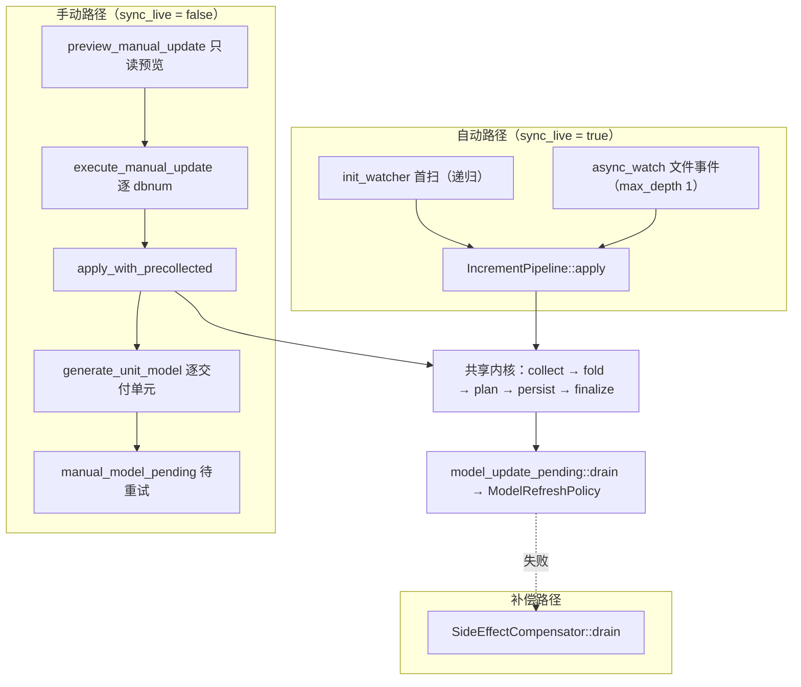

# 增量更新完整测试计划

日期：2026-07-27
项目：`D:\work\plant-code\old\gen-model`（含 `../pdms-io`、`vendor/aios-parse-pdms`、`../../rs-core-pin`）
沙箱：`D:\work\plant-code\empty1`

## 与既有文档的关系

| 文档 | 覆盖什么 | 本文与它的关系 |
|---|---|---|
| `2026-07-25_…complete-matrix-v2.md` | core.dll 的 **noun 能力矩阵**与**变化语义**（批次 A/B/C/D） | 保留，本文把它的 A/B/C 收编为阶段 S5/S6/S7 的一部分，D 批收编为 L3 |
| `2026-07-26_increment-update-chain-audit-report.md` / `-round2.md` | 链路缺陷分析 | 保留其问题分析，待办清单以下一行为准 |
| `2026-07-27_increment-update-backlog-reaudit-and-fixes.md` | 待办真实剩余集 + 本轮修复 | 本文的「已知阻塞」直接继承其 §7 |
| `specs/manual-model-update.md` | 手动更新功能规格（12 条验收标准） | 本文 S0–S10 的断言必须能追溯到它 |
| **本文** | **整条增量更新链路的测试分层、逐阶段矩阵、可执行性改造** | 新增，是执行层面的总纲 |

---

## 0. 先说结论：现在缺的不是测试，是**测试的可执行性**

逐条清点后的现状：

| 层 | 数量 | 能跑吗 |
|---|---:|---|
| 纯函数单测（L0） | 189 passed / 0 failed † | 能，`cargo test --lib` 一条命令 |
| 实库/实文件测试（L2/L3） | **增量链路上 36 个 `#[ignore]`** ‡ | **一个都没有可复现的跑法** |
| 视觉验收（L3 第三断言） | 0 | `empty1/e2e-test/evidence` 18 个文件全是 `.txt`，零张截图 |

† 引自 `2026-07-27_…backlog-reaudit-and-fixes.md` §1，**本文未重跑**；工作区此后又有改动，
Gate 0 的第四步就是重新取这个基线。
‡ 36 是本文逐文件实测的结果（见附录 B），只统计 `data_interface/` 下的增量链路。

36 个 `live_*` 测试不是占位符，它们逻辑完整、断言具体（崩溃恢复、死信复活、共享 SPCO 级联 67 个 BRAN、真实删除会话清理模型……），
写它们的人显然是手工跑通过一次的。它们跑不起来的原因是**夹具寻址方式**：

```rust
// rs-core-pin/src/lib.rs:189（gen-model 通过 [patch] 指向这份钉版拷贝）
let s = Config::builder().add_source(File::with_name("DbOption")).build()?;
```

配置文件名写死、按 **cwd** 解析、**没有环境变量入口**。而 `cargo test` 的 cwd 恒为 crate 根，
于是所有 `live_*` 永远连 `gen-model/DbOption.toml` 里的那一个库：

```
v_port = 8009      # 内存实例，进程一死即失，实测 17 张表
project_name = "AvevaMarineSample" / surreal_ns = 1516
```

而真实数据在 **8042 / ns 2077 / AvevaPlantSample**（`pe` 519,749 行）。
`empty1` 之所以要造 `e2e-test` / `e2e-test-test` / `ams-probe` 三个平行目录、每个塞一份 `DbOption.toml`，
就是在用「换 cwd」绕开这个写死。这套绕法能让**二进制**跑起来，但对 `cargo test` 无效。

上游 `rs-core` 早已有正确做法：

```rust
// rs-core/src/lib.rs:162
fn get_config_file_name() -> String {
    std::env::var("DB_OPTION_FILE").unwrap_or_else(|_| "db_options/DbOption".to_string())
}
```

**Gate 0 的全部内容就是把这 3 行搬进 `rs-core-pin`**，然后 36 个测试立刻从「写了但跑不了」变成
`$env:DB_OPTION_FILE='...'; cargo test -- --ignored` 可选靶。
在此之前写任何新的实库测试都是在增加不可执行资产。

---

## 1. 被测对象：链路分解

### 1.1 三条生产路径



三条路径**共享同一个内核**，这是测试设计的支点：内核的断言只需写一遍（L0），
路径差异只在准入、事务边界和失败处置上（L2）。

### 1.2 阶段清单

| 阶段 | 代码位置 | 职责 | 失败语义 |
|---|---|---|---|
| **S0 扫描与准入** | `increment_manager.rs`：`init_watcher` / `async_watch` / `should_process_database` / `duplicate_dbnums_across_watch_dirs` | 发现 E3D 文件、按 `db_type`+`dbnum` 过滤、阻断重复 dbnum | 该 dbnum 隔离，其余继续 |
| **S1 状态与水位** | `dbnum_state.rs`：`record_scan` / `advance_applied` / `applied_sesno` / `check_file_against_state` | 每 dbnum 一条权威状态；`applied_sesno` 是唯一水位 | 异常只隔离该 dbnum，水位绝不回退 |
| **S2 窗口解析** | `sesno_range.rs`：`SesnoRangeResolver::resolve{,_with_header}` | 水位 + 最近会话号 → `RangeInclusive<i32>`；SYS meta 冷启动 | 返回 `None` = 无事可做 |
| **S3 收集** | `increment_pipeline.rs::collect_changes` → `pdms-io::collect_increment_eles` | 打开文件、按 sesno 取元素操作，**无副作用** | 整批失败，不推水位 |
| **S4 折叠** | `increment_pipeline.rs::fold_window` / `fold_modified_run` | 同 refno 连续 Modified 合并到最后一次 | 纯函数，只可能算错不可能失败 |
| **S5 影响判定** | `model_impact.rs`：`classify_operation_impact` + 四张属性表 + DCHC 快照 | 变化 →（Data / Transform / Geometry / Cascade）效果 | `Unknown` 保守判为 Regen |
| **S6 生成根解析** | `generation_root.rs` + `manual_update.rs`：`resolve_delivery_unit` / `build_owner_overlay` / `build_unit_rollup` | 变化元素 → 最小交付单元或 significant-owner | 解析不出 → `no_generation` 显式桶 |
| **S7 反向级联** | `manual_update.rs`：`extract_reverse_ref_edges` / `build_reverse_index_statements` / `rebuild_reverse_index` / `collect_ref_reversal_closure` | 维护 `ref_rev`，共享引用 → 使用者生成根 | **非致命**，只记 warning，不阻塞水位 |
| **S8 落库** | `increment_pipeline.rs`：`persist_latest_main_data` / `datacenter_statements` | 写 `pe` 主数据 + 交付状态语句 | 失败 → 缓存仍失效、水位不推进 |
| **S9 耐久与水位推进** | `model_update_pending.rs`：`prepare_attempt` / `finalize_attempt` / `load_attempt` | 写前定范围+计划，写后一个事务推水位并清恢复记录 | 事务失败 → attempt 留存，整窗可重放 |
| **S10 模型重生成** | `model_update_pending::drain` / `model_refresh.rs` / `manual_update::generate_unit_model` | 按生成根重建几何、按 `pe.deleted` 清理 | 数据不回滚，落待重试队列 |
| **S11 补偿** | `side_effect_pending.rs` | 水位之后的副作用（模型刷新 / SYST 派生同步）重试 | 幂等重放 |
| **S12 缓存失效** | `increment_pipeline.rs::invalidate_caches` + `collect_cache_invalidation_refnos` | 变化元素 + owner 两侧 + 全局 world transform | 必须在**每次尝试落库后**执行，含部分失败 |
| **S13 CATA 按需闭包** | `cata_closure.rs` | ref0→dbnum 定位、by-refno 部分解析、引用闭包 BFS | 惰性兜底，失败降级 |

---

## 2. 测试分层

| 层 | 依赖 | 运行方式 | 单次时长 | 门禁 |
|---|---|---|---|---|
| **L0 纯函数** | 无 | `cargo test --lib` | 分钟级 | **每次提交必跑** |
| **L1 源码契约** | 无（读自己的源码） | 同 L0 | 秒级 | 每次提交必跑 |
| **L2 隔离实库** | 8042 隔离 SurrealDB + 夹具数据 | `DB_OPTION_FILE=… cargo test -- --ignored <name>` | 分钟级 | 合并前必跑 |
| **L3 端到端重放** | L2 + 真实 E3D 工程文件（+ E3D 授权） | `empty1/tools/*.ps1` 编排 | 十分钟～小时级 | 发版前必跑 |
| **L4 性能与鲁棒** | 真实工程文件（只读） | `incr_fold_probe` / 崩溃注入 | 分钟～十分钟 | 性能相关改动必跑 |

**L1 是这个仓库的特色层，值得保留**：像「重复 dbnum 判定必须早于 `record_scan`」这种顺序约束，
嵌在依赖实库的大函数里、无法用纯函数钉住，现有做法是直接对源码文本断言
（`duplicate_dbnum_guard_precedes_scan_record_on_both_auto_paths`，marker 用 `concat!` 拼接避免自命中）。
这类断言便宜且防回归，凡是「顺序 / 存在性」约束都优先考虑 L1，不要为它去搭实库。

---

## 3. 环境与夹具

### 3.1 实例现状（2026-07-27 核对）

| 端口 | 后端 | NS / DB | 内容 | 定位 |
|---|---|---|---|---|
| **8042** | `empty1\e2e-test\surreal-data`（rocksdb，6.9 GB） | 2077 / AvevaPlantSample(218 表)、TEST(99 表) | `pe` 519,749 / `pe_owner` 5,048,260 / `SUPPO` 11,801 / `ref_rev` 221 | **L2/L3 主力靶** |
| 8043 | `empty1\ams-probe\surreal-data`（0.5 GB） | 1516 / AvevaCatalogue、AvevaMarineSample | CATA 探针数据 | S13 靶 |
| 8009 | memory | 1516 / AvevaMarineSample（17 表） | 进程一死即失 | 现状默认靶，**不适合做断言** |
| 8020 | ams7997 rocksdb | 1516、main | **两个库都是 0 张表** | 用户自留，勿碰 |

两个反复被踩的坑，写进计划以免再踩：

- 主力库 218 张表里**没有 `inst_info`、没有 `geo_relate`**；那 41 行 `MESH` 是 E3D 的 MESH 元素 noun，
  不是生成出来的网格。**「库里没有生成几何」是 S10 全部实库断言的共同前置**，不是「库是空的」。
- `empty1/.probe.txt` 里 `pe = 0` 是打在 8020 上的，与沙箱无关。

### 3.2 夹具分级

| 级别 | 内容 | 建立方式 | 用于 |
|---|---|---|---|
| **F0** | 纯内存构造的 `EleOperationData` / `OwnershipSnapshot` | 测试内联 | L0 |
| **F1** | 一个空 NS/DB + 若干条手写记录 | `DEFINE`/`INSERT` 前置语句 | L2 的状态机类断言（S1/S9/S11） |
| **F2** | 8042 上 AvevaPlantSample 的**现状快照** | `snapshot_db.ps1` 抓基线，测后 `compare_snapshots.ps1` 对拍 | L2 的读多写少断言（S6/S7） |
| **F3** | 真实 E3D 工程 + 已知会话窗口 | `E3D3.1-e2e` 夹具工程 + `scripts/e3d/*.mac` | L3 |

F1 是目前最缺的一级。`model_update_pending` 的 10 个 `live_*` 全部用 `DBNUM = 4_294_967_000` 这类
魔术大号在真实库里造行——这是在没有 F1 的情况下的合理妥协，但它把测试数据混进了主力库。
Gate 1 应给出一个「一次性 NS」辅助：`test_ns_<pid>_<nonce>`，测完 `REMOVE NAMESPACE`。

### 3.3 empty1 工具链映射

| 阶段 | 工具 |
|---|---|
| 起隔离库 | `tools/start_isolated_surreal.ps1`（8042 + 健康检查） |
| 建隔离 cwd | `tools/setup_isolated_env.ps1`（junction assets，config 独立副本） |
| 构建探针 | `tools/build_backend_bins.ps1`（独立 `CARGO_TARGET_DIR`，不污染主 target） |
| 基线导入 | `tools/run_baseline.ps1`（29 个非空 DESI） |
| 抓快照 / 对拍 | `tools/snapshot_db.ps1` / `tools/compare_snapshots.ps1` |
| 并发会话检测 | `tools/watch_repo_idle.ps1`（`.rs` 改动 + cargo 进程静默 N 分钟） |

---

## 4. 逐阶段测试矩阵

状态记号：**绿** = 已有测试且能跑；**写了跑不了** = 代码里有 `#[ignore]` 的完整测试；**缺** = 无测试。

### S0 扫描与准入

| ID | 断言 | 层 | 现有测试 | 状态 |
|---|---|---|---|---|
| IU-S0-01 | 同一 dbnum 出现在多个路径时被识别 | L0 | `duplicate_dbnums_are_detected_across_separate_paths` | 绿 |
| IU-S0-02 | 重复 dbnum 阻断**早于** `record_scan` 落库，两条自动路径都是 | L1 | `duplicate_dbnum_guard_precedes_scan_record_on_both_auto_paths` | 绿 |
| IU-S0-03 | 不可读文件不被当作 E3D 库 | L0 | `unreadable_files_are_not_treated_as_e3d_databases` | 绿 |
| IU-S0-04 | `should_process_database` 遵循 `included_db_files` / `manual_db_nums` 配置 | L0 | `database_filter_uses_the_manager_option`、`test_should_exclude_file` | 绿 |
| IU-S0-05 | 文件名含 `-` 的副本被跳过并记 warning | L0 | — | **缺**（`apply_with_precollected` 里有逻辑，无断言） |
| IU-S0-06 | init 递归扫描与 watch `max_depth(1)` 的**深度不对称**符合明文约定 | L0/L1 | — | **缺**（约定本身未定，见 §10） |
| IU-S0-07 | 实目录里放入重复 dbnum 文件后该 dbnum 被阻断、其余照跑 | L2 | `live_watch_directory_blocks_duplicate_dbnum_files` | 写了跑不了 |

### S1 状态与水位

| ID | 断言 | 层 | 现有测试 | 状态 |
|---|---|---|---|---|
| IU-S1-01 | 迁移优先级：已建立 `applied_sesno` > 旧 `dbnum_watermark.sesno` > `dbnum_info_table` 最大值 | L0 | `migration_prefers_…` / `migration_inherits_…` / `migration_falls_back_…` / `migration_none_…` / `migration_preserves_zero_applied` | 绿（5 项） |
| IU-S1-02 | `file_latest_sesno < applied_sesno` 判为文件回退并阻断 | L0 | `file_rollback_is_rejected`、`file_rollback_takes_precedence_over_path_change` | 绿 |
| IU-S1-03 | 合法路径迁移被接受；`db_type` 变更被阻断 | L0 | `legal_path_migration_is_detected`、`db_type_change_is_blocked` | 绿 |
| IU-S1-04 | `record_scan` **绝不**移动 `applied_sesno` | L2 | `live_record_scan_never_moves_the_applied_watermark` | 写了跑不了 |
| IU-S1-05 | `advance_applied` 单调不减（`math::max`），并发推进不倒退 | L0 | — | **缺**（只进不退是靠 `math::max` 实现，无断言） |
| IU-S1-06 | 已登记文件缺失时保留数据/模型/水位 | L0 | — | **缺**（规格 §文件异常 第 3 行） |

### S2 窗口解析

| ID | 断言 | 层 | 现有测试 | 状态 |
|---|---|---|---|---|
| IU-S2-01 | 水位 ≥ `file_latest_sesno` 时返回 `None`，且**不开文件** | L0 | — | **缺**（`resolve` 有 cheap pre-check，值得钉住） |
| IU-S2-02 | 水位为 0 时 DESI/CATA 一律跳过（不猜历史） | L0 | — | **缺** |
| IU-S2-03 | 水位为 0 时 SYST/DICT/GLB/GLOB 冷启动，区间 = `get_nearest_large_sesno(1)..=file_latest` | L0 | — | **缺** |
| IU-S2-04 | `nearest > file_latest_sesno` 时返回 `None` | L0 | — | **缺** |
| IU-S2-05 | `skip_cata` 在 init 与 watch 两条路径取值一致 | L1 | — | **缺**（模块文档明确要求，无守护） |

> S2 是**零测试阶段**，而它决定「这次要读哪段」——窗口取错，后面每个阶段都在处理错误的数据。
> 它的输入只有 `(watermark, file_latest_sesno, db_type, nearest)` 四个标量 —— 把 `get_nearest_large_sesno`
> 抽成 trait 或参数后，S2-01…04 全部是纯函数断言。**这是投入产出比最高的一处补测。**

### S3 收集

| ID | 断言 | 层 | 现有测试 | 状态 |
|---|---|---|---|---|
| IU-S3-01 | `collect_changes` 无副作用：不写 `pe`、不写元数据、不动水位 | L2 | — | **缺**（规格验收标准 1） |
| IU-S3-02 | 一次执行对同一 (文件, 窗口) 只收集一次 | L1 | `execute_one_dbnum_collects_the_window_exactly_once` | 绿 |
| IU-S3-03 | 崩溃重放（`prepared.is_some()`）**永远重新收集**，不复用交入窗口 | L0 | — | **缺**（`range == requested_range` 守卫无直接断言） |
| IU-S3-04 | 交入窗口区间不匹配时回退到自行收集 | L0 | — | **缺** |
| IU-S3-05 | 日志中 `collect sesno:` 行数 = 窗口会话数（不是两倍） | L3 | — | 手工核对过，未自动化 |

### S4 折叠

| ID | 断言 | 层 | 现有测试 | 状态 |
|---|---|---|---|---|
| IU-S4-01 | 连续 Modified 合并到最后一次会话的位置 | L0 | `a_run_of_modified_collapses_onto_its_last_session` | 绿 |
| IU-S4-02 | 键级语义：删后加保留新值；加后删清空；后会话逐键胜出 | L0 | `a_key_deleted_then_re_added_…` / `a_key_added_then_deleted_…` / `later_sessions_win_per_key_…` | 绿 |
| IU-S4-03 | Add/Deleted 打断 run，永不并入 | L0 | `add_and_deleted_break_a_run_and_are_never_merged` | 绿 |
| IU-S4-04 | 不相关 refno 保持相对顺序 | L0 | `unrelated_refnos_keep_their_relative_order` | 绿 |
| IU-S4-05 | **折叠等价于顺序重放**（核心不变量） | L0 | `merging_is_equivalent_to_replaying_the_sequence` | 绿 |
| IU-S4-06 | 真实窗口折叠后终态与不折叠重放一致 | L4 | `folding_a_real_window_preserves_final_state` | 写了跑不了（需 `AIOS_FOLD_TEST_FILE`） |

S4 是全链路测试密度最高、也最健康的阶段，可作为其他阶段的样板。

### S5 影响判定

| ID | 断言 | 层 | 现有测试 | 状态 |
|---|---|---|---|---|
| IU-S5-01 | 四张属性表逐项映射到声明 effect + action，无重名 | L0 | `curated_attribute_tables_map_to_…`、`attribute_effect_tables_have_no_duplicate_names` | 绿 |
| IU-S5-02 | 全部 runtime schema 属性可分类，引用类不落 `Unknown` | L0 | `att_meta_all_attributes_classify_and_references_affect_model`（6556 属性 / 1421 引用类） | 绿 |
| IU-S5-03 | 六个变化桶到本地 `NetOp` 是全映射且优先级无歧义 | L0 | `core_user_change_kinds_and_effect_precedence_are_total` | 绿 |
| IU-S5-04 | OWNER 变化 → Moved，新旧 owner 都记 member-changed | L0 | `b_evt_01_…`、`owner_move_retains_both_membership_sides` | 绿 |
| IU-S5-05 | 新建元素 → 其 owner 记 member-changed | L0 | `b_evt_02_created_element_records_owner_membership` | 绿 |
| IU-S5-06 | 成员差分只对 `primaryList` 类型执行 | L0 | `b_evt_03_member_diff_only_runs_for_primary_list_types` + `core_primary_list_snapshot_is_complete_and_self_consistent` | 绿（2026-08-28：core.dll 快照 1931 resolved / 0 unknown / false 789，全部进入实际 gate。2026-08-18 那 52 个 unknown 是旧读取通道的假象，换 `DB_Noun::getField` 后全部解析为 false） |
| IU-S5-07 | 重排与增删成员是不同事件，但都触发父根重生成 | L0 | `b_evt_04_…`、`child_list_change_distinguishes_reorder_from_membership` | 绿 |
| IU-S5-08 | 字典全量 noun 的更新策略是全函数（无 noun 落空） | L0 | `all_dictionary_nouns_have_a_total_incremental_update_policy` | 绿 |
| IU-S5-09 | 字典 `point==true` 的容器一律不作生成根 | L0 | `every_dictionary_point_container_is_skipped_as_a_generation_root` | 绿 |
| IU-S5-10 | DCHC 码只承认 `REDRAW=4`/`INTUBE=1` + 字典快照，不伪造 | L0 | `dchc_codes_cover_forced_and_dictionary_snapshot` | 绿 |
| IU-S5-11 | 数组属性保留变化的 qualifier 下标 | L0 | `array_attribute_effect_retains_changed_qualifier` | 绿 |
| IU-S5-12 | 真实 ProjAMS 会话里 direct / transform / data-only 三类计划与执行确实不同 | L2 | `live_projams_real_attribute_sessions_plan_and_execute_distinctly` | 写了跑不了 |

S5 已经很扎实（32 个测试），Gate 阶段**不需要新增**，只需把 S5-12 变可跑。

### S6 生成根解析

| ID | 断言 | 层 | 现有测试 | 状态 |
|---|---|---|---|---|
| IU-S6-01 | 净变化折叠：add→modify=add、modify→delete=delete、add→delete=cancelled、delete→re-add=added | L0 | `add_then_modify_is_a_single_add` 等 7 项 | 绿 |
| IU-S6-02 | 交付单元类型来自配置；`[]` 表示全走正常颗粒；FTUB/WORL/SITE/ZONE 恒被拒 | L0 | `delivery_types_union_uppercases_and_dedups`、`default_delivery_types_are_used_with_empty_config` | 绿 |
| IU-S6-03 | FTUB 及其子件归并到所属 BRAN | L0 | `ftub_and_its_children_roll_up_to_their_branch`、`tubi_change_regenerates_its_owning_branch` | 绿 |
| IU-S6-04 | 嵌套交付单元只取**最近**祖先 | L0 | `nested_delivery_types_pick_only_the_nearest` | 绿 |
| IU-S6-05 | 跨单元移动同时重生成新旧两个单元；同单元换 ZONE 只算 modify | L0 | `cross_unit_move_regenerates_both_units`、`same_unit_moving_zones_is_just_a_modify` | 绿 |
| IU-S6-06 | 删除按**更新前**快照解析；新增按 overlay 解析；同窗口内祖先移动仍解析到同一单元 | L0 | `delete_resolves_against_pre_update_snapshot`、`added_element_resolves_through_the_overlay`、`ancestor_moving_in_the_same_window_keeps_the_same_unit` | 绿 |
| IU-S6-07 | owner 链断裂 / 自环 / 缺失 owner 都有确定行为 | L0 | `unit_resolves_even_when_owner_chain_breaks_above_it`、`delivery_unit_resolution_handles_self_missing_and_cycles`、`missing_owner_uses_the_changed_element_as_normal_root` | 绿 |
| IU-S6-08 | cancelled 变化不进 rollup | L0 | `cancelled_changes_never_reach_the_rollup` | 绿 |
| IU-S6-09 | ZONE 只做统计，解析不出时进显式警告桶 | L0 | `zone_rollup_keeps_unknown_as_an_explicit_reporting_bucket`、`zone_rollup_reports_both_sides_of_a_cross_zone_move` | 绿 |
| IU-S6-10 | 交付单元在一批内按最终状态**只生成一次** | L0 | `collect_unit_tasks_dedupes_by_root_and_skips_non_generating` | 绿 |

### S7 反向级联

| ID | 断言 | 层 | 现有测试 | 状态 |
|---|---|---|---|---|
| IU-S7-01 | 级联目标去重、排除自身、支持引用列表 | L0 | `reference_cascade_targets_dedupes_and_excludes_self` 等 3 项 | 绿 |
| IU-S7-02 | **下界**：`getDependencies` 语义要求的使用者一个不少 | L0 | `c_ref_02_cascade_lower_bound_covers_every_dependency_reference` | 绿 |
| IU-S7-03 | **上界**：非依赖属性一律不建边 | L0 | `c_ref_03_cascade_upper_bound_rejects_every_non_dependency_attribute` | 绿 |
| IU-S7-04 | 传递级联、环安全、空索引是 noop | L0 | `reverse_cascade_is_transitive_through_catalog_intermediates`、`…_transitive_is_cycle_safe`、`…_dedupes_and_empty_index_is_a_noop` | 绿 |
| IU-S7-05 | 删除清理边；`None` 不写索引；重建结果与增量维护一致 | L0 | `extract_reverse_ref_edges_deleted_purges_and_none_is_noop`、`build_reverse_index_statements_skips_none_…` | 绿 |
| IU-S7-06 | `ref_rev` 写失败**不阻塞**水位推进，只记 warning | L0/L1 | — | **缺**（`apply_one` 明确这样实现，无断言守护） |
| IU-S7-07 | 共享 SPCO 展开到真实生成根，覆盖全部使用者 | L2 | `live_shared_spco_expands_to_generation_roots`、`live_rebuild_ref_rev_covers_shared_spco_consumers`、`live_ref_rev_roundtrip_selfcheck` | 写了跑不了（3 项） |

> C-REF-02/03 有个陷阱已被前一轮识别并处理，写进计划以免复现：
> 两个测试都带 `if schema_names.is_empty() { return; }` 的**静默早退**，schema 加载失败会「绿得毫无意义」。
> 现在靠末尾的反空转断言（`checked > 100` / `checked > 300`）证明早退没触发。
> **新写的扫描类测试一律照此办理：早退 + 反空转计数断言成对出现。**

### S8 落库

| ID | 断言 | 层 | 现有测试 | 状态 |
|---|---|---|---|---|
| IU-S8-01 | 每条语句自终结，chunk 可直接拼接 | L0 | `every_statement_is_self_terminated_so_a_chunk_can_be_concatenated` | 绿 |
| IU-S8-02 | 事务包裹是全有或全无 | L0 | `wrap_in_transaction_is_atomic_or_none` | 绿 |
| IU-S8-03 | 交付单元 noun 直接更新，其余上卷到祖先；删除记录归属 ZONE；`None` 不产语句 | L0 | `delivery_unit_nouns_update_directly_…`、`deletions_record_the_owning_zone_and_no_ops_render_nothing` | 绿 |
| IU-S8-04 | 同一窗口重复应用是幂等的（`pe`/`pe_owner` 不重复膨胀） | L2 | `live_add_pe_owner_replay_is_idempotent` | 写了跑不了 |
| IU-S8-05 | 部分失败时**缓存仍失效**、水位不推进 | L0/L2 | — | **缺**（`apply_one` 注释明确要求，无断言） |
| IU-S8-06 | 落库不产生「事务未提交也未取消」告警 | L2 | — | **缺**（`surreal_8042.log.err` 里有 3 条，未定位） |

### S9 耐久与水位推进

| ID | 断言 | 层 | 现有测试 | 状态 |
|---|---|---|---|---|
| IU-S9-01 | `prepare_attempt` 往返固定区间与模型计划 | L0 | `prepared_attempt_round_trips_the_fixed_range_and_model_plan` | 绿 |
| IU-S9-02 | 文件不再覆盖固定区间时拒绝重放 | L0 | `prepared_attempt_rejects_a_file_that_no_longer_covers_fixed_range` | 绿 |
| IU-S9-03 | finalize 是一个事务：交付状态 + 模型工作 + 水位 + 清恢复记录 | L0 | `finalization_is_one_transaction_with_…` | 绿 |
| IU-S9-04 | 复活语句在它读取的水位字段**之前**执行 | L1 | `revival_clauses_run_before_the_watermark_field_they_read` | 绿 |
| IU-S9-05 | 死信留在表内，不被 drain 吞掉 | L0 | `drain_select_leaves_dead_letters_in_the_table` | 绿 |
| IU-S9-06 | 记录 id 按 (dbnum, action, target) 稳定 | L0 | `record_id_is_stable_per_dbnum_action_and_target`、`pending_record_id_is_stable_per_dbnum_and_root` | 绿 |
| IU-S9-07 | finalize 崩溃安全且幂等 | L2 | `live_finalize_is_crash_safe_and_idempotent` | 写了跑不了 |
| IU-S9-08 | **OS 强杀**后 prepared attempt 仍在，重启可续 | L2 | `live_os_kill_preserves_prepared_attempt` | 写了跑不了 |
| IU-S9-09 | 一次 drain 消费整个队列（不受旧 50 行上限约束） | L2 | `live_non_regen_drain_consumes_the_whole_queue` | 写了跑不了 |
| IU-S9-10 | 一条坏队列记录不拖垮其余 | L2 | `live_failed_queue_cleanup_does_not_stall_the_rest` | 写了跑不了 |

### S10 模型重生成

| ID | 断言 | 层 | 现有测试 | 状态 |
|---|---|---|---|---|
| IU-S10-01 | 一个 dbnum 失败不阻断其他；数据成功+模型失败=部分完成 | L0 | `one_dbnum_failing_while_others_succeed_is_partial`、`data_success_with_model_failure_is_partial` | 绿 |
| IU-S10-02 | 无任何成功=失败；无可执行工作=已是最新 | L0 | `nothing_succeeding_is_failed_and_nothing_executable_is_up_to_date` | 绿 |
| IU-S10-03 | 失败的副作用不得报成功或已最新 | L0 | `failed_side_effect_cannot_be_reported_as_success_or_up_to_date` | 绿 |
| IU-S10-04 | 待重试与新数据影响的同一单元合并去重，按最新状态生成一次 | L0 | `worklist_merges_pending_with_new_units_keeping_latest_state` | 绿 |
| IU-S10-05 | 同项目手动执行互斥 | L0 | `project_exec_guard_is_exclusive_per_project` | 绿 |
| IU-S10-06 | 生成失败时 pending 与水位都保持 | L2 | `live_generation_failure_keeps_pending_and_watermark` | 写了跑不了 |
| IU-S10-07 | BRAN / HANG / SUPPO / ZONE-owned EQUI 四类 pending 真的被重生成 | L2 | `live_bran_…` / `live_hang_…` / `live_suppo_…` / `live_zone_owned_equi_…` | 写了跑不了（4 项） |
| IU-S10-08 | 共享 SPCO 级联真的重生成 67 个 BRAN | L2 | `live_shared_spco_cascade_regenerates_every_consumer` | 写了跑不了 |
| IU-S10-09 | 删除后 inst/mesh/旧根无残留，含无 `geo_relate` 的 `inst_info` | L2 | `live_inst_info_without_geo_relate_is_reclaimed`、`live_soft_deleted_subtree_removes_all_model_nodes`、`live_shared_inst_info_is_deleted_only_after_last_reference` | 写了跑不了（3 项） |
| IU-S10-10 | 真实删除会话清理模型并重生成所属 BRAN | L3 | `live_real_delete_session_cleans_up_model_and_regenerates_branch` | 写了跑不了 |
| IU-S10-11 | FTUB 删除 / 移动 / 重排的真实组合 | L3 | `live_real_ftub_delete_move_and_reorder` | 写了跑不了 |

### S11 补偿 / S12 缓存 / S13 CATA

| ID | 断言 | 层 | 现有测试 | 状态 |
|---|---|---|---|---|
| IU-S11-01 | 补偿任务落库、drain 时重试、`model_refresh` 走幂等 Owner 重生成路径 | L0 | — | **缺**（`side_effect_pending.rs` 零测试） |
| IU-S11-02 | 分类过的 payload 不从磁盘重放 | L0 | — | **缺** |
| IU-S12-01 | 失效集合 = 变化元素 ∪ 当前 owner ∪ OWNER 移动的两侧 | L0 | `cache_targets_are_deduped_and_none_operations_are_skipped` | 绿（部分） |
| IU-S12-02 | 缓存失效在**部分失败**后仍执行 | L0/L2 | — | **缺**（同 IU-S8-05） |
| IU-S13-01 | ref0→dbnum 定位、by-refno 部分解析、闭包 BFS 收口 CATA | L0 | `cata_closure.rs` 8 项 | 绿 |
| IU-S13-02 | 闭包逐跳加载、环终止 | L0 | `reverse_cascade_closure_loads_every_hop`、`…_terminates_on_cycles` | 绿 |
| IU-S13-03 | 缺 CATA 的首次请求触发按需生成并落闭包 | L2 | `live_generates_a_missing_model` | 写了跑不了 |

---

## 5. 跨阶段不变量

这六条不属于任何单一阶段，**每一条都应该有一个独立测试直接命名它**，而不是散落在阶段测试里被间接覆盖：

| ID | 不变量 | 现状 |
|---|---|---|
| IU-INV-01 | **预览零副作用**：`preview_manual_update` 不写元素、不写模型、不动 `applied_sesno`（只允许写扫描观察字段） | 规格验收标准 1，**无端到端断言** |
| IU-INV-02 | **水位单调**：任何路径任何失败下 `applied_sesno` 只增不减 | 靠 `math::max` 实现，**无断言** |
| IU-INV-03 | **重放幂等**：同一 (dbnum, 窗口) 重放两次，`snapshot_db.ps1` 前后逐行相同 | 有跑法（§7 Gate 2），**未执行过** |
| IU-INV-04 | **dbnum 隔离**：任一 dbnum 的任何失败都不影响其他 dbnum | L0 有（IU-S10-01），实库无 |
| IU-INV-05 | **折叠等价**：折叠后落库终态 = 逐条重放终态 | L0 绿（IU-S4-05），真实窗口级 IU-S4-06 跑不了 |
| IU-INV-06 | **收集一次**：一个窗口在一次执行中只被解析一次 | L1 绿（IU-S3-02），日志级 IU-S3-05 未自动化 |

IU-INV-03 的具体跑法（写库操作，至今未执行）：

1. `empty1/tools/snapshot_db.ps1 before.txt`
2. 绕过应用层，直接发裸 SurrealQL 把 8042 上 `dbnum_watermark:8191` 的 `applied_sesno` 改回 1
   （`advance_applied` 是 `math::max`，只进不退，走应用层改不动）
3. 重放该窗口
4. `snapshot_db.ps1 after.txt`
5. `compare_snapshots.ps1 before.txt after.txt` 断言逐行相同

---

## 6. 性能与容量基线

| ID | 指标 | 当前基线 | 回归阈值 |
|---|---|---|---|
| IU-PERF-01 | 单趟 collect（dbnum=8191 SYST，1,829 元素） | 2,269 ms（改前 42,016 ms） | > 4,000 ms 视为回归 |
| IU-PERF-02 | 单趟 collect（dbnum=250206 DICT，17,006 元素） | 4,532 ms（改前 322,186 ms） | > 8,000 ms 视为回归 |
| IU-PERF-03 | 4 批次 collect 合计 | ~7 s（改前 ~737 s） | > 20 s 视为回归 |
| IU-PERF-04 | 折叠收益（8191） | 1768→1589，省 179 条 | 数值变化需解释 |
| IU-PERF-05 | 落库语句体积（8191） | 0.82 MB | — |

跑法：

```powershell
cargo run --release --bin incr_fold_probe -- `
  --file "D:\AVEVA\Projects\E3D3.1-e2e\AvevaPlantSample\aps000\apssys" --to 101 --dbnum 8191
```

三条口径声明必须随基线一起保留，否则数字会被误读：

- 现有基线全部是 **debug 构建**；release 绝对值不同，但比值应站得住。
- `incr_fold_probe` 只调一次 collect，**不受双跑修复影响**，它量的是页缓存的贡献。
- 「双跑是否消除」要数日志里 `collect sesno:` 的**行数**，不是看 `timings.collect` 数字——
  复用预收集结果时该计时器读到 0，因为成本转移到了调用方一侧。

---

## 7. 批次与门禁

| Gate | 内容 | 前置 | 退出条件 | 预估 |
|---|---|---|---|---|
| **Gate 0 可执行性** | ① `rs-core-pin` 加 `DB_OPTION_FILE` 支持；② 加 `db_options/` 目录放 8042/8043/一次性 NS 三份配置；③ 一次性 NS 辅助；④ 重跑 L0 拿到新基线 | 无 | 任取一个 `live_*` 能用环境变量指定靶跑通 | **半天，最高优先级** |
| **Gate 1 补零测试阶段** | S2 全部 5 项（抽 `get_nearest_large_sesno` 为可注入）+ S11 两项 + IU-S1-05/06 | 无（纯 L0） | 9 项新单测绿 | 1 天 |
| **Gate 2 不变量落地** | IU-INV-01/02/03/04 + IU-S8-05/S12-02 + IU-S3-03/04 | Gate 0 | 幂等重放跑完且快照逐行相同 | 1–2 天 |
| **Gate 3 实库测试上线** | 把 36 个 `live_*` 分批点亮，按 S9→S10→S7→S1 顺序 | Gate 0、Gate 2 | 每个测试有一次可复现的通过记录 + 日志归档 | 3–5 天 |
| **Gate 4 生成几何前置** | 在 8042 的 AvevaPlantSample 上真正生成一批模型（当前 218 表里无 `inst_info`/`geo_relate`） | Gate 3 | S10 的 11 项有观测对象 | 依赖生成链路本身 |
| **Gate 5 视觉验收** | D 批第三断言：修改前后同相机全景+近景截图 | Gate 4；桌面捕获 `0x80070057` 需先解决 | 每个 D 用例两张图 + 前后 JSON | 阻塞中 |

顺序不能调换的理由：Gate 3 之前点亮实库测试，等于把「测试失败」和「夹具没配对」混在一起；
Gate 4 之前跑 S10，只能得到「查无此物」而不是「结果不对」。

---

## 8. 证据规范

| 层 | 必须留存 | 位置 |
|---|---|---|
| L0/L1 | `cargo test --lib` 完整输出（含 passed/failed/ignored 三个数） | `empty1/logs/<日期>_<主题>.log` |
| L2 | 测试名 + 靶实例 + 前后快照 + 完整输出 | 同上 + `empty1/e2e-test/evidence/` |
| L3 | 上述 + 修改前后同相机截图（全景 + 近景）+ refno/noun/owner/关键属性/模型记录/AABB/world transform 的前后 JSON | `empty1/e2e-test/evidence/` |
| L4 | 探针原始输出 + 构建模式 + 文件与窗口标识 | `empty1/logs/` |

截图只接受来自 `rs-plant3-d`，不接受 `plant3d-web`，也不接受数据库记录的截图。

---

## 9. 验收口径

### 可以宣称

- L0 全绿 ⇒ 「纯逻辑层无回归」。
- 某阶段矩阵全绿（含其 L2 行）⇒ 「该阶段在隔离实库上行为符合规格」。
- IU-INV-03 通过 ⇒ 「落库幂等」。
- 某 D 用例三断言（数据 / 模型 / 视觉）全绿 ⇒ 「该变化等价类端到端通过」。

### 不能宣称

- **`cargo test --lib` 全绿 ≠ 增量更新可用。** 36 个实库测试全部在 ignored 里，
  报告任何「测试全通过」时必须同时给出 ignored 数字。
- **等价类抽样 ≠ 全覆盖。** 未被抽到的 noun 只享有「同类推定」。
- **`changeType` 等价类是变化处理分类，不是几何生成分类。** 同类走同一变化路径，不代表共用生成器。
- **DCHC 在活字典导出完成前只有两个确定码**（`REDRAW=4` / `INTUBE=1`），其余按效果分类，不得伪造。
- **数据成功不能顶替视觉成功。** 桌面捕获仍报 `0x80070057` 时，相关用例记「视觉证据阻塞」。
- **静默早退的绿不算绿。** 带早退分支的扫描测试若无反空转计数断言，视为未通过。

---

## 10. 已知阻塞与前置

| # | 项 | 影响 | 处置 |
|---|---|---|---|
| 1 | **跨仓未提交**：gen-model 217 / pdms-io 37 / rs-core-pin 5 / plant-io 14 个改动全在工作区 | 任何测试基线都不可复现 | Gate 0 之前先落一次提交；提交前用 `watch_repo_idle.ps1` 确认无并行会话在写 |
| 2 | **主力库无生成几何**（218 表无 `inst_info`/`geo_relate`） | S10 全部 11 项 + P0-1 无观测对象 | Gate 4 |
| 3 | **视觉证据为零** | D 批第三断言全线为空 | Gate 5，先解 `0x80070057` |
| 4 | ~~`primary_list_hint()` 仍恒返回 `true`~~ | **2026-08-18 CLOSED**：live core.dll 同字段读取链冻结 1931 noun。**2026-08-28 补全**：换用 `DB_Noun::findNoun` + `getField`（旧的 `db_get_element_info` 是只认五个 field id 的外壳）后 1931 全部 resolved，原 52 个 unknown 全为 false，兜底只剩「快照之外的 noun」一种情况 | `tests/fixtures/core-primary-list-e3d31.json` + B-EVT-03 + 快照完整性测试 |
| 5 | B6：CATA 派生根仍继承目录库 dbnum | 死信只能被 CATA 新会话复活 | 记为开放缺陷，补 L0 断言钉住现状再改 |
| 6 | B4：init 递归 vs watch `max_depth(1)` 深度不对称 | IU-S0-06 无法写断言（约定未定） | 先定约定：init 降一层，还是 watch 改递归 |
| 7 | 3 条 `A transaction was dropped without being committed or cancelled`（`surreal_8042.log.err`） | IU-S8-06 | 未定位代码路径 |
| 8 | `get_refno_operation_status` 重复 B+ 树下降 | 性能，页缓存后边际收益已小 | 不阻塞测试 |

---

## 附录 A：命令速查

```powershell
# L0：全量单测（必须同时记录 ignored 数）
. D:\work\plant-code\empty1\tools\build_env.ps1
$env:CARGO_TARGET_DIR = 'D:\Rust\target-gen-model-codex'
cd D:\work\plant-code\old\gen-model
cargo test --lib 2>&1 | Out-File D:\work\plant-code\empty1\logs\l0_baseline.log -Encoding UTF8

# L2：Gate 0 之后（DB_OPTION_FILE 落地后才可用）
$env:DB_OPTION_FILE = 'db_options/DbOption-e2e-8042'
cargo test --lib live_finalize_is_crash_safe_and_idempotent -- --ignored --nocapture

# L2 现状变通（Gate 0 之前唯一跑法：换 cwd）
cd D:\work\plant-code\empty1\e2e-test
& D:\Rust\target-gen-model-codex\debug\deps\aios_database-<hash>.exe live_xxx --ignored --nocapture

# L3：隔离环境准备 + 幂等重放
.\tools\start_isolated_surreal.ps1
.\tools\snapshot_db.ps1 .\e2e-test\evidence\before.txt
# …重放…
.\tools\snapshot_db.ps1 .\e2e-test\evidence\after.txt
.\tools\compare_snapshots.ps1 .\e2e-test\evidence\before.txt .\e2e-test\evidence\after.txt

# L4：性能基线
cargo run --release --bin incr_fold_probe -- --file "<apssys 路径>" --to 101 --dbnum 8191
```

## 附录 B：阶段 ↔ 测试文件

2026-07-27 逐文件实测（`#[test]` / `#[tokio::test]` 计数，含 `#[ignore]`）：

| 阶段 | 文件 | 测试 | ignored | **可跑** |
|---|---|---:|---:|---:|
| S0 | `increment_manager.rs` | 7 | 2 | 5 |
| S1 | `dbnum_state.rs` | 12 | 1 | 11 |
| **S2** | `sesno_range.rs` | **0** | 0 | **0** |
| S3/S4/S8/S9 | `increment_pipeline.rs` | 22 | 6 | 16 |
| S5 | `model_impact.rs` | 32 | 0 | 32 |
| S6/S7 | `manual_update.rs` | 75 | 5 | 70 |
| S6 | `generation_root.rs` | 7 | 0 | 7 |
| S9/S10 | `model_update_pending.rs` | 16 | 10 | 6 |
| S5/S10 | `model_update_plan.rs` | 10 | 4 | 6 |
| **S10** | `model_refresh.rs` | 2 | 2 | **0** |
| S10 | `helper.rs` | 8 | 5 | 3 |
| **S11** | `side_effect_pending.rs` | **0** | 0 | **0** |
| S13 | `cata_closure.rs` | 8 | 0 | 8 |
| S13 | `on_demand_model.rs` | 3 | 1 | 2 |
| — | `db_model.rs` | 2 | 0 | 2 |
| — | `increment_record.rs` | 0 | 0 | 0 |
| **合计** | | **204** | **36** | **168** |

三个**零可跑覆盖**的模块：`sesno_range.rs`（无测试）、`side_effect_pending.rs`（无测试）、
`model_refresh.rs`（2 个测试全是 `#[ignore]`）。前两个是 Gate 1 的全部内容，第三个由 Gate 0 解锁。

注意 168 与 §0 表里的 189 不是同一口径：189 是整个 crate 的 `cargo test --lib` 计数，
168 只统计 `data_interface/` 下的增量链路。
