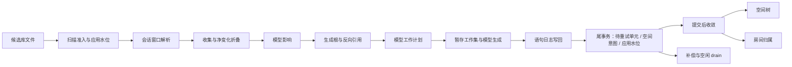

# 增量模型生成 · 单元测试总纲

原始建账：2026-08-06
本次汇总：2026-08-13
状态：现行主文档

> **重要口径**
>
> - 本文是增量模型生成测试的统一入口，汇总数据、模型、暂存、队列、空间树与房间归属相关的单元测试工作。
> - “单元测试”严格指不依赖外部 SurrealDB / E3D 的纯函数、源码契约和进程内 kv-mem 测试。离线文件夹具、live / ignored、真实 E3D 与视觉验收只在本文登记边界和入口，不冒充单元测试。
> - 测试是否存在以当前源码为准；live 是否验证过以
>   `docs/2026-08-12_live-test-ledger.md` 为唯一事实来源。
> - 本文不再长期维护硬编码总数。数字只作为带日期的校准快照；每次执行用命令重新计算。

## 0. 本文解决什么

此前与增量模型生成测试相关的内容散落在 S0–S13 阶段矩阵、U1–U13 单测分组、三阶段总纲、暂存窗口方案、房间 RS/RF/RL 场景、live 台账和 db8000 离线夹具计划中。它们各自有价值，但也产生了四类问题：

1. 同一测试在不同文档中被不同编号重复描述；
2. 历史计数和状态已经过期，例如“S2 零测试”“`src/data_interface/side_effect_pending.rs` 零测试”“`spatial_tree` 九键契约”均已不成立；
3. 进程内单测、离线集成、外部数据库 live 与 E3D 实机测试被混在同一张表里；
4. 已完成项、仍缺项和只能在 live 层证明的事项没有清晰边界。

本文负责：

- 固定唯一的测试分层和编号解释；
- 把阶段、不变量、现有测试和待补测试放到同一张地图上；
- 给每项待补测试写出落点、输入、断言和回退即红条件；
- 给出按改动范围选组和最终门禁；
- 只链接 live / E3D 事实，不复制会迅速漂移的执行台账。

本文不负责：

- 重复记录每条 live 用例的最近通过时间；
- 取代房间实机场景的金基线、场景宏对和恢复合同；
- 用单元测试结果宣称真实项目的几何或视觉闭环已经通过。

## 1. 权威来源与冲突裁决

| 内容 | 权威来源 | 本文如何使用 |
|---|---|---|
| 术语 | `CONTEXT.md` | 全文使用“生成根、模型影响、应用水位、待重试单元、房间归属、AABB 变更集”等规范术语 |
| 应用水位 | `docs/adr/ADR-001-dbnum-update-state.md` | 失败不推进、观察值不冒充权威值、默认单调不回退 |
| 房间归属 | `docs/adr/ADR-010-room-membership-incremental-update.md` | 增量终态必须与同数据全量重建逐边相等 |
| 单队列单消费者 | `docs/adr/ADR-011-one-data-batch-queue-for-manual-and-auto.md` | 自动与手动路径共用准入、队列和 worker |
| 合批与待重试单元 | `docs/adr/ADR-012-batched-root-regeneration.md`、`docs/adr/ADR-013-generation-outcome-separate-from-pending.md`、`docs/adr/ADR-015-pending-work-identity.md` | fresh 根合批、生成结果与待重试单元分离、revision 收口 |
| 分支原子替换 | `docs/adr/ADR-014-branch-atomic-model-replacement.md` | 一个生成根的新旧模型不得形成外部可见的半状态 |
| 暂存窗口 | `docs/adr/ADR-017-staged-increment-window-commit.md` | 提交单元、ReplaySafe、应用水位门控写回、窗口阻断 |
| 单测是否存在 | `src/**` 当前源码 + `cargo test --lib -- --list` | 文档旧计数不得覆盖源码事实 |
| 离线 CI | `.github/workflows/windows-tests.yml` | 机器实际执行步骤优先于文字描述 |
| live 最近结果 | `docs/2026-08-12_live-test-ledger.md` | 不在本文复制逐项结果 |
| 模型类型覆盖 | `scripts/e3d/ams_model_type_cases.json` 的 `coverage` 字段 | 文档台账只补时间和证据 |

以下旧口径明确作废：

- “S2 窗口解析零测试”：现有 `admission_truth_table`、`window_and_seek_arithmetic`、
  `admission_precedes_file_open_on_both_entry_points`、
  `production_call_sites_pass_skip_cata_false` 已覆盖 IU-S2-01…05；
- “`src/data_interface/side_effect_pending.rs` 零测试”：已有空间意图渲染、互斥、health 四键和持久化门控测试；
- `/health.spatial_tree` 九键契约：现行为十五键，
  `spatial_tree_status_keeps_its_fifteen_key_shape_in_both_branches` 是唯一形状钉；
- 房间夹具只能人工逐条跑：`Run-LiveBatch.ps1` +
  `scripts/live-batches/room-fixture-8071.json` 已在一次性空库上串行执行；
- 房间夹具未闭门：11 条 `live_room_*` 已于 2026-08-12 在全新 8071 上 11/11 通过；
- 旧文档中的 8042 / `empty1/tools` 是历史环境，不是当前 testbed / 一次性空库口径。

### Constitution Check

| 宪法原则 | 本文守护方式 | 结论 |
|---|---|---|
| I. 水位是承诺，不是进度 | IU-INV-02、P0-4、P0-5 同时覆盖失败不推进、单调性和持久补偿 | PASS |
| II. 一条规则只有一份实现 | P0-7 要求自动首扫与 watch 共用准入和登记语义 | PASS |
| III. 静默失效是最高级别缺陷 | P0-3、P0-5、P0-8 要求错误进入回执且不得静默 `continue` | PASS |
| IV. 队列任务可消费、可收口、可复活 | P0-5 全枚举 action、销账身份和复活路径 | PASS |
| V. 标识只用真值 | P0-7 明确 Ref0 库归属缺失即未解析，不用 `RefU64::get_0` 猜测 | PASS |
| VI. 不变量由可执行守护看住 | 每个 P0 项均给出落点、断言或“回退即红”条件 | PASS |

Complexity Tracking：无宪法例外；本文不引入第二个批次消费者、不新增近似标识，也不以 warning 替代持久补偿。任务均指向具体文件，`[P]` 表示在不修改同一文件时可并行。

## 2. 测试分层

为避免旧文档中 L1/L2 含义漂移，本文优先写完整层名，不再单独使用字母宣称覆盖。

| 层 | 依赖 | 典型载体 | 是否属于单元测试 | 门禁 |
|---|---|---|---|---|
| 纯函数 | 无 I/O | 分类、折叠、集合归并、SQL 渲染、状态裁决 | 是 | 每次改动 |
| 源码契约 | 只读自身源码文本 | 顺序、调用点枚举、共享谓词接线 | 是 | 每次改动 |
| 进程内 kv-mem | 当前测试进程内的 `mem://` SurrealDB | 暂存窗口、事务、队列、两路径对拍 | 是 | 每次改动 |
| 离线文件夹具 | 仓内 zip / dabacon 快照，无外部服务 | db8000 会话切片、历史还原、快照差分 | 否，属离线集成 | PR / CI |
| live / ignored | 外部 SurrealDB、解析或生成基线 | 水位耐久、真实生成、房间夹具 | 否 | 按 live 台账 |
| E3D / V | 真实 E3D、场景宏对、HTTP、plant-ui | 源会话、几何、恢复、视觉 | 否 | 发版或专项 |

三个单元测试层的选择原则：

1. 能写成纯函数就不连库；
2. 依赖 SurrealQL 事务或 record id 语义时用进程内 kv-mem；
3. 只有无法通过函数边界表达的源码顺序和“双路径都接线”才用源码契约；
4. 源码契约不能替代行为测试，能下沉到纯函数或 kv-mem 时必须补行为半边；
5. 外部库、端口、E3D 文件、环境变量或本机 mesh 是测试前置时，不得称为单元测试。

## 3. 怎么跑

本仓 Rust 必须使用 nightly；禁止 `cargo clean`。

```powershell
# 快速全量
cargo test --lib

# HTTP 契约半边
cargo test --lib --features http_api

# CI 特性口径
cargo test --locked --lib `
  --no-default-features --features ws,gen_model,manifold,project_hd `
  -- --nocapture

# 动态校准测试清单
cargo test --lib -- --list
cargo test --lib -- --ignored --list

# 精确单跑
cargo test --lib -- --exact `
  data_interface::sesno_range::tests::admission_truth_table --nocapture

# 按模块过滤
cargo test --lib data_interface::model_update_pending -- --nocapture
cargo test --lib data_interface::staging -- --nocapture
cargo test --lib fast_model::room_ -- --nocapture
```

live 用例只按台账和清单执行：

```powershell
$env:DB_OPTION_FILE = "python/testbed/DbOption-pytest"
cargo test --lib --features http_api <测试名> -- --ignored --exact --nocapture

powershell -File scripts\Run-LiveBatch.ps1 `
  -Manifest scripts\live-batches\<批次>.json
```

判读纪律：

- 默认测试结果必须同时记录 passed / failed / ignored；
- `--list` 只证明编译和枚举成功，不等于测试已执行；
- 过滤器是子串匹配时，要在输出中确认恰好命中目标测试；
- 所有会返回空集合的测试必须有反空转断言；
- 改过 Rust 后按仓库惯例运行 `cargo fmt` 和 `cargo check`。

## 4. 被测链路与分组



S0–S13 是需求阶段编号；U1–U13 是便于选择测试的模块分组。两者不能互相替代。

| 阶段 | 职责 | 主测试组 |
|---|---|---|
| S0 | 候选库文件发现、范围、重复 dbnum 阻断 | U12 |
| S1 | 登记文件身份、扫描观察值、应用水位 | U12 |
| S2 | 会话窗口解析 | U2、U12 |
| S3 | 单次收集、崩溃重放重新收集 | U2 |
| S4 | 会话窗口折叠为净变化 | U2、U3 |
| S5 | `classify_operation_impact` 模型影响三态 | U1 |
| S6 | 最小交付单元、正常颗粒与生成根 | U3 |
| S7 | 反向引用维护与级联闭包 | U3、U5 |
| S8 | 主数据与反向引用写入 | U2、U6 |
| S9 | 恢复记录、尾事务、应用水位 | U5、U6 |
| S10 | Transform / Regen / DeleteCleanup / 按需生成 | U4、U8、U9、U11 |
| S11 | 持久补偿和待重试单元 drain | U5、U7 |
| S12 | 缓存失效 | U2 |
| S13 | 按需 CATA 引用闭包与 Ref0 库归属 | U3、U12 |
| 提交后 | 空间意图收敛、空间版本号、房间目标 | U7、U8、U10 |
| 服务面 | health、任务、错误与身份契约 | U13 |

编号纪律：

- `IU-Sx-yy`：阶段断言，继续作为数据链的稳定需求 ID；
- `IU-INV-xx`：跨阶段不变量；
- `I1…I9`：暂存窗口不变量；
- `RI-1…RI-15`：房间归属不变量；
- `U1…U13`：只表示过滤与选组，不表示测试需求；
- `RS/RF/RL`：房间合成冒烟、合成全量、实机场景；
- A/B/C/D 不再用于表示层级，避免与 live 夹具类别、模型类型批次冲突。

## 5. 不变量总表

### 跨阶段不变量

| ID | 不变量 | 当前主钉 | 状态 |
|---|---|---|---|
| IU-INV-01 | 预览除扫描观察字段外零副作用 | `the_preview_replays_the_execute_partition_step_for_step` 等局部钉 | 缺一个 kv-mem 终态对拍 |
| IU-INV-02 | 应用水位任何失败下不虚增，默认只增不减 | `render_watermark_advance` 的 `math::max` 与时刻同条件测试 | 缺 `advance_applied` 行为级并发对拍 |
| IU-INV-03 | 同一 dbnum × 窗口重放幂等 | 暂存 executor 重放、live finalize | 进程内局部绿；整窗快照对拍属离线/live |
| IU-INV-04 | 一个 dbnum 失败不阻断其他 dbnum | batch verdict 与按 dbnum 阻断测试 | 缺多 dbnum kv-mem 组合用例 |
| IU-INV-05 | 折叠终态等价于逐条重放 | `merging_is_equivalent_to_replaying_the_sequence` | 纯函数绿；真实窗口由离线夹具补 |
| IU-INV-06 | 一次执行对同一窗口只收集一次 | `execute_one_dbnum_collects_the_window_exactly_once` | 源码契约绿；可补注入计数行为半边 |

### 暂存窗口不变量

| ID | 不变量 | 主要覆盖 |
|---|---|---|
| I1 | 窗口计算期持久层零业务写入 | staging 路由、预载、journal 准入、mini parity |
| I2 | 应用水位只在尾事务推进 | lifecycle / finalize tail / model pending |
| I3 | 批内复用工作集；跨批次或崩溃重建完整窗口 | attempts / stale attempt / interrupted replay |
| I4 | “暂存 + 写回”终态等于直写终态 | `staging::parity` |
| I5 | 生成根死信导致窗口阻断；房间失败保留待重试单元 | executor / attempts / room drain |
| I6 | 基线、冷启动、全量路径维持豁免 | batch worker 模式选择 |
| I7 | 提交后收敛完成前不得接纳下一数据批次 | spatial reconcile 门与状态机 |
| I8 | Regen / Transform / Delete / 按需生成共享生成根锁 | batch worker、write context、on-demand |
| I9 | 两张房间归属表同源；预载不完整时 fail-closed | room model、preload、pending |

### 房间归属不变量

| ID | 不变量摘要 | 单测边界 |
|---|---|---|
| RI-1 | 数据硬失败时应用水位不动；仅房间失败时保留 durable pending | 尾事务 + room drain |
| RI-2 | 提交成功后按“空间树收敛 → 释放暂存库 → scoped room drain”执行 | worker 顺序与行为 |
| RI-3 | PANE 走整间分支，其它 AABB 变化走元素分支；相等 AABB 当前不触发 | 计划与 AABB 谓词 |
| RI-4 | 房间待重试单元按 action + target 唯一 | record id / revision |
| RI-5 | data task 与 fallback 来源必须可追踪，不用最新 task id 猜 | 服务契约，非纯单测全部 |
| RI-6 | scoped drain 报告 requested / loaded / done / failures，最终收敛 | drain report |
| RI-7 | 本轮目标收敛为零，旧死信不被误删 | scoped selection |
| RI-8 | `room_relate` 逐边、逐载荷、排序后比较 | renderer + parity |
| RI-9 | `room_panel_relate` 与房间拓扑精确一致 | panel rewrite |
| RI-10 | 删除后双向边和空间树条目均不存在 | delete renderer / live |
| RI-11 | 第二次执行零工作且终态不变 | idempotency |
| RI-12 | 增量边集合等于同数据全量重建边集合 | room fixture / rebuild-only |
| RI-13 | E3D 查询值与库侧位置、名称、owner 双侧对拍 | E3D，非单测 |
| RI-14 | V 级只接受自动刷新画面 | plant-ui，非单测 |
| RI-15 | apply 失败仍必须执行 restore，restore 失败立即停后续场景 | runner，非单测 |

## 6. 现有单测分组

以下不写固定条数，只列当前承重面和缺口。

| 组 | 代码范围 | 已有承重测试 | 当前判断 |
|---|---|---|---|
| U1 模型影响 | `src/data_interface/model_impact.rs`、`src/fast_model/shared.rs` | 全 dabacon 字典 totality、DCHC、未知属性保守 Regen、成员事件 | 健康，当前无需扩量 |
| U2 窗口与折叠 | `src/data_interface/sesno_range.rs`、`src/data_interface/increment_pipeline.rs` | S2 真值表、不开文件顺序、精确区间复用、崩溃重收集、折叠等价、部分失败仍清缓存 | 历史缺口大部已闭合 |
| U3 生成根与级联 | `src/data_interface/generation_root.rs`、`src/data_interface/manual_update.rs`、`src/data_interface/cata_closure.rs` | 最小交付单元、搬迁双端、反向引用闭包、环安全、CATA locator 与依赖缓存 | 健康；保留 gap 测试成对翻转纪律 |
| U4 模型工作计划 | `src/data_interface/model_update_plan.rs` | Transform / Regen / Delete / Room / CATA 分派、排序去重、取消、派生直管段 | 健康；新离线快照再扩展真实形态 |
| U5 durable pending | `src/data_interface/model_update_pending.rs` | 三条出路、revision 收口、死信复活、尾事务、scoped room drain | 健康；空间跨行净变化仍缺行为专测 |
| U6 暂存窗口 | `src/data_interface/staging/**`、`src/surreal_retry.rs` | ReplaySafe、生命周期、预载、分块重放、断点收敛、资源状态机、parity | 当前最强的一组 |
| U7 队列与 worker | `src/data_interface/batch_*.rs`、`src/data_interface/task_registry.rs`、`src/data_interface/side_effect_pending.rs` | FIFO、暂停、panic 隔离、提交后空间门、退避、空闲轮 | 源码顺序多，暂停/失败行为半边仍需下沉 |
| U8 模型生成与空间树 | `src/fast_model/gen_model.rs`、`src/fast_model/cata_model.rs`、`src/fast_model/occ_generate.rs`、`src/fast_model/aabb_tree.rs` | 失败汇聚、AABB 写序、空间版本号、十五键 health、持久化失败保脏 | 新增 5mm 连接容差缺回归测试 |
| U9 删除清理 | `src/data_interface/helper.rs`、`src/data_interface/model_refresh.rs` | 级联删除、共享模型保留、房间双向清边、直写 epoch | 单测健康，真实产物由 live 补 |
| U10 房间归属 | `src/fast_model/room_model.rs`、`src/fast_model/room_predicate.rs` | renderer、候选、强边归并、双表同源、coverage gate、fail-closed | 场景语义仍过度依赖 ignored live |
| U11 按需生成 | `src/data_interface/on_demand_model.rs` | durable 行先行、活动生成根 409、先锁后查、不可绘终态 | 健康 |
| U12 数据面准入 | `src/data_interface/dbnum_state.rs`、`src/data_interface/increment_manager.rs`、`src/data_interface/update_scope.rs`、`src/data_interface/project_paths.rs` | 异常真值表、候选库文件、双路径共享门、Ref0 库归属、兼容播种 | 应用水位并发和缺失文件行为仍需补 |
| U13 Web 服务面 | `src/web_service/**` | 身份、超时、health 共享渲染、错误码、sul_db endpoint | 需 `http_api`；形状契约以当前渲染器为准 |

## 7. 待补单测：P0

P0 是下一轮应先做的单元测试，均不依赖外部 SurrealDB 或 E3D。

### P0-1 连接容差与隐含直管段

背景：`TUBI_CONNECT_TOL = 5.0mm` 已替换 `gen_cata_geos` 两处原有的
`TUBI_TOL = 0.1mm` 判定，用于过滤 E3D 允许的 0.66–2.70mm 关节余量和 4.18mm 以下薄片段。当前判定埋在大型异步函数中，没有回退即红测试。

建议落点：

- `src/fast_model/cata_model.rs`：抽出单一纯谓词，关节段与尾段共用；
- `src/data_interface/db_model.rs`：只保留常量及实证说明，不复制判定。

计划测试：

| 计划测试名 | 输入 | 期望 |
|---|---|---|
| `joint_slack_at_or_below_connect_tolerance_emits_no_tube` | 0、0.66、2.70、4.18、5.0mm | 不产隐含直管段 |
| `a_real_gap_above_connect_tolerance_emits_a_tube` | 6.70mm 且方向有效 | 产管 |
| `same_direction_or_excluded_joint_never_emits_fill_tube` | 距离 > 5mm，但同向或被排除 | 不产管 |
| `joint_and_tail_fill_use_the_same_connect_tolerance` | 两个生产调用点 | 均调用同一谓词 |
| `rvm_proven_three_millimetre_joint_slack_emits_no_tube` | `/C-OR-1R345-C` 的 3mm 实证值 | 不产管 |

回退即红条件：任一生产调用点改回 `TUBI_TOL`，或边界从 `>` 偷换为 `>=`。

### P0-2 空间意图跨行净变化

背景：单行渲染已经保证 refresh/remove 互斥，但
`reconcile_spatial_pending_locked` 会按 `updated_at` 读取多行后合并，目前没有行为级测试证明“较晚净变化胜出”。

建议落点：

- `src/data_interface/side_effect_pending.rs`：抽出纯函数
  `merge_spatial_reconcile_jobs`，输入包含行 id、更新时间、refresh/remove；
- 若排序依赖 Surreal 行，补一个进程内 kv-mem 测试。

计划场景：

1. 旧 refresh + 新 remove → 最终 remove；
2. 旧 remove + 新 refresh → 最终 refresh；
3. 不同 refno → 分别保留；
4. 同时间戳 → 用确定性行 id 破同值，重复执行结果相同；
5. 无有效变更 → 不持久化空树；
6. 树文件持久化失败 → 任何输入行都不得 `mark_done`；
7. 成功后只按行内实际字段销账，不重算 id。

回退即红条件：用两个集合简单 union，导致同一 refno 同时出现在两侧，或先销账后持久化。

### P0-3 提交后收敛的暂停与失败行为

背景：`spatial_reconcile_is_the_gate_before_every_dequeue` 已钉源码顺序，但五缺陷方案
W1.3 的“暂停时仍收敛、失败时不出队”缺少行为级测试。

建议落点：

- `src/data_interface/batch_worker.rs`：把“是否允许 freeze / dequeue”的裁决收成纯函数或注入 fake reconciler；
- `src/data_interface/side_effect_pending.rs`：提供可注入的持久化结果。

计划测试：

- queue paused + 有空间意图 → 收敛被调用，`freeze_next` 不被调用；
- reconcile 失败 → 批次不出队、行仍 pending/failed、错误进入可见回执；
- reconcile 成功 → 才允许冻结下一批；
- stale spatial state → 房间轮也不得执行；
- 连续失败走退避但不进普通死信上限。

### P0-4 应用水位行为级测试

建议落点：`src/data_interface/dbnum_state.rs` 和
`src/data_interface/model_update_pending.rs` 的进程内 kv-mem 测试。

计划测试：

| 场景 | 断言 |
|---|---|
| 先推进 50，再推进 40 | `applied_sesno` 仍为 50，应用时刻也不倒退 |
| 并发推进 55 与 60 | 终态为 60 |
| 尾事务任一前置语句失败 | 应用水位不动，恢复记录保留 |
| `record_scan` 观察到更大文件会话 | 只更新 `file_latest_sesno`，不改应用水位 |
| 已登记文件缺失 | 数据、模型、登记文件身份和应用水位全部保留，回执明确阻断 |
| 确为回退（`file_latest < applied`，ADR-021） | 扫描只入队重建批次不删数据；worker 冻结点复核后整库清空并按首次导入重建（`watermark_realign` 档位已随 ADR-021 移除） |

回退即红条件：把 `math::max` 改成直接赋值，或用扫描观察值替代应用水位。

### P0-5 持久补偿队列的全枚举

`SideEffectKind` 已有 `SystDerived / RefRevMaintain / SpatialReconcile`，但现有单测主要集中在空间意图。

建议落点：`src/data_interface/side_effect_pending.rs`。

计划测试：

- 每个 `SideEffectKind` 恰好被一个 drain 分支消费；
- 每个 SYST 成功文件各自产生一行，不能用“第一 dbnum + 最大 sesno”拼成不存在的来源；
- `RefRevMaintain` 行保留真实引用者集合，不用 `RefU64::get_0` 猜 dbnum；
- 反向引用维护失败时，补偿行成功落库后才允许继续收口；
- 补偿行也落不下时，调用方必须得到错误且应用水位不推进；
- 不支持的 legacy kind 必须标失败并进入调用方回执，不得 `_ => continue`；
- 新触发到来时，达到重试上限的可复活任务按其身份规则复活。

### P0-6 房间归属的两个可下沉场景

建议落点：

- `src/fast_model/room_model.rs`：AABB 判定与边渲染；
- `src/data_interface/model_update_pending.rs`：房间目标；
- `src/data_interface/staging/preload.rs`：预载失败；
- 需要 SurrealQL 时使用进程内 kv-mem。

计划测试：

1. **RF8 负例**：普通重生成后 AABB 逐位相等 → 零房间目标、空间版本号不变、pending revision 不变；
2. **RF11 fail-closed**：面板工作集预载失败 → 两张房间归属表原样保留、目标保留为待重试单元、移除故障后同一 target 成功；
3. 整间分支与元素分支同轮冲突时，只有吸收封闭条件成立才可跳过元素；
4. 旧边指向未覆盖面板时，不得因新候选集合为空而吸收；
5. scoped drain 只消费当前 plan targets，不搭车历史 backlog。

RF10（关闭空间树）和 RF14（人工 retry 死信）可先写进程内行为半边，完整恢复仍由 live 夹具证明。

### P0-7 CATA 登记与 Ref0 库归属

当前已有源码钉 `out_of_scope_cata_is_recorded_but_never_enqueued`。它还需要行为半边，防止“源码里有调用、实际事务没有行”。

建议落点：

- `src/data_interface/increment_manager.rs`：共享准入；
- `src/data_interface/cata_closure.rs`：locator；
- 进程内 kv-mem + 临时最小文件头夹具。

计划测试：

- 范围外 CATA 候选库文件登记文件身份，但不进入数据批次；
- 自动首扫与 watch 事件走同一个谓词和同一个登记语义；
- 一个 dbnum 可映射多个 Ref0，每个 Ref0 反查唯一 dbnum；
- Ref0 库归属缺失保留为未解析，不用 `RefU64::get_0` 填近似值；
- Ref0 库归属冲突只阻断命中的闭包，不污染无冲突 Ref0；
- locator 合并依赖项目时只吸收 CATA，不把外部 DESI 冒充目录库。

### P0-8 `sweep_watch_dirs` 读目录失败守卫

`specs/001-incr-update-integrity-fixes/tasks.md` 的 T033 仍未完成。

建议落点：`src/data_interface/increment_manager.rs::tests`。

计划测试：源码契约断言每个项目目录的读取失败被记录并继续处理其他项目，禁止在逐项目循环中恢复成 `?` 直接终止整轮；同时保留一个纯函数或临时目录行为测试证明“一个不可读项目不擦掉其他候选”。

### P0-9 `src/test/` 死模块定夺

`src/test/mod.rs` 仍注释了 `test_spatial`（含旧 `test_room`）、`test_api`、
`test_query`、`test_incr_update`、`test_data_state` 等模块。它们不编译，不是覆盖。

执行规则：

1. 逐模块先用临时启用或独立 target 判断能否编译；
2. 与现行 U1–U13 重复且语义过期的删除；
3. 能钉住仍有效不变量的迁入对应生产模块 `mod tests`；
4. 不允许只取消注释后把真实项目探针混进默认 `cargo test --lib`；
5. 本项完成标准是“现役并稳定”或“明确删除”，不是继续留注释。

## 8. 待补单测：P1 / P2

### P1 跨阶段行为

| 项 | 建议落点 | 完成标准 |
|---|---|---|
| IU-INV-01 预览零副作用 | `src/data_interface/manual_update.rs` + kv-mem | 对比预览前后业务表 hash；只允许扫描观察字段变化 |
| IU-INV-03 重放幂等 | `src/data_interface/staging/parity.rs` | 同一 mini window 重放两次，全部相关表 multiset 相等 |
| IU-INV-04 dbnum 隔离 | `src/data_interface/batch_worker.rs` + kv-mem | A 库注入失败，B 库仍完成；A 应用水位不动 |
| IU-INV-06 收集一次 | `src/data_interface/increment_pipeline.rs` | fake collector 计数恰为 1，不只靠源码文本 |
| IU-S8-06 事务生命周期 | Surreal wrapper / kv-mem | 所有错误出口显式 commit 或 cancel，不出现 dropped transaction 告警 |
| 生成根锁竞争 | `src/data_interface/batch_worker.rs` / `src/data_interface/on_demand_model.rs` | 窗口持锁期间按需生成返回 409，窗口结束后可取得 |
| 十五键 health 接线 | `src/web_service/handlers.rs` | handler 始终复用共享渲染器，成功与降级同键 |
| 房间 rebuild-only | `src/fast_model/room_model.rs` | 不启动 watcher、不做 startup autorun，直接全量重建并与增量逐边对拍 |

### P2 离线和 live 补强

这些不是单元测试，但属于完整证明链：

- db8000 新会话快照：纯 POS/ORI、BRAN/HANG 派生几何、反向引用 / CATA、PANE / ROOM；
- RF10 / RF11 / RF14 的一次性空库完整行为；
- RF12 backlog 饥饿、RF13 跨 dbnum revision 的长时压力；
- HANG / BOXI 派生几何与隐含直管段；
- 崩溃恢复、空间持久化失败、生成竞争进入固定轮换批；
- C 组真实 E3D 场景取得最近通过记录；
- plant-ui 提供可 inspect 的房间号 / 房间树 surface 后再开启 RI-14。

## 9. 历史缺口的现行裁决

| 旧 ID / 说法 | 现行状态 | 裁决 |
|---|---|---|
| G-01 空间跨行合并 | 开放 | P0-2 / P0-3 |
| G-02 health 形状 | 已关闭并迁移 | 四键 `spatial_reconcile` + 十五键 `spatial_tree` |
| G-03 `src/test` 注释模块 | 开放 | P0-9 |
| G-04 三类故障注入未轮换 | 部分关闭 | 多条 live 已通过，但仍需固定批次与台账纪律 |
| IU-S0-05 副本文件静默跳过 | 已关闭 | `skipped_copy_files_leave_a_warning_behind` |
| IU-S0-06 init / watch 深度不对称 | 未裁决 | 先定产品约定，再写共享谓词测试 |
| IU-S1-05 应用水位单调 | 结构半边已绿 | P0-4 补行为和并发 |
| IU-S1-06 登记文件缺失 | 开放 | P0-4 |
| IU-S2-01…05 | 已关闭 | `src/data_interface/sesno_range.rs` 四个测试 |
| IU-S3-03 / 04 | 已关闭 | `crash_replay_never_consumes_the_handed_in_window`、`handed_in_window_is_only_accepted_on_an_exact_range_match` |
| IU-S7-06 “ref_rev 失败只 warning” | 旧语义作废 | 现行为 durable recovery；补偿也失败则不收口 |
| IU-S8-05 / IU-S12-02 | 已关闭 | `cache_invalidation_survives_a_partially_failed_persist` |
| IU-S8-06 dropped transaction | 开放 | P1 事务生命周期测试 |
| IU-S11-01 side-effect 零测试 | 旧说法作废 | 空间半边已绿；legacy kind 全枚举见 P0-5 |
| RF10 / RF11 / RF14 | 开放 | P0-6 行为半边 + P2 live 全链 |
| `/health spatial_tree` 九键 | 作废 | 十五键为现行契约 |

## 10. 实施波次

每条 Rust bug 修复必须先有一条“回退到旧写法就会红”的测试。以下任务按文件冲突和依赖排序。

### 波次 A：纯函数与源码契约

- [P] `src/fast_model/cata_model.rs`：抽连接容差谓词并完成 P0-1；
- [P] `src/data_interface/side_effect_pending.rs`：抽空间跨行净变化合并并完成 P0-2；
- [P] `src/data_interface/dbnum_state.rs`：补应用水位纯渲染 / kv-mem 测试准备；
- [P] `src/data_interface/increment_manager.rs`：完成 T033 与 CATA 双路径源码钉；
- [P] `src/data_interface/side_effect_pending.rs`：补 `SideEffectKind` 全枚举；
- `src/test/mod.rs`：完成死模块盘点，不与前述生产文件迁移并行。

退出条件：新增测试逐条单跑绿，故意恢复旧判定时逐条能红。

### 波次 B：进程内 kv-mem

- `src/data_interface/side_effect_pending.rs` + `src/data_interface/batch_worker.rs`：暂停 / 失败 / 出队行为；
- [P] `src/data_interface/dbnum_state.rs` + `src/data_interface/model_update_pending.rs`：应用水位并发与失败；
- [P] `src/fast_model/room_model.rs` + `src/data_interface/model_update_pending.rs`：RF8 / RF11；
- [P] `src/data_interface/increment_manager.rs` + `src/data_interface/cata_closure.rs`：CATA 登记行为；
- `src/data_interface/manual_update.rs`：预览零副作用；
- `src/data_interface/staging/parity.rs`：整窗幂等与多 dbnum 隔离。

退出条件：不启动外部 SurrealDB，`cargo test --lib` 可完整执行。

### 波次 C：离线夹具与 CI

- `tests/db8000_session_pairs.rs`：接入新录制的 POS/ORI、几何、CATA、房间案例；
- `.github/workflows/windows-tests.yml`：维持离线增量回归五步，不引入 E3D；
- 失败产物上传夹具台账与断言输出。

退出条件：本地 CI 同款命令和 GitHub Actions 均绿，防伪修改能使对应断言变红。

### 波次 D：live / E3D

- `scripts/live-batches/`：RF10 / RF11 / RF14 和三类故障注入轮换；
- `docs/2026-08-12_live-test-ledger.md`：逐项回填最近通过；
- `docs/evidence/`：水位、队列、模型生成和房间归属的实测证据；
- 场景宏对必须在 `finally` / guard 中执行 restore。

退出条件：以台账为准，不用本文的计划状态代替实测状态。

## 11. 改哪跑哪

| 改动文件 | 至少运行 | 连带运行 |
|---|---|---|
| `src/data_interface/model_impact.rs` | U1 | U4 |
| `src/data_interface/sesno_range.rs`、`src/data_interface/increment_pipeline.rs` | U2 | U5、U6、U12 |
| `src/data_interface/manual_update.rs`、`src/data_interface/generation_root.rs`、`src/data_interface/cata_closure.rs` | U3 | U4、U5、U12 |
| `src/data_interface/model_update_plan.rs` | U4 | U5、U10 |
| `src/data_interface/model_update_pending.rs` | U5 | U7、U10 |
| `src/data_interface/staging/**` | U6 | U5、U7 |
| `src/data_interface/batch_worker.rs`、`src/data_interface/batch_queue.rs`、`src/data_interface/side_effect_pending.rs` | U7 | U5、U6、U10 |
| `src/fast_model/cata_model.rs`、`src/fast_model/gen_model.rs`、`src/fast_model/occ_generate.rs`、`src/fast_model/aabb_tree.rs` | U8 | U7、U10 |
| `src/data_interface/helper.rs`、`src/data_interface/model_refresh.rs` | U9 | U5、U10 |
| `src/fast_model/room_model.rs`、`src/fast_model/room_predicate.rs`、`src/fast_model/room_fixture.rs` | U10 | U5、U7 |
| `src/data_interface/on_demand_model.rs` | U11 | U3、U5 |
| `src/data_interface/dbnum_state.rs`、`src/data_interface/increment_manager.rs`、`src/data_interface/update_scope.rs`、`src/data_interface/project_paths.rs` | U12 | U2、U3 |
| `src/web_service/**` | U13（`http_api`） | U5、U7 |

最终收尾不因选组而省略：

```powershell
cargo fmt
cargo check
cargo test --lib
cargo test --lib --features http_api
```

## 12. 离线、live 与 E3D 的边界

### 离线 CI

`.github/workflows/windows-tests.yml` 的 `offline-increment-regression` 是机器事实源，当前覆盖：

1. `db8000_two_delete_fixture`；
2. `db_session_fixture_selfcheck`；
3. `db8000_session_pairs`；
4. `pdms_record_boundary`；
5. 删除清理的定向 lib 回归。

它能证明文件会话切片、历史还原、净变化、快照差分和删除计划，不证明真实 Surreal 持久化、E3D 保存、真实几何或视觉刷新。

### live

- `src/**` 当前 ignored 清单由 live 台账管理；
- 房间夹具必须使用一次性空库 8071，不能在带真实基线的 8019 上复用；
- B 组 testbed 批次已有大量通过记录，仍有数据绑定、长跑和专用前置项；
- C 组真实 E3D 用例没有最近通过记录时，按未验资产处理；
- `tests/*.rs` 的 live 目标和 Python 房间档也应逐步纳入同一台账口径。

### E3D

- 金基线对必须同时恢复 E3D 项目副本与 Surreal 数据；
- 场景宏对的 restore 是一次反向真实增量，不是数据库回滚；
- C0/C9 前必须满足稳定输入栅栏，不能让 startup autorun 或 watcher 偷改输入；
- 删除场景只能用一次性牺牲构件，不得删除既有 AMS 元素；
- 房间归属必须逐边、逐载荷比较，不能只看非空或 count。

## 13. 测试编写纪律

1. **回退即红**：修 bug 先写失败测试，再实现；提交说明指出恢复旧写法时哪条会红。
2. **反空转**：循环、集合、候选和窗口断言必须证明输入确实被消费。
3. **fail-closed**：预载、状态、Ref0 库归属或 owner 图无法判定时，测试必须断言任务保留和错误可见，不接受空集成功。
4. **不静默跳过**：判定路径上的 `continue`、`_ =>`、`Option::unwrap_or_default` 必须有回执或测试说明谁会发现。
5. **队列三出口**：每种 action 恰好一个 drain 阶段；成功删除、失败计数；死信有复活路径。
6. **真实身份**：Ref0 不当 dbnum，`file_stem` 不当 `file_name`，扫描观察值不当应用水位。
7. **SurrealQL 转义**：外部字符串必须经过 `dbnum_state::escape_surql_str`；测试至少含单引号、反斜杠和中文。
8. **不钉店态常量**：真实库数量、消费者数量等只在 manifest / 环境变量明确声明时精确比较；结构断言与店态断言分层。
9. **源码钉是最后手段**：优先抽纯函数；无法抽出的顺序约束才读源码，marker 用 `concat!` 防自命中。
10. **注释不变量有测试**：任何新增“必须、永远、不得”注释都要能指向测试名。

一个合格的新用例应能回答：

- 它钉住哪个 ADR / IU / I / RI 不变量？
- 为什么最低层不能更低？
- 旧实现具体在哪个断言失败？
- 空输入时会不会假绿？
- 失败是否对调用方和台账可见？
- 是否需要同步 live 台账或 `docs/evidence/`？

## 14. 证据与回写

| 测试层 | 必须记录 | 位置 |
|---|---|---|
| 单元测试 | 命令、passed / failed / ignored、首个失败名 | `output/logs/` 或对应计划回写 |
| 离线夹具 | 测试名、fixture manifest、hash 台账、防伪结果 | CI artifact + 夹具计划 |
| live | 测试全名、`DB_OPTION_FILE`、实例、最近通过、日志 | live 台账 + `output/live-batch/` |
| E3D | 场景宏对、哨兵日志、前后库侧 JSON、恢复结果 | `docs/evidence/` / 场景输出目录 |
| V | before / queue / after / repeat，同一相机与自动刷新证明 | 场景输出目录 |

回写规则：

- 新增或删除测试后，更新本文的承重面与缺口，不手改永久总数；
- 动过 `#[ignore]` live 用例，必须同步 live 台账；
- 涉及应用水位、队列、模型生成或房间归属的改动，补相应 live 证据；
- 形状契约只在共享渲染器旁钉一次，Python / 文档不复制完整键清单；
- 计划完成状态不能代替实际执行结果。

## 15. 当前校准与历史快照

2026-08-13 在当前工作树执行 `--list`：

| 目标 | 总测试 | ignored | 默认可跑 |
|---|---:|---:|---:|
| `cargo test --lib` | 765 | 82 | 683 |
| `cargo test --lib --features http_api` | 776 | 82 | 694 |

这次校准只证明两套目标编译并成功枚举；实际执行结果要由对应 `cargo test` 命令记录。

历史快照仅用于解释漂移，不再作为当前门禁：

- 2026-08-06：439 passed / 67 ignored；HTTP 443 passed / 67 ignored；
- 2026-08-12：648 passed / 79 ignored；HTTP 657 passed / 79 ignored；
- 2026-08-13：live 台账口径与 `--ignored --list` 的范围存在纳管差异时，以源码枚举和台账逐项核对，不用单个总数互相覆盖。

## 16. 可以和不能宣称

可以宣称：

- 三个单元测试层全绿：纯逻辑、源码契约和进程内 SurrealQL 语义没有已知回归；
- 离线夹具门禁全绿：被录制的会话形态在文件解析、折叠和计划层符合声明；
- 某条 live 有台账通过记录：该测试在记录的靶实例和前置条件下通过；
- RI-12 对拍通过：该合成输入上的增量房间归属与全量重建逐边相等。

不能宣称：

- `cargo test --lib` 全绿不等于增量模型生成可用于真实项目；
- 等价类抽样不等于所有 noun 的几何生成正确；
- 计划层 `Regen` 不等于真实几何已生成；
- live 在某个店通过不等于另一代文件或另一份模型基线也通过；
- count 相等不等于房间归属逐边、载荷和 multiplicity 相等；
- 两个共享同一错误输入或错误谓词的实现对拍相等，不构成正确性证明；
- 没有最近通过记录的 ignored / E3D 用例，不得写成“已覆盖”。

## 17. 关联文档

- `docs/2026-07-27_increment-update-complete-test-plan.md`：S0–S13 历史逐阶段矩阵；
- `docs/2026-08-04_data-model-queue-test-plan.md`：数据 → 模型 → 队列三阶段与视觉边界；
- `docs/plans/2026-08-06-staged-increment-five-defect-closure-plan.md`：I7–I9 与五缺陷验收；
- `docs/2026-08-06_room-incremental-automation-test-plan.md`：RS/RF/RL 与 RI-1…RI-15；
- `docs/2026-08-12_room-test-plan-oracle-review.md`：房间场景可证伪判据、假红 / 假绿与恢复合同；
- `docs/plans/2026-08-12-db8000-session-snapshot-fixture-test-plan.md`：离线会话夹具与七类性质断言；
- `docs/plans/2026-08-12-live-batch2-b-group-plan.md`：testbed B 组环境建设与点亮记录；
- `issues/ISSUE-020-db8000-model-increment-ci-suite.md`：首批可移植增量 CI 场景与新快照需求；
- `docs/2026-08-12_live-test-ledger.md`：live / ignored 唯一执行台账。
