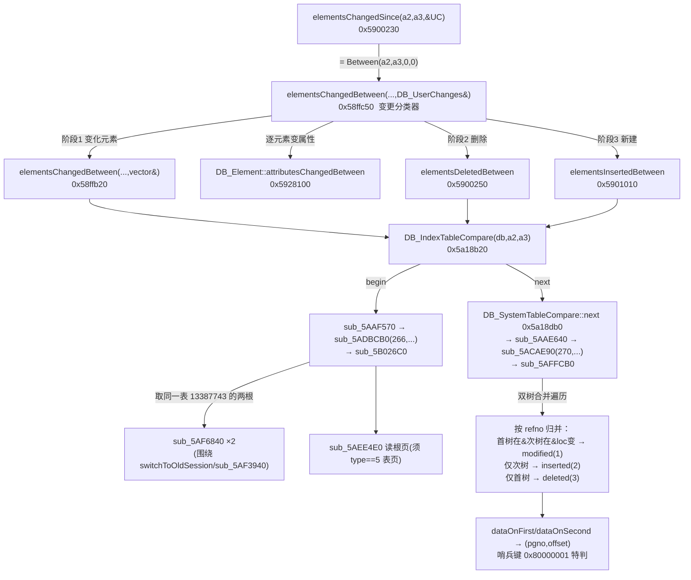

# core.dll 会话变更收集与索引表差分 —— live 逆向报告

- **日期**：2026-08-13
- **角色**：逆向与安全研究员（kc-mcp-agent-4）
- **任务**：用 live IDA（ida-bridge / idalib，非仅引用仓内文档）核实 ADR-022 拟补充的
  core.dll 事实，重点闭合「是否做索引根双根差分」「`RefnoDataLoc.flag`」「`0x80000001`
  起始哨兵」三处。
- **关联**：ADR-022（会话索引差分/净窗口）、ADR-002/009、`teach/learning-records/0002·0004`、
  `docs/2026-07-25_test-plan-core-dll-model-update-complete-matrix-v2.md`、
  `src/data_interface/session_index_diff.rs`。

> ⚠️ **本报告推翻一处旧结论**：先前「仅凭仓内文档」得出的
> 「现有逆向未见 core.dll 做索引根双根差分」是**过度保守**的。本轮 live 逆向证明：
> core.dll 的会话变更枚举**正是一个双根 B+ 索引表差分**（`DB_IndexTableCompare`，
> dabacon 比较引擎 opcode 266/270），删除即「首根在、次根不在」。gen-model 的
> `session_index_diff`（双根差分）与 core.dll 是**同一算法**，只是纯文件重实现。
>
> 🔑 **删除判据（最高优先，回应一致性审查，见 §4.4）**：core.dll `elementsDeletedBetween`
> 的删除判据 = **索引键集差**（旧会话根有键、新会话根无键），callees 里**无任何**
> owner/children/primaryList 调用——即它**同于 gen-model 净路径、异于 vendor 回放的
> owner.children 包含性**。故 core.dll 是把 154/818 分歧「判给净路径」的**独立权威**；
> 而 `pdms_io::search_latest_refno` 与净路径同判据、不能独立自证（控端指出正确）。

---

## 1. 样本与环境（可复现）

| 项 | 值 |
|---|---|
| 目标 | `D:\AVEVA\Everything3D3.1\core.dll` |
| 大小 | 50,071,544 字节 |
| SHA-256 | `3C1F52DA4E893D939ED646B8AD91DB7DABBD8307BFCE66AB7F4D5AE5A419417D` |
| 位数/架构 | 32 位（`inf_is_64bit()=False`，`metapc`） |
| 加载区间 | `0x5170000`–`0x928C000`（`min_ea`/`max_ea`） |
| IDA | IDA Professional 9.2，headless idalib，client `idalib-45188` |
| IDB | `D:\AVEVA\Everything3D3.1\core.dll.i64`（复用 3.1 既有库，符号为原始 MSVC mangled 名） |

SHA-256 与测试计划 v2 记录的样本（`3c1f52da…417d`）**逐字一致**，确认是同一份二进制。
符号是 core.dll 自带的 MSVC 修饰名（`?elementsChangedBetween@DB_DB@@…`），非人工命名——
所有 `DB_DB` / `DB_UserChanges` / `DB_IndexTableCompare` 结论有真实符号背书，不是猜名。

### 实际运行的 ida-bridge 命令（节选，全部只读）

```powershell
ida-bridge list
ida-bridge supervisor start-idalib --idb 'D:\AVEVA\Everything3D3.1\core.dll.i64'
# 定位与反编译（--sql 单句只读）
ida-bridge exec idalib-45188 --sql "SELECT decompile(0x58ffc50) AS text"      # 变更分类器
ida-bridge exec idalib-45188 --sql "SELECT decompile(0x58ffb20) AS text"      # 变更枚举器
ida-bridge exec idalib-45188 --sql "SELECT decompile(0x5900250) AS text"      # 删除枚举器
ida-bridge exec idalib-45188 --sql "SELECT decompile(0x5901010) AS text"      # 新建枚举器
ida-bridge exec idalib-45188 --sql "SELECT decompile(0x5a18b20) AS text"      # DB_IndexTableCompare 构造
ida-bridge exec idalib-45188 --sql "SELECT decompile(0x5B026C0) AS text"      # dab 比较-begin 处理器
ida-bridge exec idalib-45188 --sql "SELECT decompile(0x5AFFCB0) AS text"      # dab 比较-advance（合并遍历）
ida-bridge exec idalib-45188 --sql "SELECT decompile(0x5AF6840) AS text"      # 系统表根获取
```

未做任何写入/改名/注释；未运行 UI；分析结束后 `supervisor stop idalib-45188`
（既有的 `idalib-4200`（radsrvitem.dll）不动）。

---

## 2. 核心调用链



三个枚举器（变化/删除/新建）**同构**，只差一个谓词——它们都遍历一个
`DB_IndexTableCompare`，逐元素读 `.modified()` / `.deleted()` / `.inserted()`。

---

## 3. Goal A：三阶段变更收集（live 确认，置信度：高）

`elementsChangedBetween(...,DB_UserChanges&)`（`0x58ffc50`）的反编译与仓内测试计划 v2 §1.1
的流程图**逐条吻合**：

1. **阶段1 变化元素**：内层 `elementsChangedBetween(...,vector<DB_Element>&)`（`0x58ffb20`）
   给出变化元素表；对每个元素 `DB_Element::attributesChangedBetween`（`0x5928100`）取变化属性：
   - 属性 `== MEMORY[0x641DEC8]`（**ATT_OWNER**）→ `switchToOldSession(this,a4,a5,0)`（`0x5914040`）
     读旧 owner → `DB_UserChanges::elementIncluded(&UC, elem, oldOwner)`（`0x5987ea0`）；
   - 否则 → `DB_UserChanges::attributeModified(&UC, elem, attr)`（`0x5987090`）；
   - 若 `DB_Noun::primaryList(type)` 为真 → 成员差分：变化码 `== 3` → `elementReordered`（`0x5988040`），
     每项 `attributeModified(elem, MEMORY[0x6420728]=ATT_MEMB)`。
2. **阶段2 删除**：`elementsDeletedBetween`（`0x5900250`）→ 逐项 `elementDeleted`（`0x5987b70`）。
3. **阶段3 新建**：`elementsInsertedBetween`（`0x5901010`）→ 逐项 `elementCreated`（`0x5987a90`）。
4. 收尾：`switchBackSession` → `checkDBOpen` → `leafExtract`，若脏 → `DB_DBPlugger::ClearCaches`。

`elementsChangedSince`（`0x5900230`）实测：

```c
bool DB_DB::elementsChangedSince(this, int a2, int a3, DB_UserChanges *a4)
{ return DB_DB::elementsChangedBetween(this, a2, a3, 0, 0, a4); }   // 两个尾零确认
```

**粒度（分两层，勿混）**：
- **上游候选集**：谁被增/删/改的**候选元素集合**由**索引双根差分**产生（§4，页/索引级）。
- **下游分类/桶**：`DB_UserChanges` 的最终**分类与桶粒度**是**元素 +（attribute, qualifier）级**——
  对候选集里的每个变化元素再逐属性归桶。`attributeModified(elem,attr)`（`0x5987010`）只是
  `attributeModified(elem,attr,DB_Qualifier{})`（`0x5987090`）的默认包装；消费侧有 `AttributesModified`
  与 `AttributesQualsModified` 两种。

即「候选集=页/索引级双根差分 → 分类/桶=元素+(attr,qualifier)级」，两层不冲突；
早前「非页/索引级」的绝对措辞已删除（它只想说分类层，却读成否定索引层，与 §4 冲突）。

**六桶名核对（准确 ✅）**：`DB_UserChanges` 写入方法地址全部 live 确认，与 ADR-009 记录一致：

| 桶（对象偏移） | 写入方法 | 地址(live) |
|---|---|---|
| Created(+0) | `elementCreated` | `0x5987a90` |
| Deleted(+8) | `elementDeleted` | `0x5987b70` |
| Moved(+16) | `elementIncluded` | `0x5987ea0` |
| MemberChanged(+24) | 由 created 写 owner / included 写新旧两 owner / reordered 写 owner | — |
| Reordered(+32) | `elementReordered` | `0x5988040` |
| Modified(+40) | `attributeModified` | `0x5987010` / `0x5987090` |

---

## 4. Goal B：**是双根索引表差分**（live 证明，置信度：高）

这是本轮最重要的发现，直接改写 ADR-022 的措辞。

### 4.1 三个枚举器 = 同一个索引表比较器

变化/删除/新建枚举器（`0x58ffb20` / `0x5900250` / `0x5901010`）结构完全相同：

```c
if ( DB_DB::switchToOldSession(this, a4, a5, 0) ) {
  DB_IndexTableCompare cmp(this, a2, a3);              // 构造：对 (a2,a3) 两会话建比较器
  while ( !cmp.finished() ) {                          // 0x5a18d80
    DB_Element e = cmp.dbele();                        // 0x5a18d10 取当前元素(带 refno + 记录 loc)
    if ( cmp.modified() /* 或 .deleted()/.inserted() */ )   // 0x5a18da0/d70/d90
        append(e);
    cmp.next();                                        // 0x5a18db0
  }
  DB_DB::switchBackSession(this, 0);
}
```

`DB_SystemTableCompare` 状态机（`*(this+48)` 一个字段）实测：

| 值 | 含义 | 访问器 |
|---:|---|---|
| 1 | **modified** | `modified()` `0x5a18da0` |
| 2 | **inserted** | `inserted()` `0x5a18d90` |
| 3 | **deleted** | `deleted()` `0x5a18d70` |
| 4 | **finished** | `finished()` `0x5a18d80` |
| 5 | 终态（`next()` 归一为 4） | — |

`dataOnFirst()`（`0x5a18cd0`）读 `(this+12, this+16)`、`dataOnSecond()`（`0x5a18cf0`）读
`(this+20, this+24)`——即**同一元素在「首会话」与「次会话」各自的记录位置 `(pgno, offset)`**。
「First / Second」两侧就是双根的两端。

### 4.2 dabacon 比较引擎：两根 + 合并遍历

`DB_IndexTableCompare(db, a2, a3)`（`0x5a18b20`）→ `sub_5AAF570(dbnum, 13387743, a2, a3)`
→ `sub_5ADBCB0(266, …)` → **`sub_5B026C0`**（begin）；
`next()` → `sub_5AAE640(…)` → `sub_5ACAE90(270, …)` → **`sub_5AFFCB0`**（advance）。

**`sub_5B026C0`（begin）实测取「同一张表的两个根」**：

- `sub_5AF6840(db, 13387743, &rootA)`；`sub_5AF3940(db, …, a3, …)`（切换/定位到另一会话）；
  再 `sub_5AF6840(db, 13387743, &rootB)`——**同一表 13387743、两个会话位置各取一次根**。
- 两根页各 `sub_5AEE4E0` 读入，**强校验 `*page == 5`（"Page is not a table page (page is type %d)"）**，
  记录各自层级 `page[2]`，`malloc(20 * 层数)` 为**每棵树**建一份逐层页栈游标
  （`MEMORY[0x6423B24][1622453]` = 首树、`…1622454` = 次树）。

`sub_5AF6840` 实测就是「从库控制块取某系统表的根定位」：

```c
if ( a2 == 13387743 ) { *out = ctrl[+12]; out[1] = ctrl[+16]; }   // 主索引表根
else if ( a2 == 7618377 ) { *out = ctrl[+20]; out[1] = ctrl[+24]; } // 另一系统表根
else { /* 在表目录数组里按 id 线性查 */ }
```

**`sub_5AFFCB0`（advance）= 两棵 B+ 树的归并遍历**：逐层用 `sub_5AEE4E0` 读子页（校验
type==5、层级一致："Expected page of level %d, but got level %d"），按 refno 键归并两树：

- 首键 < 次键 → **deleted**（kind=3）；
- 次键 < 首键 → **inserted**（kind=2）；
- 键相等且记录数据不同 → **modified**（kind=1）；相等且相同 → 跳过（未动）。

### 4.3 结论（可直接写进 ADR-022）

- **core.dll 确实做索引根双根差分**：`DB_IndexTableCompare` 取**同一主索引表（id `13387743`）
  在窗口两端会话的两个根**，做 B+ 树归并（dabacon opcode 266/270）。这与 gen-model
  `session_index_diff`「取窗口两端会话页里的索引根做双根差分」是**同一算法思想**。
- **删除如何在目标根表达**：**不是**目标根里的某个墓碑标记，而是**归并集差**——键在首（旧）根、
  不在次（新）根即 deleted（kind=3）。与 gen-model「base 有、target 无 → Deleted」逐字对应。
- **差异**：核内比较器是「定位到两个会话、比较系统表」；gen-model 是「直接吃 copy-on-write
  会话页各自携带的索引根」。两者殊途同归——都靠「同一 B+ 索引在两会话的两个根」判存在性。
  故 ADR-022 说 gen-model 与 core.dll「同源/同思想」是**成立的、且现在有 live 证据**。

### 4.4 `elementsDeletedBetween` 判据 = 索引键集差，**非** owner.children 包含性（最高优先，置信度：高）

一致性审查提出：回放 vendor 以 `owner.children` 包含性/父 children 丢失派生 Deleted；净路径以
target 根按键不可达；而 `pdms_io::search_latest_refno` 与净路径同属「按键可达 + 不看 flag」，
其仲裁**天然偏净路径、不能独立证明删除**。core.dll 是独立权威，本节把它钉死。

**live 证据（callees 全集，负向证明）**：

`DB_DB::elementsDeletedBetween`（`0x5900250`）的**完整** callee 集合：
`switchToOldSession` / `switchBackSession` / `DB_IndexTableCompare(db,a2,a3)` /
`DB_SystemTableCompare::{finished,dbele,deleted,next,~}` / `DB_Ref::DB_Ref` /
`sub_58F13C0`(入向量) / trace / 栈哨兵。
**没有** `DB_Element::owner`、**没有** `children`、**没有** `primaryList`、**没有**任何父子/成员表包含性调用。

合并遍历 `sub_5AFFCB0` 的**完整** callee 集合：`sub_5AEE4E0`(读页) / `sub_5AF11D0`(释放页) /
`LicFeatureCheckOut_FormatSafe`+`sub_5861C70`(错误串) / `free`。**纯页 IO + 键归并**，零元素/属主逻辑。

`deleted()` == `*(this+48) == 3`；kind=3 在 `sub_5AFFCB0` 归并里的产生条件是
**首（旧会话）根有该 refno 键、次（新会话）根无匹配键**（首键 < 次键分支）。

**结论**：**core.dll 的删除判据 = 主索引表在窗口两端两根的「键集差」**（旧根在、新根不在）。
它**更接近净路径**（target 根按键不可达），而**不是** vendor 回放的 owner.children 包含性。
一个元素若只是被改写（记录换页），其键仍在新根 → 判 **modified(kind=1)**，**不**判 deleted。
只有键在新根彻底消失才判 deleted。

**对 154 / 818 分歧归因的影响（必须写进 ADR/证据）**：

1. **独立性补正**：先前 live A/B 用 `pdms_io::search_latest_refno`（按键可达 + flag 盲）做逐 refno
   仲裁——它与净路径**同判据**，故「仲裁站净路径一边」**不构成独立证明**（控端指出正确）。
   本轮 core.dll 逆向是**独立于 gen-model 的权威**，它给出的删除判据与净路径**一致**——
   这才是把分歧「判给净路径」的**独立依据**。ADR/证据里应把归因措辞从「点查仲裁证明」改为
   **「core.dll `elementsDeletedBetween` 判据（索引键集差）= 净路径判据，故净路径正确」**。
2. **回放的孤儿 Deleted 腿属过报**：回放靠 owner.children 包含性/临时 Add 终态对账派生的
   Deleted 腿（ams8000 的 22 条、amssys 的 653 条主体），在 core.dll 判据下**本不该删**
   （键仍在新根或本是临时记录）——即净窗口证据里「孤儿 Deleted 腿误报」的归因**与 core.dll 一致**。
3. **仍需补的独立验证**：现有 live A/B 的删除腿因基线无对应活行而空跑（删除语句落空），
   **不能**作为删除口径的证据。要独立证死删除，应构造「起点早于删除会话、库内确有活行」的形态，
   并**以 core.dll `elementsDeletedBetween` 的输出为黄金基准**（而非 `search_latest_refno`）——
   否则又回到「同判据自证」。
4. **边界（诚实标注）**：本轮证明 core.dll 取「同一表 13387743 在两会话的两个根」并按键集差判删；
   **未**逐字节证明这两个根就是 gen-model 所读的 copy-on-write 会话页根（`switchToOldSession` /
   `sub_5AF5820` 取根指针的内部未展开）。但**判据层面**（键集差 vs owner 包含性）已确定无疑。

### 4.5 flag 全链路补查：是否可能在进入比较器前被过滤（有界，置信度：中）

一致性审查追问：我此前「flag 不是可见性门」是**功能性否定**，但只证了**比较器层**不读 flag；
若 `sub_5AEE4E0`（页读取器）在条目进入比较器前按 flag 过滤，则 flag 仍可能是**上游可见性门**。
本节做定向补查（禁 mass decompile）。

**补查命令**（`<cid>` = 本次 idalib）：
```powershell
ida-bridge exec <cid> --sql "SELECT DISTINCT hex(callee_addr),COALESCE(demangle(callee_name),callee_name) FROM callees WHERE func_addr=0x5AEE4E0 ORDER BY callee_addr"
ida-bridge exec <cid> --sql "SELECT n,line FROM pseudocode WHERE func_ea=func_start(0x5AEE4E0) AND (line LIKE '%& 0x%' OR line LIKE '%>> %' OR line LIKE '%== 5%' OR line LIKE '%!= 5%') ORDER BY n LIMIT 60"
ida-bridge exec <cid> --sql "SELECT n,line FROM pseudocode WHERE func_ea=func_start(0x5AFFCB0) AND (line LIKE '%v15[%' OR line LIKE '%v22[%' OR line LIKE '%v36[%') ORDER BY n LIMIT 60"
```

**证据 1 —— 遍历的是 raw 页项（非 sub_5AEE4E0 规范化项）**：`sub_5AFFCB0` 直接把
页栈里的**页指针**当作 int 数组访问：`v[2]` = 层级（`v22[2] <= 0` 即叶）、`v[3]`/`v[4]` = 两个计数
（变长：`<0` 时改读 `v[idx]+1`）、`v[6]` = 容量界，随后**键/数据是连续 int 数组**
（`&v36[v33 + i]`、`&v22[v127 + i]`，步长 1 dword）。即节点是
**SoA（键数组 + 数据数组）B+ 结点，非 AoS 的 {refno,pgno,offset,flag} 定长条目**；
键按整型直接比较，**全程未见任何 per-entry flag 字段被读取或判定**（唯一特判是哨兵 `-2147483647`）。

**证据 2 —— `sub_5AEE4E0` 是页缓存取，不做 per-entry 过滤**：其 callees 为 dabacon 页原语
（`CHLENG`、`FHQERC`、`sub_5B8F880` 等 + 解压/校验）；其里的位运算都作用在
**28 字节/槽的页缓存描述符**上：`*(dword_6453DC4[1573066] + 28*slot + 24) & 0x3FFF`（页号 14 位）、
`& 0x10000`（缓存有效位）；以及**页级**校验 `*page == 5`（表页类型）且 `page[1] == 表id`
（13387743 / 7618377）。**没有**对**表项**按某字段/位过滤/跳过的循环——它按页读入、校类型、返指针。

**结论（按控端要求降级，不写功能性否定）**：
- **已证**：变更检测**全链路**（页取 `sub_5AEE4E0` + 双根归并 `sub_5AFFCB0` + begin `sub_5B026C0`）
  **不读 flag、不按 flag 过滤或跳过任何条目**；它只用 页类型(5)/表id/层级/键(refno)/记录位置(pgno,offset)。
  比较器结构里也**没有** flag 字段（只有 refno + 两侧 (pgno,offset) + kind）。
- **未闭合（降级措辞）**：**raw 叶数据元素内是否含 flag 字段**（数据元素步长是 2 字 (pgno,offset)
  还是 3 字 (pgno,offset,flag) 而 core.dll 只取前 2 字），以及**是否存在本链路之外的可见性门**，
  **未闭合**——需展开 dabacon 叶写/查路径（大片 FORTRAN，触 mass-decompile 红线）。
- **与 gen-model `RefnoDataLoc` 的交叉映射**：`pdms_io` 未纳入 git，无法读其结构布局逐字对映
  flag 偏移；仅从 `session_index_diff.rs` 用法知 `RefnoDataLoc{refno_0,refno_1,pgno,offset,flag}`、
  `att_offset=pgno*0x800+offset*2`。core.dll 侧是 SoA、gen-model 侧是 AoS 重构，**flag 偏移未对映**。
- 故对「flag 是否墓碑/可见性门」的表述订正为：**「变更检测链路不以 flag 作门（已证）；flag 自身
  在 raw 叶内的存在/偏移/位语义、及是否有链路外的门，未闭合」**——**不再**写「功能上否定可见性门」。

---

## 5. Goal D：`0x80000001` 起始哨兵（live 确认，置信度：高）

- 双哨兵字节序列 `01 00 00 80 01 00 00 80` 在 core.dll 静态镜像里 **`bin_search` 零命中**
  → 哨兵**不是代码里的字节常量**，而是**索引页（文件数据）里的键值**。
- 合并遍历 `sub_5AFFCB0` 里，键比较对 **`-2147483647`（= `0x80000001`）做特判**：
  ```c
  v35 = *(_DWORD *)v121 == -2147483647;          // 次树键 == 哨兵?
  if ( *(_DWORD *)ArgList == -2147483647 ) break; // 首树键 == 哨兵
  if ( *(_DWORD *)v121 == -2147483647 ) goto LABEL_194 /* inserted */;
  ```
  即哨兵作为**键空间的边界值**参与归并（首键位置），与 gen-model `RefnoDataLoc::is_start_page()`
  对首条 `0x80000001_0x80000001` 的处理一致：非叶层是最左子树边界、叶层非数据。
- **底层位定义来源**：哨兵是**文件/页内的键常量**（0x80000001），核内以立即数 `-2147483647`
  在归并代码里识别它；不是某个结构位域。

---

## 6. Goal C：`RefnoDataLoc.flag`（部分闭合 + 明确边界，置信度：中）

- **已查到（决定性）**：**变更检测子系统（`DB_IndexTableCompare`）根本不读 flag**。比较器每条目
  只携带 `refno`（`this+4/+8`）与记录位置 `(pgno, offset)`（`dataOnFirst`/`dataOnSecond` 各 2 字）；
  存在性/路由/增删改判定**全部**基于「refno 键在两根的归并结果」，与任何 flag 无关。
  → 从核内权威侧**证实** gen-model「路由不看 flag、存在性不看 flag」的口径。
- **已查到**：core.dll 侧**没有** `RefnoDataLoc` 之类结构名（gen-model 自造名）；索引页是「表页」
  （page type==5），条目为 `(键=refno, 数据=(pgno,offset))`。删除**不靠** flag/墓碑位，靠集差。
- **未覆盖（有意收口，避免 mass-decompile）**：raw 叶条目里 `flag` 的**确切字节偏移/位宽/取值
  枚举/写者**未逐位闭合。dabacon B+ 子系统是约 60 个 FORTRAN 翻译函数（`sub_5AE****`/`sub_5AF****`/
  `sub_5B0****`，如页读取器 `sub_5AEE4E0` 单体 3179 字节），逐位追 flag 需要展开整片写/查路径，
  超出「优先 SQL、避免 mass decompile」的作业纪律，本轮不做。
- **对「是否墓碑/可见性门」的结论（已按一致性审查降级，详见 §4.5）**：
  **变更检测全链路（页取 + 双根归并 + begin）不读 flag、不按 flag 过滤/跳过条目**（已证，含
  `sub_5AEE4E0` 页取层——其位运算只作用于 28 字节页缓存描述符，非叶条目）。
  但**不写「功能上否定 flag 是可见性门」**：raw 叶数据元素内 flag 的存在/偏移/位语义、
  以及是否存在**本链路之外**的可见性门，**未闭合**（需展开 dabacon 叶写/查大片 FORTRAN，触红线）。
  → 净窗口判定不依赖 flag 这一点**不受影响**（本就与核内变更检测链路一致）。

---

## 7. 事实 / 推断 / 未知 汇总

| # | 命题 | 级别 | 证据 |
|---|---|---|---|
| A1 | 变更收集 = 变化→删除→新建 三阶段 | **事实** | `0x58ffc50` 反编译 |
| A2 | OWNER 变更走 `elementIncluded`(先读旧owner) | **事实** | `0x58ffc50`：`==MEMORY[0x641DEC8]` 分支 |
| A3 | 成员差分按 `primaryList` 门控、重排码==3 | **事实** | `0x58ffc50`：`DB_Noun::primaryList` + `==3` |
| A4 | 粒度 = 元素 + (attr,qualifier) | **事实** | `0x5987010`/`0x5987090` 双重载 |
| A5 | 六桶名 Created/Deleted/Moved/MemberChanged/Reordered/Modified | **事实** | 写入方法地址 live 全中 |
| B1 | 变更枚举 = 双根 B+ 索引表归并差分 | **事实** | `DB_IndexTableCompare` + `sub_5B026C0`/`sub_5AFFCB0` |
| B2 | 取同一表(13387743)在两会话的两个根 | **事实** | `sub_5AF6840`×2 围绕 `sub_5AF3940` |
| B3 | 删除 = 键在首根、不在次根(kind=3) | **事实** | `sub_5AFFCB0` 归并 + `deleted()==3` |
| B4 | 索引页 type==5「表页」、按层级下降 | **事实** | `sub_5B026C0`/`sub_5AFFCB0` 一致性错误串 |
| B5 | 13387743=主索引表；7618377=另一系统表(根在控制块+20/+24) | **推断(强)** | `sub_5AF6840` 分支；名义未 dehash |
| B6 | **删除判据 = 索引键集差(旧根在/新根不在)，非 owner.children** | **事实** | `elementsDeletedBetween` callees 无 owner/children；`sub_5AFFCB0` 纯页 IO+键归并 |
| B7 | 改写(换页)判 modified 不判 deleted | **事实** | 键仍在新根 → kind=1 |
| B8 | core.dll 删除判据 ≈ gen-model 净路径，≠ vendor 回放 owner 包含性 | **事实** | B3/B6 |
| B9 | 两根即 gen-model 所读 copy-on-write 会话页根 | **推断(中)** | `switchToOldSession`/`sub_5AF5820` 取根内部未展开 |
| C1 | 变更检测**全链路**(页取+双根归并+begin)不读 flag、不按 flag 过滤/跳过条目 | **事实** | 比较器仅携带 refno+(pgno,offset)；`sub_5AEE4E0` 位运算只作用于页缓存描述符 |
| C2 | 遍历的是 raw 页项(SoA 结点:键数组+数据数组)，非 sub_5AEE4E0 规范化项 | **事实** | `sub_5AFFCB0`:`v[2]`层级/`v[3][4]`计数/`&v[i]`键数组 |
| C3 | raw 叶数据元素内 flag 偏移/位宽/取值枚举/写者；链路外可见性门 | **未知/未闭合** | 需展开 dabacon 叶写/查(触 mass-decompile 红线) |
| C4 | flag 是否墓碑/可见性门 | **未闭合(降级)** | 仅证本链路不以 flag 作门；不写功能性否定 |
| D1 | 0x80000001 是页内键哨兵、非代码字节常量 | **事实** | `bin_search` 零命中 + `-2147483647` 特判 |
| D2 | 哨兵作键边界(首条/最左)参与归并 | **事实** | `sub_5AFFCB0` 归并循环 |

---

## 8. 对 ADR-022 的精确修订建议（主控收口，勿我直接改 ADR）

1. **删去/改写「未见 core.dll 做索引根双根差分」这类保守措辞**。改为：
   > core.dll 的会话变更枚举（`DB_DB::elementsChanged/Deleted/InsertedBetween` →
   > `DB_IndexTableCompare`，dabacon 比较引擎 opcode 266/270，主索引表 id `13387743`）
   > **本身就是一次「同一 B+ 索引表在窗口两端会话的两个根」的归并差分**
   > （live 逆向 core.dll 3.1，SHA `3c1f…417d`，`0x5B026C0`/`0x5AFFCB0`）。gen-model 的
   > `session_index_diff` 双根差分与其**同思想**——差别仅在 gen-model 纯文件重实现、
   > 直接吃 copy-on-write 会话页各自携带的索引根。
2. **删除语义（结合一致性审查，最高优先）**：明确「删除 = 键在旧根在、新根不在（比较器 kind=3）」，
   **核内亦非墓碑位、亦不看 owner.children**，与 gen-model 净路径「target 根按键不可达 → Deleted」
   **同判据**；与 vendor 回放「owner.children 包含性」**不同判据**。
   - 归因措辞订正：154/818 分歧「判给净路径」的依据应写作
     **「core.dll `elementsDeletedBetween` 判据 = 净路径判据（live 逆向 `0x5900250`+`0x5AFFCB0`）」**，
     **不要**再以 `pdms_io::search_latest_refno` 点查仲裁作独立证明（它与净路径同判据，非独立）。
   - 回放的孤儿 Deleted 腿（ams8000 22 / amssys 653）在 core.dll 判据下属**过报**，归因成立。
   - 诚实标注：live A/B 删除腿因基线无活行而空跑，尚缺「起点早于删除会话」的独立删除验证，
     且该验证须以 core.dll 输出为黄金基准。
3. **flag（措辞需谨慎，见 §4.5 降级）**：把「路由不看 flag / 存在性不看 flag」升级为
   **「实测(生产点查) + core.dll 变更检测全链路(页取+双根归并+begin)亦不读 flag、不按 flag 过滤条目（live 确认）」**；
   但**不得**写「flag 功能上不是可见性门」——诚实标注「raw 叶内 flag 的存在/偏移/位语义、
   及链路外是否有门，**未闭合**（未展开 dabacon 叶写/查，避免 mass-decompile）」。结论正确性不受影响
   （净窗口判定不依赖 flag）。
4. **哨兵**：`0x80000001_0x80000001` 明确为**页内键哨兵**（非代码常量），核内以 `-2147483647`
   识别、作键边界；`is_start_page()` 的「非叶最左子树、叶层非数据」有核内归并逻辑背书。
5. **粒度补注**：core.dll 变更粒度含 `qualifier` 维（`attributeModified(elem,attr,qual)`），
   gen-model `ModifiedElement` 按属性名聚合会丢 qualifier——此为已知取舍，可在 ADR/后续单列。

---

## 9. 关键地址表（core.dll 3.1，SHA `3c1f…417d`，全部本轮 live）

| 符号 | 地址 |
|---|---:|
| `DB_DB::elementsChangedBetween(...,DB_UserChanges&)` | `0x58ffc50` |
| `DB_DB::elementsChangedBetween(...,vector<DB_Element>&)` | `0x58ffb20` |
| `DB_DB::elementsChangedSince(...,DB_UserChanges&)` | `0x5900230` |
| `DB_DB::elementsDeletedBetween(...)` | `0x5900250` |
| `DB_DB::elementsInsertedBetween(...)` | `0x5901010` |
| `DB_DB::switchToOldSession` | `0x5914040` |
| `DB_Element::attributesChangedBetween` | `0x5928100` |
| `DB_Element::dabAttributesChangedBetween` | `0x592ba80` |
| `DB_UserChanges::elementCreated` | `0x5987a90` |
| `DB_UserChanges::elementDeleted` | `0x5987b70` |
| `DB_UserChanges::elementIncluded` | `0x5987ea0` |
| `DB_UserChanges::elementReordered` | `0x5988040` |
| `DB_UserChanges::attributeModified(elem,attr)` | `0x5987010` |
| `DB_UserChanges::attributeModified(elem,attr,qual)` | `0x5987090` |
| `DB_IndexTableCompare::DB_IndexTableCompare(DB_DB*,int,int)` | `0x5a18b20` |
| `DB_SystemTableCompare::next` | `0x5a18db0` |
| `DB_SystemTableCompare::dbele` | `0x5a18d10` |
| `DB_SystemTableCompare::modified/inserted/deleted/finished` | `0x5a18da0`/`0x5a18d90`/`0x5a18d70`/`0x5a18d80` |
| `DB_SystemTableCompare::dataOnFirst/dataOnSecond` | `0x5a18cd0`/`0x5a18cf0` |
| dab 比较-begin 处理器 `sub_5B026C0`（opcode 266） | `0x5b026c0` |
| dab 比较-advance 处理器 `sub_5AFFCB0`（opcode 270） | `0x5affcb0` |
| 系统表根获取 `sub_5AF6840` | `0x5af6840` |
| 页读取/定位 `sub_5AEE4E0`（表页 type==5） | `0x5aee4e0` |
| ATT_OWNER 全局 | `MEMORY[0x641DEC8]` |
| ATT_MEMB 全局 | `MEMORY[0x6420728]` |
| dabacon 状态块 / 错误标志 | `MEMORY[0x6423B24]` / `MEMORY[0x6453B98]` |
| 主索引表 id / 另一系统表 id | `13387743`(0xCC441F) / `7618377`(0x743F89) |
| 起始哨兵键 | `0x80000001`（= `-2147483647`） |

---

## 10. 复现步骤

```powershell
# 1) 校验样本
(Get-FileHash 'D:\AVEVA\Everything3D3.1\core.dll' -Algorithm SHA256).Hash   # 须 = 3C1F52DA...417D

# 2) 起 headless idalib（bridge 已在跑；否则先 ida-bridge server start）
ida-bridge supervisor start-idalib --idb 'D:\AVEVA\Everything3D3.1\core.dll.i64'

# 3) 关键反编译（把 <cid> 换成上一步的 client_id）
ida-bridge exec <cid> --sql "SELECT decompile(0x58ffc50) AS text"   # 三阶段分类器
ida-bridge exec <cid> --sql "SELECT decompile(0x58ffb20) AS text"   # 变更枚举器(索引表比较)
ida-bridge exec <cid> --sql "SELECT decompile(0x5a18b20) AS text"   # 比较器构造(表 13387743)
ida-bridge exec <cid> --sql "SELECT decompile(0x5B026C0) AS text"   # 双根 begin
ida-bridge exec <cid> --sql "SELECT decompile(0x5AFFCB0) AS text"   # 双树归并 + 0x80000001 特判
ida-bridge exec <cid> --sql "SELECT decompile(0x5AF6840) AS text"   # 取表根
# 哨兵非静态字节：
ida-bridge exec <cid> --sql "SELECT hex(address) FROM bin_search WHERE pattern='01 00 00 80 01 00 00 80' LIMIT 5"  # 应为空
# 删除判据负向证明（callees 无 owner/children）：
ida-bridge exec <cid> --sql "SELECT hex(callee_addr), COALESCE(demangle(callee_name),callee_name) FROM callees WHERE func_addr=0x5900250 ORDER BY callee_addr"
ida-bridge exec <cid> --sql "SELECT hex(callee_addr), COALESCE(demangle(callee_name),callee_name) FROM callees WHERE func_addr=0x5AFFCB0 ORDER BY callee_addr"

# 4) 收尾（只停自己起的实例）
ida-bridge supervisor stop <cid>
```
