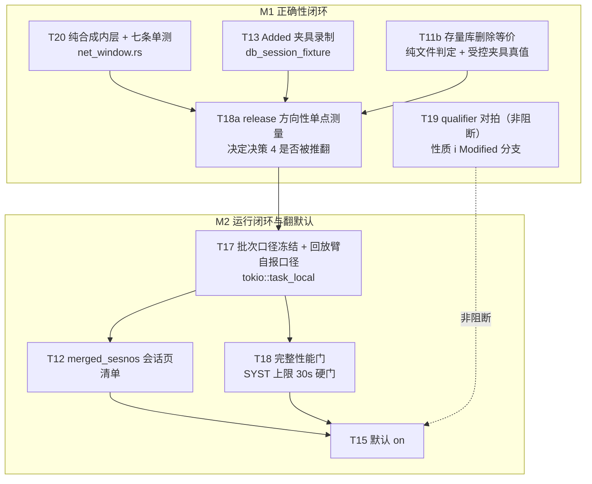

# 净窗口收集翻默认开发计划（ADR-022 / specs/003）

| 项 | 值 |
|---|---|
| 日期 | 2026-08-13（终审修订版） |
| 状态 | **已被取代（2026-08-18）**——M2「运行闭环与翻默认」由 [ADR-031](../adr/ADR-031-single-net-window-collection-caliber.md) 的一次性单路径切换取代；M1 已完成项与全部执行卡内容保留为历史记录 |
| 决策来源 | [ADR-022](../adr/ADR-022-net-window-collection-via-session-index-diff.md)、[specs/003](../../specs/003-net-window-collection/spec.md) + [plan](../../specs/003-net-window-collection/plan.md) + [tasks](../../specs/003-net-window-collection/tasks.md) |
| 证据基线 | [净窗口验收证据](../evidence/2026-08-13-session-index-diff-net-changes.md)、[core.dll live 逆向报告](../evidence/2026-08-13_reverse-core-dll-index-leaf-report.md) |
| 台账 | [live 测试台账](../2026-08-12_live-test-ledger.md)（live 用例唯一事实来源） |
| 覆盖任务 | T11b · T12 · T13 · T15 · T17 · T18 · T19 · T20 |

---

> **2026-08-18 取代说明**（读本计划前先读这段）
>
> 推行方式已改为一次性单路径切换（ADR-031）：`net_window_collection` /
> `AIOS_NET_WINDOW` 退役，`collect_window` 只走净窗口，回放降级为 legacy 诊断入口。
> 对本计划的影响：
>
> - **M2 整体取消**。其中 T12 已完成；**T17 CANCELLED**（无开关即无口径可冻，
>   `collection_verdict.rs` 不再实现）；**T18 降为记录项**，SYST `250206` 改为上线后
>   现场复测；**T15 并入单路径提交**（没有默认值可翻）。
> - **前提 2 / 3 / 4 / 5 随之作废**：前提 2 是倍数门与 SYST 硬门的纪律（已由 ADR-031
>   显式修订并独立提交）；前提 3/4/5 全部是为 T17 的 `task_local` 口径快照而设，
>   没有口径要传就没有栈预算、跨 spawn 与 `OnceLock` 这三个坑。
> - **前提 1 仍然有效且更硬**：运行时只解析 dabacon 文件、不查库；core.dll / IDA
>   只作判据层机制背书，不得进任何运行时或 CI 必需路径。
> - **M1 执行卡（T20 / T13 / T11b / T19 / T18a）保留**为历史记录；T13 的阻塞事实
>   与「绝不放宽性质 h/i」的纪律不变，只是不再是切换门。
>
> 下文原样保留，不回填改写——它是当时决策的记录。

## 先读：五条会让计划作废的前提

硬约束。任何一条被违反，对应提交打回而不是补丁绕过。

### 前提 1：运行时只解析 dabacon 文件，不查库

生产运行时的契约是：**输入 = 库文件路径 + 起止 sesno，输出 = 窗口净 Added / Deleted / Modified**。全过程不得查询 SurrealDB 做存在性判断或前后对比。

- 源码断言守着：`net_window.rs` 的 `the_net_window_module_never_touches_the_database`、`session_index_diff` 同款零 `SUL_DB` 断言。
- **core.dll 不是运行时依赖**，只有两个角色：① 已完成的双根 B+ 差分机制逆向背书（判据层）；② T11b 的离线机制参照。任何让生产路径依赖 IDA / core.dll / idb 的设计一律否决。
- 窗口**起点**仍由水位给出（ADR-001），属调用方职责，不在收集器内。

### 前提 2：T18 的 SYST 门是硬门，倍数门禁止静默降

- **`250206`（SYST）单趟 collect < 30s 是硬门**。该库在**客户现场**，本地 amssys 只是**代理形态**，代理达标不等于硬门达标，二者分开记。
- **完整收集倍数**按 **release 实测**定论，基线是 **debug 8.8×**（含终稿合成，evidence L101）。
- **4.4×（A/B probe）不得引用为门证据**：它是「净差分 vs 回放完整收集」的混层比较，只能当**下界参考**，不是同层倍数。纯差分 15–34× 同理不算数。
- 若 release 实测不达 ≥10×：**必须在翻默认前显式修订 ADR-022 验收 4**，写明实测值与调门理由，且修订与翻默认**分属两个提交**。禁止默默降门。

### 前提 3：`task_local` 有栈预算

`batch_worker.rs` 已有两层 `window.scope(...)`（预载 `:824`、执行体 `:843`）。`main.rs:54-62` 记着代价：

> 这条复合 future 加上各层 poll 帧超过 std 默认的 2MB 线程栈，表现为
> `thread 'tokio-rt-worker' has overflowed its stack`——服务能起、/health 全绿，
> 直到真有增量要应用才当场死。

`main.rs` 用 `RUNTIME_STACK_SIZE = 64MB` 压住了，但 **`#[tokio::test]` 与 `run_cli` 走默认栈**。T17 加 scope 后必须在 **debug** 下验证无栈溢出；红了就与既有 scope 合并进入而不是再套一层。

### 前提 4：`task_local` 不跨任何 spawn

`tokio::spawn` / `spawn_blocking` / `spawn_local` / `std::thread::spawn` 起的都是新执行单元，**不继承** task-local。执行链上任何一处 spawn 都会让口径快照静默丢失、回落现读——正是 T17 要消灭的东西。必须附 **body-scoped** 源码断言（见 T17）。

### 前提 5：不得用进程级 `OnceLock` 存口径

除了跨批次污染，还有一条更硬的：**`OnceLock` 会直接破坏 A/B 臂间切换**。`test_net_window_ab.py` 在同一进程里先后跑 off 臂与 on 臂，进程级一次性取值会把第二臂锁死在第一臂的口径上，A/B 立刻失去意义。口径只能是 task-local（每批次一份）+ 作用域外现读回退。

---

## 里程碑与门

按**失败语义**切分：M1 失败意味着「口径可能是错的」（要重设计），M2 失败意味着「口径是对的但还不能当默认」（要修或显式接受）。

### M1 正确性闭环

| 项 | 内容 |
|---|---|
| **Entry gate** | ADR-022「算法来源与正确性边界」已按 live IDA 结论定稿（**已满足**）；specs/003 tasks 与 plan 的机制层措辞已同步（**已满足**） |
| **范围** | T20 合成器纯内层 · T13 Added 夹具 · T11b 存量库删除等价 · T19 qualifier 对拍（非阻断，随行） |
| **Exit gate** | ① T20 七条纯单测全绿，性质 i 全部案例窗口不回归；② T13 夹具录入且性质 h/i 复用通过；③ T11b 存量库删除等价通过、evidence + 台账登记；④ **T18a release 方向性单点测量已出数** |
| **不在范围** | 任何默认值改动、任何口径开关行为改动 |
| **实际进度（2026-08-13）** | ① ✅ 七条全绿（lib 13 passed / 0 failed / **1 ignored 未跑**，`db8000_session_pairs` 集成目标 20 passed（用例数，非覆盖窗口数），5 处分支变异准确红，Python 离线 66 passed / 20 deselected）；② ❌ **T13 BLOCKED**——仓内无「Added>0 且 raw 净集 == 回放折叠集」的真实窗口，须受控 E3D `scratch-create` 录制，**不得放宽 h/i**；③ ✅ K=24 / 窗口 25..=209，真立碑 2 条、共同活行 6,536 一致、0 未归因，118s 绿；④ ✅ 高复触窗 17.7×（n=1）。**Exit gate 未通过，卡在 ②。** |

**M1 的额外硬规则**：Exit 前先跑 **T18a**（release 方向性单点测量，不是完整门）。目的只有一个——提前知道 ADR-022 决策 4 会不会被推翻。若 release 完整收集远低于 10×，M2 可能要改口径设计，M1 的证据范围就得重新界定；早知道比晚知道便宜。

### M2 运行闭环与翻默认

| 项 | 内容 |
|---|---|
| **Entry gate** | M1 Exit 全绿；T18a 数据在手且已判定「决策 4 是否需修订」 |
| **实际进度（2026-08-13）** | **未启动，且不得启动**——M1 Exit 被 T13 阻断。T18a 已判定「在高复触形状上决策 4 不需修订」，这一半 Entry 条件满足，但 M1 那一半没有。 |
| **范围** | T17 批次口径冻结（含回放臂自报口径）· T12 merged_sesnos 会话页清单 · T18 完整性能门 · T15 翻默认 |
| **Exit gate** | ① T17 冻结落地 + 五路径覆盖 + body-scoped 禁 spawn 断言 + debug 无栈溢出；② T12 两处 call site 改完、降级不静默、`merged_times_aligned` 仍绿；③ T18 SYST 硬门通过，倍数门已按 release 实测定论（不达则 ADR 已显式修订，且是独立提交）；④ T15 默认 on + 一个发布周期观察 |
| **回退** | T15 是一行兜底值，可瞬回；T17 / T12 各自单提交可 revert |

**M1 → M2 间隔上限一个迭代**。台账纪律是「没有最近通过记录的用例视同未验资产」，拖长了 T11b 得重跑。

---

## 依赖 DAG



**并行性核实结论**（按文件与不变量核，不按任务编号猜）：

| 组合 | 判定 | 依据 |
|---|---|---|
| T20 ∥ T13 ∥ T11b | **真并行** | 分别落 `src/data_interface/net_window.rs`、`tests/fixtures/`、`python/tests/`，无共享文件、无共享不变量 |
| T17 与 T12 | **语义上可并行，实施串行** | 二者**无逻辑依赖**——冻结口径与 merged 清单来源互不相干。串行只因**共享工作区文件冲突**：都改 `manual_update.rs` 执行体 `L4470-L4501` 邻域。若在独立 worktree 各自开发可并行，合并时按 T17→T12 顺序 |
| T18 在 T17 之后 | **必须** | 性能要测「将来会发布的那份代码」，冻结改了收集入口 |
| T19 独立 | **是** | 只落 `tests/db8000_session_pairs.rs` 性质 i 分支 + 文档，不阻断任何门 |

---

## 最小提交序

| # | 提交标题 | 落点 | 验证策略 | 回滚点 |
|---|---|---|---|---|
| C1 | `refactor(net-window): extract a pure synthesis layer behind an injected resolver` | `src/data_interface/net_window.rs` | **纯提取，不伪称先红**：安全网 = 性质 i + 既有 live 负载对拍；新测试有效性用**逐分支变异抽检**证明 | 性质 i 一红即 revert |
| C2 | `test(fixture): record an added-shape session fixture` | `tests/fixtures/` + `SHA256SUMS`、台账 | 指入前性质 h/i 无 Added 覆盖 → 指入后覆盖且 Added 条数 > 0 | 删夹具目录 |
| C3 | `test(net-window): prove delete equivalence on a real backlog window` | `python/tests/test_net_window_ab.py`、evidence、台账 | 受控夹具声明真值 + `before_apply` 断言；新形态首跑必须能红 | 纯测试 + 文档 |
| C4 | `docs(evidence): release directional timing for the net collector` | evidence、台账 | 无测试；产出数字 | 文档 |
| C5 | `feat(increment): freeze the collection verdict per batch and per preview` | 新模块 `src/data_interface/collection_verdict.rs`、`increment_pipeline.rs`、`manual_update.rs`、`batch_worker.rs` | 先写「同批次内覆盖值变化不换臂」测试 → 当前实现必红 | 单提交 revert；退回现读须**同改 ADR 决策 4** |
| C6 | `feat(increment): source merged_sesnos from the file session-page list` | `manual_update.rs`（**两处** call site）、`python/tests/test_net_window_ab.py`（签名补项） | 先写「自我抵消会话仍进 merged」+「io.open 失败不静默空列表」→ 当前必红 | 单提交 revert |
| C7 | `docs(evidence): full-collection and SYST performance gate` | evidence、台账 | 无测试 | 文档；触发 ADR 改动时**必须**拆两个提交 |
| C8 | `feat(options): default net_window_collection to on` | `src/options.rs`、`DbOption.toml`、`changelog.md` | 改 `net_window_collection_defaults_to_replay` 断言方向 | **一行兜底值**，成本最低 |

**T19 的提交归属**（落点已从「文档评估」改为 `tests/db8000_session_pairs.rs` 性质 i 分支，旧的「随 C2/C3 搭车」已作废——C2 只动 `tests/fixtures/`、C3 只动 Python，都碰不到那个集成测试）。两种走法二选一：

- **合并**：与任何一个**确实触及 `tests/db8000_session_pairs.rs`** 的提交合并，并让提交标题覆盖这项改动（不能挂在标题只说夹具或 A/B 的提交下）；
- **单开**：`test(net-window): pin qualifier recovery parity in property i`。

默认走单开——它与其它提交没有共同主题，合进去会让标题失真。

---

## 执行卡：M1

### T20 抽纯合成内层，覆盖三形状与降级

**为什么现在缺**：`net_window.rs` 现有 3 条纯单测（`identical_versions_diff_to_none` L316、`attribute_buckets_carry_old_and_new_values` L326、`children_only_change_still_emits_modified` L354）**全部只测 `diff_ele_data`**；`collect_net_window` 本体零纯单测，因为它吃 `&mut PdmsIO`（vendor 具体类型、非 trait）。ADR-022 验收 1 因此未满足。

**缝的签名**（按值接收、私有、resolver 收窄）：

```rust
pub fn collect_net_window(
    io: &mut PdmsIO,
    sesno_range: RangeInclusive<i32>,
) -> anyhow::Result<NetWindowOutcome> {
    let net = session_index_diff::collect_net_changes(io, sesno_range, false)?;
    synthesize_net_window(net, |loc| io.parse_raw_element(loc.att_offset()))
}

/// 纯合成层：净三态 → 同形状操作流。不碰 IO、不碰库。
/// `net` 按值接收（`stats` 直接移交 outcome，不必 clone）。
fn synthesize_net_window<F>(
    net: session_index_diff::NetChangeSet,
    mut resolve: F,
) -> anyhow::Result<NetWindowOutcome>
where
    F: FnMut(RecordLoc) -> anyhow::Result<EleData>,
```

三条设计约束：

- **`mut resolve: F`**——闭包要跨条目多次调用。
- **按值接收 `NetChangeSet`**：`stats` 直接移交 `NetWindowOutcome`，省一次 clone；`NetEntry` 也不必逐条 clone。
- **解析上下文的错误格式化留在合成器里**，不推给 resolver。resolver 只负责「给我这个位置的记录」，收窄成 `FnMut(RecordLoc) -> Result<EleData>`；「refno / 终稿还是基版本 / 页与偏移」这些上下文由合成器包装（原 `parse_record` 的 `anyhow!("解析 {refno} 的{side}记录（页 {} 偏移 {}）失败")` 逻辑搬进合成层）。这样测试构造 resolver 时只需按位置返回结果，不必复刻错误文案。

缝的先例在隔壁：`session_index_diff.rs` 的单测用 `MemPages` 做同款注入，照抄结构。`NetChangeSet` / `NetEntry` 字段全部 `pub`（`session_index_diff.rs:36-65`、`:117-129`），测试可直接构造字面量。

**七条测试**（三形状 + 三降级 + 一硬失败）：

| 测试 | 断言 | 对应实现 |
|---|---|---|
| `a_net_added_entry_becomes_an_add_on_its_last_touch_session` | 挂 `last_touch_sesno`，`Add(终稿)` | `net_window.rs:79-93` |
| `a_net_deleted_entry_hangs_on_the_window_end_session` | 挂 `target_sesno` 而非 `last_touch_sesno` | `:95-102` |
| `a_net_modified_entry_diffs_both_versions_exactly_once` | `resolve` 恰被调 2 次，产出 `Modified` | `:104-131` |
| `a_base_parse_failure_degrades_to_add_and_names_the_refno` | 落 `Add(latest)`，`warnings` 点名 refno | `:132-144` |
| `an_unparseable_final_is_skipped_counted_and_aggregated` | 不入 window，`unparseable_finals` +1，聚合警告含样例 | `:91`、`:112`、`:147-159` |
| `a_missing_base_loc_fails_hard_and_names_the_refno` | **硬失败**（`Err`），错误文本含 refno | `:116-121` |
| `an_identical_rewrite_emits_nothing_but_is_counted` | 不入 window，`unchanged_rewrites` +1 | `:130` |

**分类澄清**：**原样重写不是降级路径**，它是正常判定的一个正常结果（两端同 loc = 真无事发生）。降级只有三条：终稿解析失败（跳过 + 计数）、基版本解析失败（保守按新增）、`base_loc` 缺失（**硬失败，不许降级**——那是 classify 的不变量被破坏）。

**验证策略（不伪称先红）**：这是**纯提取重构**，重构前后行为应当完全一致，所以「先写测试看它红」在这里是假的——测试对着旧代码同样会绿（只要能编译）。真实的验证是两层：

1. **安全网**：性质 i（`net_window_collector_matches_replay_ops_on_every_case_window`，Modified 负载逐桶相等，**全部案例窗口**）+ 既有 live 负载对拍 `live_ams8000_net_window_payloads_match_replay_on_single_touch_refnos`。任一变红说明提取改了行为，立即 revert。
2. **新测试有效性证明（逐分支变异抽检）**：对七条测试各自对应的实现分支做一次一次性变异，确认对应测试确实变红。至少抽检这四处——把 Deleted 的 `target_sesno` 改成 `last_touch_sesno`、把 `unchanged_rewrites += 1` 删掉、把基版本失败分支从 `Add` 改成 `continue`、把 `base_loc` 的 `ok_or_else` 换成 `unwrap_or(entry.loc)`。变异结果记在提交信息里，**变异代码不入库**。

```powershell
cargo test --locked --lib net_window --no-default-features --features ws,gen_model,manifold,project_hd -- --nocapture
cargo test --locked --test db8000_session_pairs --no-default-features --features ws,gen_model,manifold,project_hd -- --nocapture
```

**提交 type 用 `refactor(net-window)`**，不是 `test(...)`——主体是生产代码结构调整。

**回滚点**：C1 单提交 revert，无外部依赖。

---

### T13 录制 Added 形态会话夹具

**现状**：Added 形态的夹具级台账断言缺席，当前靠纯单测 + live 全窗口（6,609 added 过点查仲裁）兜底（evidence L180-182）。

**做法**：用 `db_session_fixture` 录一个「创建 → Save Work」案例，产物入 `tests/fixtures/` 并更新 `SHA256SUMS`。**不改测试代码**——`AIOS_SESSION_FIXTURE` 指入即复用既有性质 h / i。

**验收**：指入新夹具后性质 h（差分 ≡ 回放折叠）与性质 i（Modified 负载逐桶相等）全绿，且断言里显式体现 **Added 条数 > 0**（否则等于没录到东西）。

**回滚点**：删夹具目录 + 还原 `SHA256SUMS`。

---

### T11b 存量库删除等价直证

M1 里最贵也最关键的一条：目前**唯一没有结果层证据的存在性腿**。

**为什么现有 A/B 不算数**：evidence L157-160 写得清楚——当前 A/B 起点是「当前文件的基线」，窗口内被删元素**在基线里本就无行**，两臂的删除语句都落空（墓碑归一实测 0 条）。**恒绿的测试不是证据**。

#### 存量基线的构造步骤（可执行）

机制本体是**会话链切割**：PDMS DB 文件是 append-only 会话链，沿头部偏移 40 的 session page 指针回溯，按某个 sesno 的 `latest_page` 截断并回写头指针，即可从最终文件切出任意历史 sesno 的完整快照。Rust 侧权威实现是 `session_cut::write_snapshot`（`src/bin/db_session_fixture/session_cut.rs:94`）+ `session_chain(&bytes).cut_for(sesno)`；已被 `tests/db8000_session_pairs.rs:35-37` 与 `tests/db_session_fixture_selfcheck.rs:25-27` 经 `#[path]` 复用。

Python 侧按同一算法**镜像**一份切割助手（约 30 行：走链 → 截断 → 回写头指针），并**用等价断言钉住不漂移**：对同一 sesno，Python 切出的文件 SHA256 必须与 Rust `session_cut::write_snapshot` 切出的一致。这条断言本身就是一个可红可绿的测试，先写它。

选定切点 `K`（K < 删除会话 ≤ latest），然后：

1. **切 @K 快照**：从当前最终文件切出 sesno=K 的完整快照。
2. **先换文件，再建基线**：把项目目录里的库文件**换成 @K 快照**，然后跑基线导入。顺序不能反——先 baseline 再换文件会让基线建在错误世代上。
3. **窗口前断言（这是本条能立住的关键）**：应用窗口**之前**，断言被删 refno 在 `pe` 中**存在且 `deleted = false`**。这一步不成立就说明基线没建到位，测试必须当场失败而不是继续跑成空跑。
4. **应用窗口 `K+1..=latest`**：两臂各走一遍完整执行。
5. **`finally` 恢复**：无论成败都把全量文件恢复回去，并**校验 SHA256** 与恢复前一致。这一步不能漏——半途失败留下一个被截断的库文件会污染后续所有测试。

#### 真值来源与 oracle 边界（务必照此写，别越界）

- **被测对象是纯文件删除判定**：净收集只吃「文件 + 起止 sesno」给出 Deleted 集合。测试的成功判据**不得依赖生产 DB 查询**。
- **持续测试的真值 = 受控夹具的声明 + `before_apply` 断言**。即「我构造时就知道哪些 refno 会在窗口内被删，且我在应用前确认过它们活着」。这是可重复、可进 CI、零外部依赖的真值。
- **core.dll 的角色是判据层机制背书，不是逐样本清单**。live 逆向已证 `elementsDeletedBetween`（`0x5900250`）的删除判据是索引键集差（旧根有键、新根无键），callees 里没有 owner / children / primaryList（report §4.4）——这独立地确认了「净路径的删除判据是对的」。但**不得宣称 IDA 能输出逐样本删除清单**：那需要在线跑核内枚举器，本轮没有也不打算做。
- **可选增强（不是生产依赖，不进 CI 必需路径）**：若确实需要逐样本的更强 oracle，唯一可行路径是在 E3D 里用 `.mac` **在线冻结一次**结果快照，作为一次性对照。它是加分项，不是本条的通过条件。
- **明禁**：不得把 `pdms_io::search_latest_refno` 点查仲裁当独立证明——它与净路径**同判据**（按键可达 + 不看 flag），属同源自证（report §4.4 一致性审查结论）。

#### 删除腿的预期：允许发散

两臂**不要求**删除腿逐条相等。回放臂用 owner.children 包含性派生 Deleted，在 core.dll 判据下属**过报**（孤儿 Deleted 腿：ams8000 22 条、amssys 653 条）。所以：

- 允许 net / replay 在删除腿上**预期发散**，发散条目**逐条归因到回放旧口径盲区**。
- **最终库状态等价只作附加断言**，用来确认这次删除语句真的落到了活行上（不是空跑），**不作为**删除判定本身的 oracle。

**跑法**：

```powershell
cd python
$env:AIOS_NET_AB='1'
.venv\Scripts\python.exe -m pytest tests/test_net_window_ab.py -q -s
```

**首跑必须能红**：先确认新形态在「故意把净臂删除腿短路」时会失败。恒绿即无效，退回重构造。

**留痕**：evidence 追加「存量库删除等价」节，写明切点 K / 窗口 / 被删 refno 清单 / 真值来源 / 归因明细；台账登记用例与最近通过日期。

**回滚点**：纯测试 + 文档，无生产代码改动。

---

### T19 qualifier 对拍（非阻断）

**结论先行**：不阻断翻 on。`ModifiedElement` 按属性名聚合会丢 qualifier，但这是**回放与净路径共享的既有输出形状限制**，切臂不新增回归。core.dll 侧粒度确实含 `(attribute, qualifier)`（`attributeModified(elem, attr, qual)` `0x5987090`，report §3 / A4）。

**落点**：`tests/db8000_session_pairs.rs` 的**性质 i Modified 分支**——在既有逐桶相等断言旁，补一条「两臂经 `classify_operation_effects`（`model_impact.rs:345`）恢复出的 `qualified_attribute_changes()` 逐项相等」。

**诚实标注它的强度**：这条断言在当前实现下是**由完整 old/new 桶相等推出的**，**不是独立 oracle**——两臂桶已经逐字段相等，恢复结果自然相等。它的真实价值是**防回归**：将来若有人把 helper 改成读 `current_data` 而不是读 old/new 桶，这条会当场红。写测试注释时必须这么说，不许把它说成独立验证。

**明确不做**：**不扩公开 DTO**，不改 `ModifiedElement` 形状，不改 `OperationEffectSummary` 对外字段。

**留痕**：结论写回 [specs/003 spec](../../specs/003-net-window-collection/spec.md) 与 ADR-022 qualifier 段；不得把 qualifier 丢弃说成「无条件安全取舍」。

---

### T18a release 方向性单点测量（M1 Exit 的一部分）

**目的**：只回答一个问题——release 下完整收集的倍数大致在什么量级，据此判断 ADR-022 决策 4 会不会被推翻。**不是完整性能门**，测量方法可以简化，但结论必须标清等级。

```powershell
cd python
.venv\Scripts\maturin.exe develop --release
```

**必须取 ≥20 会话的高复触窗口**（与 T18 的 ≥10× 判定窗同类形态），净 / 回放各跑一趟**完整收集**（含终稿合成），记比值。

**不要用 Add 地板窗做这次测量**：地板窗复触率接近 1，净收集本来就不该比回放快多少，拿它测出来的 <10× 是**形态决定的、无意义的预警**，会误导「决策 4 要被推翻」这个判断。T18a 的全部意义是预判决策 4，测错窗口等于没测。

**判读**：
- release ≥ 10× → 决策 4 不动，M2 按原计划推进。
- release 明显 < 10× → **立刻上报**，在 M2 启动前决定是修订验收 4 还是调整口径设计。**不要**先做 T17 / T12 再发现要改设计。

**留痕**：数字入 evidence，**必须标注「方向性测量，非性能门，样本 n=1」**，避免被后续引用成已达门。

---

## 执行卡：M2

### T17 批次与预览各自冻结一次口径

#### 缺口事实（代码核实）

`options.rs:346-357` 的 `net_window_collection()` **每次调用都读** `std::env::var(NET_WINDOW_ENV)`；`load_ext_fields()` 是 `OnceLock`，所以配置只读一次、**只有 env 是活的**。`increment_pipeline.rs:910` 的 `collect_window` 每次收集都调它。同一批次内确实会读多次：

| 调用点 | 位置 | 场景 |
|---|---|---|
| 手动预览 | `manual_update.rs:3889` | 预览（**按请求冻结**，见下） |
| 执行体主收集 | `manual_update.rs:4470` | 批次主路径 |
| apply 内重收集 | `increment_pipeline.rs:1064` | fresh 未交接窗口时 |
| 崩溃恢复重收集 | `increment_pipeline.rs:1112` | recovery 固定区间重放 |
| worker 尾段 | `batch_worker.rs:1305`（`roots_touched_since` `:1295`） | 尾段 RegenRoot；注释自述「口径标注由**主批次收集时**已经报过」——坐实同批次 |

于是 ADR-022 决策 4 的「开关只在批次冻结点取值一次」**是规范写了、代码没有的性质**。

#### scope 挂点（关键，不能只包 `:843`）

**挂在 `run_one_batch`**：`refresh_candidate(&job)` 成功、`record_frozen_end(...)` 之后（`batch_worker.rs:467-482`），把**整个 `execute_frozen_batch(...)` future**（`:483`）包进 scope。

为什么不能只包 `execute_frozen_batch` 内的 `window.scope(execute_frozen_batch_body(...))`（`:843`）：因为 `execute_frozen_batch` 在 **`:783-794` 有一条提前 return**——非暂存窗口路径 / 应急直写路径直接 `return execute_frozen_batch_body(...).await`，**根本不经过 `:843`**。只包 `:843` 会让这条路径静默回落现读。挂在 `:483` 则两条路径都在 scope 内。

**每批各自 scope，不包 drain 全局循环**：口径是批次属性，包住整个 worker 消费循环会让第一批的取值污染后续所有批次，且与「冻结点取值」的语义不符。

#### 模块归属与对外面

task-local **放 `data_interface` 下的新模块**（建议 `src/data_interface/collection_verdict.rs`），**不把 tokio 拖进 `options`**——`options` 是同步配置层，引入 async 运行时依赖会污染它的可测试性与调用面。

照抄仓内既有先例 `src/data_interface/staging/write_context.rs:11-13, 188-197`：

```rust
tokio::task_local! {
    static COLLECTION_VERDICT: bool;
}

/// 批次冻结点 / 预览入口进入：作用域内共用这一次取值。
pub async fn with_frozen_verdict<F: Future>(verdict: bool, future: F) -> F::Output {
    COLLECTION_VERDICT.scope(verdict, future).await
}

/// **对外只暴露这一个**：作用域内用冻结值，作用域外（诊断、单测、非批次路径）
/// 回退现读。调用方不需要、也不应该知道自己在不在作用域里。
pub fn effective_collection_verdict() -> bool {
    COLLECTION_VERDICT
        .try_with(|verdict| *verdict)
        .unwrap_or_else(|_| crate::options::net_window_collection())
}
```

`collect_window`（`increment_pipeline.rs:910`）改读 `effective_collection_verdict()`。

#### 预览也冻结

**在 `preview_manual_update`（`manual_update.rs:3302`）这个唯一入口，按「一次预览请求」冻一次**，覆盖它内部的整个 dbnum 循环。理由：一次预览请求横跨多个 dbnum，口径中途翻转会让同一张预览面板里不同库走不同收集器，用户看到的是一份自相矛盾的清单。

测试名 `preview_freezes_one_verdict_for_the_whole_request`。

**这是对 spec US3 的加强**（原 spec 只要求「预览与执行同谓词」，没要求预览内部一致）。计划落地后**需同步 ADR-022 决策 4 与 specs/003 US3 / FR-1 的措辞**——本计划只记，不改那些文件。

#### 必须覆盖的测试

单测一律用既有的 **`NetWindowOverride`**（`options.rs:365-381`，`NET_WINDOW_OVERRIDE` AtomicU8 + 作用域守卫）来摆布口径，**禁止 `std::env::set_var`**——多线程测试进程里改环境变量会互相踩，这条纪律 `RoomIncrementalOverride` 已经立过。

**这决定了测试放哪里**：`NetWindowOverride` 与 `NET_WINDOW_OVERRIDE` 都带 `#[cfg(test)]`（`options.rs:361-366`），**对集成测试目标不可见**——`tests/` 下的目标编译的是不带 `cfg(test)` 的 lib。所以下面这批 T17 测试**必须写在 lib 内**（`src/data_interface/` 相关模块的 `#[cfg(test)] mod tests`），用 **`#[tokio::test]`**（需要 task-local scope，同步 `#[test]` 进不了 async 作用域）。放进 `tests/` 会直接编译不过，别浪费一轮。

| 测试 | 断言 |
|---|---|
| `a_frozen_batch_keeps_one_verdict_when_the_override_flips_midway` | 冻结 on 后翻转覆盖值，主收集与后续收集仍走净臂 |
| `the_fresh_and_recovery_recollects_inherit_the_frozen_verdict` | `increment_pipeline.rs:1064` / `:1112` 两条重收集读到同一冻结值 |
| `the_worker_tail_recollect_inherits_the_frozen_verdict` | `roots_touched_since`（`batch_worker.rs:1305`）与主批次同臂 |
| `the_non_staging_early_return_path_is_still_inside_the_scope` | 走 `:783-794` 提前 return 的路径同样拿到冻结值 |
| `preview_freezes_one_verdict_for_the_whole_request` | 一次预览请求内跨 dbnum 口径一致 |
| `the_execution_chain_never_spawns_and_loses_the_task_local`（源码断言） | 见下 |

#### 禁 spawn 源码断言（body-scoped）

必须是 **body-scoped**——只截目标函数体，不能对整个文件 grep（文件里其它地方合法地用 spawn，全文件计数会永远红或永远绿，两种都没用）。仿照既有 `execute_one_dbnum_collects_the_window_exactly_once`（`manual_update.rs:4801`）的截取手法。

- **覆盖的 spawn 形式**：`tokio::spawn`、`spawn_blocking`、`spawn_local`、`std::thread::spawn`。
- **覆盖的函数体**：`execute_frozen_batch`、`execute_frozen_batch_body`、`execute_one_dbnum`、`apply_with_precollected`（`increment_pipeline.rs:964`）、`apply_one`（`:1009`）、`roots_touched_since`（`batch_worker.rs:1295`）。
- **注明当前状态**：写这条断言时，上述六个函数体内 spawn 计数**当前均为 0**，即**生产链现在是绿的**。这条断言是**防回归**，不是修 bug——注释里要说清楚，否则下一个人会以为发现了缺陷。

#### 顺带修：回放臂也要自报口径

`collect_window` 的回放分支现在 `return Ok((…, Vec::new()))`（`increment_pipeline.rs:911`）——**一条警告都不发**。净臂每次收集都自报口径与计数，回放臂却沉默，于是回执上「没有口径行」有两种含义：走了回放，或者根本没收集。灰度期这正是要靠回执判断走了哪条路的时候。

**回放臂补一条同款口径警告**（标注「回放收集」+ 会话数 / op 数）。这条随 C5 一起做——它就在同一个函数里。

#### 失败语义

`try_with` 落空**不是错误**，回落现读（诊断路径、单测、非批次路径都合法）。但**执行链内**落空就是缺陷，由 body-scoped 禁 spawn 断言挡住。

#### debug 栈验证（前提 3）

改完在 **debug** 下跑 `batch_worker` / `manual_update` / `increment_pipeline` 全部相关测试，确认无 `has overflowed its stack`。红了就把新 scope 与既有 `window.scope` 合并进入，而不是叠第三层。

**回滚点**：单提交 revert。退回「每次现读」等于放弃决策 4 的规范性质，**回退必须同步改 ADR-022 决策 4**。

---

### T12 merged_sesnos 改由文件会话页清单给出

#### 口径定义（照此实现）

> `merged_sesnos` = **文件真实会话页清单 ∩ 实际应用窗口**，**包含空保存与自我抵消的会话**，**升序**，时间数组严格平行。

#### 现状缺陷

两处 call site 都把**净 op 流的 keys** 当 merged 清单：

| call site | 位置 | 现状 |
|---|---|---|
| 收集后主路径 | `manual_update.rs:4497` | `sessions_merged_after(&collected.keys()…, previous_observed)` |
| 崩溃重放路径 | `manual_update.rs:4544` | `sessions_merged_after(&success.range_eles.keys()…, previous_observed)` |

净口径下 keys = 「有净变化的会话」，于是**空保存与自我抵消的会话被漏列**（ADR-022 §5.4 已登记为灰度期已知偏差）。

#### 改法

1. 清单来源换成**文件会话页清单**，与**实际应用窗口**取交。
2. `sessions_merged_after`（`manual_update.rs:2550`）**纯函数本身不改**——它只做 `> previous_observed` 过滤，改的是喂给它的清单来源。
3. **IO 复用**：`fill_batch_session_times`（`:3072-3104`）本来就开文件逐条读会话页时刻，会话页清单**搭同一趟 IO**。分两趟读会让同一条保存出现两种说法。

#### 降级不许静默

会话页清单**可能取不到**：`io.open` 失败，或会话页映射为空。此时：

- **退回操作流 keys**（旧口径，至少不空），
- **并向 `warnings` 点名 dbnum**，说明本批次的 merged 清单是降级口径。
- **绝不静默给空列表**——空列表在界面上和「本窗口没有并入会话」长得一模一样，是典型的静默失效。

#### 第二 call site 的重算条件

崩溃重放路径（`:4544`）：

- 清单来自**实际 success 窗口**（`success.start_sesno..=success.end_sesno`），不是计划窗口——重放可能把窗口挪回更早一段。
- **重算条件收窄为「仅窗口端点变化时」**。既有逻辑（`:4548-4552`）已经是「窗口或并入名单变了才重读时刻」，改成只看端点：端点没动就不必重开文件，名单由端点唯一决定。

#### 必须守住的不变量

- `DataBatchResult::merged_times_aligned()`（`:2185-2194`）：① 两者等长；② 末条并入正好是窗口右端时，时刻必须同值。
- `fill_batch_session_times` 末尾的 `debug_assert!`。
- 既有回归 `merged_times_must_stay_parallel_to_the_merged_sesnos`（`:7220`）仍绿。
- 读不到时刻填 `None`，**绝不缩短数组、绝不回落成 sesno**。

#### 先红后绿

1. 「窗口内有一个自我抵消会话（净变化为空）→ 它仍出现在 `merged_sesnos`」——当前必红。
2. 「`io.open` 失败 → 退回 op keys **且** warnings 点名 dbnum」——当前必红（现在根本没有这条路径）。
3. 「崩溃重放窗口端点变了 → 清单按实际 success 窗口重算、时刻同步重读」。

#### A/B 签名补项

`test_net_window_ab.py` 的终态签名**增加一维：两臂 `merged_sesnos` 逐项相等**。这是 T12 是否真的让两臂口径归一的直接证据——改完不加这条，等于改了没验。

**回滚点**：单提交 revert；同时恢复 ADR-022 §5.4 的灰度期偏差说明。

---

### T18 完整性能门

#### 两个门，性质不同，分开记

| 门 | 判据 | 当前状态 |
|---|---|---|
| SYST `250206` 单趟 collect | **< 30s，硬门；该库在客户现场** | **未实测**；本地 amssys 仅为**代理形态**，代理达标不等于硬门达标 |
| ≥20 会话完整收集倍数 | ADR-022 验收 4 写 ≥10× | debug 8.8×（含合成，唯一有效基线），**未达** |

**4.4× 的处置**：明确降级为「**净差分 vs 回放完整收集的混层比较，仅作下界参考，非门证据**」。它两边不同层，不能当倍数用。纯差分 15–34× 同理。

#### 测量协议（照此执行，缺项即无效）

- **同机、同窗口、同一 release 构建**，三者任一变化都要重测。
- **1 次 warmup + 至少 5 次正式**，记录 **median / min / p95**。
- **配对同 cache 态**：净臂与回放臂必须在相同缓存状态下比较。**门用 warm 态判定**，**cold 态另报**（cold 是现场首次触发的真实形态，值得记但不当门）。
- **两类窗口都跑**：
  - **≥20 会话高复触窗**——这是 ≥10× 的**判定窗**；
  - **Add 地板窗**（以净新增为主、复触率接近 1）——**不要求 10×**，它是收益下界，用来说明「最坏形态也不劣化」。
- **每个窗口记录**：会话数、净三态计数、**复触率 = 回放 `ops_total` ÷ 净集大小**、构建 features、CPU / RAM / 盘型 / 电源策略、文件 SHA256 与 `latest_sesno`、git commit、`RUST_MIN_STACK`、`--verify` 结果。

复触率是解释倍数的关键变量：净收集的收益正比于它。不记复触率，两个窗口的倍数就没有可比性，后人无法判断 8.8× 是形态问题还是实现问题。

#### 不达门时的处置（禁止静默降门）

- **倍数门不达** → 在翻默认前**显式修订 ADR-022 验收 4**：写明 release 实测 median / p95、测量协议、调门理由，以及为什么收益仍成立（真实收益是消除 amssys 全窗口 43% / 818 条旧口径盲区，不是倍数）。修订与翻默认**分成两个提交**。
- **SYST 硬门不达** → **不翻默认**。无替代方案。

**留痕**：全部计时与环境项入 evidence，用例记台账。

---

### T15 翻默认 on

**前置**：M2 Exit gate 全部满足。

**改动**：`src/options.rs` 的 `effective_net_window_collection`（`:383-388`）兜底值 `unwrap_or(false)` → `unwrap_or(true)`；同步改单测 `net_window_collection_defaults_to_replay`（`:469-473`）的断言方向与测试名；`DbOption.toml` 注释；`changelog.md` 登记。

`the_net_window_env_override_wins_in_both_directions`（`:479-485`）**不变**——env 双向覆盖与「认不出回落配置」的纪律不动。

**回滚**：一行兜底值。这是全链回退成本最低的一步，也是把「翻默认」单独成里程碑的核心理由。

**观察期**：默认 on 一个发布周期后再执行 T16（拆开关、回放收集退出执行路径接线，诊断入口保留）。T16 不在本计划范围。

---

## 失败语义总表

一处都不许静默跳过——判定为异常的分支不得落进 `_ => 放行`。

| 场景 | 行为 | 谁看得见 | 落点 |
|---|---|---|---|
| 终稿记录解析失败 | 跳过 + 计数 + 聚合警告（与回放同口径） | `unparseable_finals` + 回执警告 | `net_window.rs:91,112,147-159` |
| 基版本解析失败 | **保守按新增全量处理**（整根重生成） | `warnings` 逐条点名 refno | `:132-144` |
| `base_loc` 缺失 | **硬失败整批**（不是降级） | `anyhow` 错误含 refno | `:116-121` |
| 两端同 loc（原样重写） | 不发操作（**正常结果，非降级**） | `unchanged_rewrites` 计数 | `:130` |
| 追加模型被破坏（压缩 / 回卷） | **响亮拒绝**，批次 Failed | 差分器错误 | 转 ADR-021 整库重建 |
| 冻结口径 `try_with` 落空 | 回落现读（合法） | 执行链内由 body-scoped 禁 spawn 断言挡住 | T17 |
| 会话页清单取不到 | 退回 op keys + **点名 dbnum 告警** | `warnings` | T12 |
| 会话页时刻读不到 | 填 `None`，不缩短数组 | 界面留空 | `fill_batch_session_times` |
| 回放臂收集 | **自报口径**（不再静默） | 回执首条警告 | T17 顺带修 |

---

## live 证据与台账

每条 live 用例落两处：`docs/evidence/` 留痕 + [live 台账](../2026-08-12_live-test-ledger.md)登记「最近通过」。**没有最近通过记录的用例视同未验资产**。

| 任务 | evidence 落点 | 台账动作 |
|---|---|---|
| T11b | 新增「存量库删除等价」节（切点 K / 真值来源 / 归因明细） | 更新 `test_net_window_ab.py` 行，标注新形态与通过日期 |
| T13 | 新增「Added 夹具」节 | 更新性质 h / i 的夹具前置说明 |
| T18a | 新增条目，**标「方向性测量，非性能门，n=1」** | 不入门判定 |
| T18 | 新增「release 性能门」节（含完整测量协议与环境项） | 更新 `live_ams8000_net_window_payloads_match_replay_on_single_touch_refnos` 计时 |
| T17 / T12 | 无需 live | 不涉及 |

---

## 每次 Rust 改动后的固定动作

```powershell
cargo fmt
cargo check
cargo test --locked --lib <相关测试名> --no-default-features --features ws,gen_model,manifold,project_hd -- --nocapture
cargo test --locked --test db8000_session_pairs --no-default-features --features ws,gen_model,manifold,project_hd -- --nocapture
```

**禁止 `cargo clean`**（宪法「运行环境」条，`target-dir` 指向仓外共享目录）。

提交信息用 Conventional Commits，subject 英文小写；变更记入 `changelog.md`（中文，`## YYYY-MM-DD` 倒序）。

---

## 事实校正备忘（写文档 / 写注释时别再写错）

| 常见错法 | 正确表述 |
|---|---|
| 「性质 i 20/20 全绿」 | 性质 i 覆盖**全部案例窗口**，窗口数由夹具决定；**不写死数字**，加夹具就会变 |
| 「冻结点在 `batch_worker::freeze_next`」 | 队列层出队是 `batch_queue::freeze_next`（`batch_queue.rs:134`）与 `BatchScheduler::freeze_next`（`batch_scheduler.rs:371`）；**窗口右端定死**发生在 `run_one_batch` 的 `refresh_candidate` + `record_frozen_end`（`batch_worker.rs:467-482`），T17 挂点在这里 |
| 「core.dll 机制层全部闭合」 | **核心机制层已闭合**（双根差分 / 删除即集差非墓碑 / 变更检测全链路不以 flag 作门 / 哨兵）；**raw 叶内 flag 的位语义与链路外是否另有门仍未闭合**，只是不影响净窗口正确性 |
| 「用进程 `OnceLock` 存口径也行」 | 不行。除跨批次污染外，它会**直接破坏 A/B 臂间切换**——同进程内先 off 后 on 的两臂会被锁在第一次取值上 |
| 「回放臂沉默是正常的」 | 不正常。回放臂**也要自报口径**，否则回执上「没有口径行」分不清是走了回放还是没收集（T17 顺带修） |
| 「原样重写是一条降级路径」 | 不是。它是正常判定的正常结果；降级只有终稿解析失败、基版本解析失败两条，`base_loc` 缺失是**硬失败** |
| 「A/B 点查仲裁证明了删除口径」 | 不成立。`search_latest_refno` 与净路径同判据，属同源自证；删除判据的独立背书来自 core.dll `elementsDeletedBetween` 的键集差 |

---

## 自检清单

推进过程中逐条对，全绿才算这一步做完。

- [ ] 生产路径没有任何新增 DB 访问；`the_net_window_module_never_touches_the_database` 与零 `SUL_DB` 断言仍绿
- [ ] core.dll / IDA 只出现在「已完成的判据层机制背书」与「T11b 的可选增强」里，**不在**任何运行时或 CI 必需路径上
- [ ] T11b 的持续测试真值来自**受控夹具声明 + `before_apply` 断言**；未宣称 IDA 能输出逐样本清单；未把 `search_latest_refno` 当独立证明
- [ ] T11b 的 `finally` 恢复全量文件并校 SHA256
- [ ] T20 的缝是纯提取；性质 i 与既有 live 对拍仍绿；新测试有效性已由逐分支变异抽检证明
- [ ] T17 挂点在 `run_one_batch`（`:467-483`），覆盖 `:783-794` 提前 return 路径；每批各自 scope，未包 drain 全局
- [ ] T17 的 task-local 在 `data_interface` 新模块，`options` 未引入 tokio；对外只有一个 effective verdict 函数
- [ ] T17 单测用 `NetWindowOverride`，**无 `set_var`**，且写在 **lib 内 `#[cfg(test)]` + `#[tokio::test]`**（`NetWindowOverride` 带 `cfg(test)`，`tests/` 目标看不见）
- [ ] T18a 用的是**高复触窗口**，不是 Add 地板窗
- [ ] T19 的提交归属明确：单开 `test(net-window): pin qualifier recovery parity in property i`，或合进确实触及 `tests/db8000_session_pairs.rs` 且标题覆盖它的提交
- [ ] 禁 spawn 断言是 body-scoped，覆盖四种 spawn 形式 × 六个函数体，且注明当前生产链为绿
- [ ] T17 改完在 **debug** 下无 `has overflowed its stack`
- [ ] 回放臂已自报口径
- [ ] T12 两处 call site 都改；降级有告警不静默；第二处按**仅端点变化**重算；`merged_times_aligned` 仍绿；A/B 已补两臂 merged 逐项相等
- [ ] T18 的 4.4× 已降级标注；测量协议（同机同构建 / warmup+5 次 / median·min·p95 / warm 判定 cold 另报 / 两类窗口 / 复触率与环境项）逐项落实
- [ ] T18 SYST 硬门通过；倍数门不达时 ADR-022 验收 4 已**显式**修订且与翻默认分属两个提交
- [ ] T19 落在性质 i Modified 分支，注释已注明「非独立 oracle，价值是防 helper 改读 `current_data`」；未扩 DTO
- [ ] 预览冻结属 spec US3 加强，已登记「需同步 ADR-022 决策 4 与 specs/003」
- [ ] 每条 live 用例都在台账里有「最近通过」
- [ ] 文档未复活「core.dll 未见双根差分」；未写死「性质 i 20/20」
