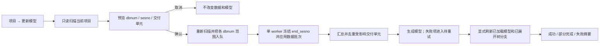

# 手动模型更新功能规格

状态：已确认（2026-07-23 修订：ZONE 仅用于预览统计，不作为数据边界或生成根）
日期：2026-07-23  
前端：`rs-plant3-d`  
后端：`D:\work\plant-code\old\gen-model`

## 目标

在桌面版或 Web 入口提供“更新模型”。用户先只读预览当前项目尚未应用的 E3D 会话变化，再明确确认把数据批次加入统一队列；自动 watcher 与手动触发共享相同执行链路。

系统必须同时满足：

- 数据更新边界始终是完整的 `dbnum + sesno` 范围。
- 模型生成严格按最小交付单元进行；不再引入 ZONE 层级，也没有整 ZONE 兜底生成。
- 每个最小交付单元独立生成；类型集合来自项目配置，默认 BRAN、HANG、SUPPO、EQUI。
- 已应用水位只能在对应数据批次成功落库后推进。
- 模型生成失败不得回滚或重复应用已经成功的数据。

统一业务术语见项目根目录的 `CONTEXT.md`。

## 范围

### 本期包含

- 当前已打开项目的只读变化扫描与预览。
- 按 E3D 文件、`dbnum`、`sesno` 和模型交付单元统计。
- 全部待处理 `dbnum` 批次的一次确认执行。
- 预览后、执行前新增会话的自动合并。
- DBNUM 文件状态和权威应用水位管理。
- 最小交付单元生成和独立失败重试。
- 更新成功后的显式元素树与场景刷新。
- 本地异常、部分成功和待重试状态展示。

### 本期不包含

- 按交付单元或单个元素选择性应用数据。
- DESI 数据库的首次全量导入。
- SurrealDB LIVE 查询。
- 项目级完整更新历史审计报表。

## 可用条件

手动更新入口仅要求：

- 编译启用 `auto_gen`。
- 当前项目已经加载。

`sync_live` 开启时仍允许预览和提交；请求只负责扫描、合并并入队，不做单飞预检。已有运行中或排队中的同库范围由调度器合并或判定已覆盖。

## 用户流程

### 打开与扫描

点击“更新模型”后立即开始当前项目的只读扫描。扫描允许更新 DBNUM 状态记录中的文件观察字段，但不得修改元素数据、模型或已应用水位。

没有待处理会话且没有模型待重试时，显示“当前项目已是最新状态”，不提供无意义的执行操作。

### 预览结构

预览按以下层级组织：

1. E3D 数据文件和 `dbnum`
2. `sesno`
3. 受影响模型交付单元

每个 `dbnum` 另带两类报告口径（不改变执行边界）：

- `zones[]` / `sites[]`：净变化按最近 ZONE / SITE 祖先分桶（ADR-020；SITE 是
  S2-G 预览树的顶层语言，挪动的单元可以出现在两个桶里，解析不出祖先的进
  「归属未知」桶）。
- `applied_sesno_time` / `file_latest_sesno_time`：已应用会话与文件最新会话在
  **E3D 里被写入的时刻**（同一把尺子，相减 = 文件里没被吸收的时间跨度；从未
  应用为空，界面文案「从未应用」）。

会话层保留原始变化记录；交付单元汇总按 `refno` 去重，并按整个待更新范围的最终结果归类：

- 新增后修改：一次新增。
- 多次修改：一次修改。
- 修改后删除：一次删除。
- 新增后删除：无净模型变化，但会话明细仍可追溯。

预览统计全部数据变化。只有几何变化、变换变化，以及新增、删除或 OWNER 变化引起的归属变化触发模型生成。

### 确认与合并

用户确认后，系统重新读取当前应用水位和文件头并把范围加入统一队列；worker 在批次真正开始时重扫并冻结 `end_sesno`：

- 冻结上界覆盖已有后继任务时，完全覆盖的任务标记为 absorbed，部分覆盖的任务从
  `frozen_end + 1` 继续。
- 批次执行期间继续产生的新会话留到下一次更新。
- 结果摘要必须列出相对预览新增合并的会话。

确认可带 `dbnums[]` 子集（ADR-020）：界面以 SITE 为勾选入口、折算成库号名单，
未勾选的库不入队、水位不动，等下一次更新；SYS meta（SYST/DICT/GLB/GLOB）不是
勾选对象，永远随批。仍不提供 ZONE 或交付单元级勾选——执行边界只有
（`dbnum`, 会话号区间）一种。

## 数据更新规则

### 批次边界

一个增量更新批次由当前项目中的一个 `dbnum` 和连续待处理 `sesno` 范围组成。ZONE、模型交付单元和元素类型都不能缩小该批次。

不同 `dbnum` 彼此隔离：

- 一个批次失败不阻止其他批次。
- 失败批次不得推进 `applied_sesno`。
- 成功批次不因后续模型生成失败而回滚。

### 数据库类型

- DESI：参与数据更新和模型影响计算。
- CATA：参与数据更新；通过 `ref_rev` 反向级联定位受影响的设计生成根，查询失败时保留
  `cascade_expand` pending。
- SYST、DICT、GLB、GLOB：参与数据更新，不触发模型生成。

DESI 没有已应用水位时，标记为“尚未初始化，需要先完成全量项目生成”，本功能不猜测历史范围。

## DBNUM 状态

当前项目库内每个 `dbnum` 必须有且只有一条权威状态记录。物理上扩展现有 `dbnum_watermark:{dbnum}`，不复用按 `ref_0` 分行的 `dbnum_info_table`。

最小字段：

- `dbnum`
- `db_type`
- `file_name`
- `file_path`
- `file_size`
- `file_modified_at`
- `file_latest_sesno`
- `applied_sesno`
- `scanned_at`
- `applied_at`

`file_latest_sesno` 是扫描观察值；`applied_sesno` 是成功落库水位。二者不得互相替代。

本方案按全新状态存储启用，不读取或迁移旧水位。DESI 没有权威 `applied_sesno` 时阻断
增量应用，要求先完成明确的全量基线建立。

详细决策见 `docs/adr/ADR-001-dbnum-update-state.md`。

## ZONE 和模型交付单元

### ZONE 统计

全部元素变化按所属 ZONE 分桶。元素跨 ZONE 移动时：

- 原 ZONE 记为移出影响。
- 新 ZONE 记为移入影响。
- 原、新 ZONE 都属于受影响范围。

ZONE 无法解析时进入显式警告桶，不阻止数据批次。

### 最小交付单元

最小交付单元类型集合是项目配置项，不是硬编码常量。未配置时使用默认集合：

- BRAN
- HANG
- SUPPO
- EQUI

`DbOption.toml` 提供两个配置项：`delivery_unit_types` 完全取代默认集合（写成 `[]` 表示不使用交付单元，全部按正常颗粒生成），`append_delivery_unit_types` 在默认集合之外追加、仅在未配置前者时生效。两者都会 trim、转大写、去重；层级容器 WORL/WORLD/SITE/ZONE 和管件 FTUB 始终被拒绝，配置里写了也会被忽略并告警。

FTUB 是 BRAN 内的普通管件，不是最小交付单元；FTUB 本身及其子件变化归并到所属 BRAN。即使项目显式清空或替换最小交付单元集合，正常颗粒解析也必须跨过 FTUB，不能把 FTUB 重新选成生成根。
配置归一会拒绝 FTUB，避免项目配置重新引入错误生成根。

变化元素本身或其最近的匹配祖先作为交付单元；无法匹配时按自动 watch 路径既有的 significant-owner 正常颗粒选择生成根。SITE、ZONE、WORL/WORLD 只作为层级容器，不允许成为生成根。

生成根解析不依赖 ZONE；ZONE 未知只进入显式警告桶，不阻止最小交付单元或正常颗粒生成。

### 新旧归属

执行数据更新前必须保存旧归属：

- 删除：影响原交付单元。
- 新增：影响新交付单元。
- 跨交付单元移动：同时影响原、新交付单元。

旧归属快照只存在于本次执行上下文，不建立长期 OWNER 历史表。

同一批次内同一交付单元按最终数据状态只生成一次。

## 失败与重试

数据成功、模型生成失败时，记录“模型生成待重试”：

- 不回滚数据。
- 不重复应用已经成功的 `sesno`。
- 不影响其他交付单元继续生成。
- 下次预览即使没有新 `sesno` 也显示并允许重试。
- 与新数据再次影响的同一交付单元合并去重，按最新状态生成一次。

每个待重试记录以 `(action, target_refno)` 为身份，至少保存派生的目标 `dbnum`、队列
`revision`、最近触发来源 `source_dbnum/source_end_sesno`、尝试次数和最后错误。
`dbnum/sesno` 只用于路由、校验与追踪，不参与任务身份或 revision 比较。

最终任务状态：

- 成功：所有数据批次和模型交付单元成功。
- 部分完成：至少一个数据批次或模型交付单元成功，同时存在失败或待重试。
- 失败：没有任何可执行工作成功。

## 文件异常

| 场景 | 处理 |
|---|---|
| `file_latest_sesno < applied_sesno` | 标记文件回退或替换，阻断该 `dbnum`，不回退水位 |
| 同项目出现多个同 `dbnum` 文件 | 展示全部路径，阻断该 `dbnum`，不自动挑选 |
| 已登记文件缺失 | 展示原路径，保留数据、模型和水位 |
| 唯一同 `dbnum` 文件移动路径 | 项目、类型一致且水位不回退时自动更新路径 |
| 执行期间文件读取失败 | 当前批次失败，不推进水位 |

所有异常只隔离所属 `dbnum`，不阻止其他正常批次。

## 任务与进度

手动与自动发现共用单 worker 数据批次队列：

- 手动请求始终返回入队、合并、已覆盖或阻断结果，不插队。
- 执行开始后不支持中途取消；关闭窗口只隐藏进度，后台任务继续。
- 再次点击入口重新扫描并按当前队列状态合并，不创建并行手动执行器。
- 任务历史是 UI 视图；durable 语义由应用水位与 `model_update_pending` 承担。

界面不显示预计百分比，分两段展示：

- 数据更新：按 `dbnum` 展示等待、执行中、成功或失败，以及实际 `sesno` 范围。
- 模型生成：按 ZONE 和交付单元展示等待、生成中、成功或待重试。

## 显式界面刷新

客户端不使用 SurrealDB LIVE 查询。

数据与模型处理完成后：

- 仅自动重载成功生成且当前场景已加载的交付单元。
- 未加载交付单元不主动载入。
- 保留相机位置。
- 原选中元素仍存在时恢复选择；已删除时清空选择。
- 模型生成失败时按 BRAN 保留完整旧显示并标记待重试：单个 BRAN 的旧关系删除与新关系写入必须原子替换；同一生成根内允许已成功 BRAN 使用新版本、失败 BRAN 保留旧版本，由后续重试最终收敛。本期不承诺生成根级快照事务。
- 已确认删除或已不存在的 BRAN 以空关系集完成原子替换，清除其旧 `tubi_relate`；BRAN 仍存在但属性、变换或查询失败时不得清除旧关系，当前单元失败并保留待重试。不得用同一个 `continue` 同时吞掉这两种情况。
- 仅重新查询当前已展开的原、新 OWNER 树分支；未展开分支保持懒加载。

## 验收标准

1. 打开预览不会写元素、模型或 `applied_sesno`。
2. 同一文件多个待处理会话能逐会话展示，并正确汇总到 ZONE。
3. 同一元素跨会话重复变化时，会话明细完整、汇总不重复放大。
4. 确认前新增会话会被合并，执行期间新增会话留待下次。
5. ZONE 只影响统计，不改变数据批次，也不作为兜底生成根。
6. 配置生效的交付单元类型（默认 BRAN、HANG、SUPPO、EQUI）按最近祖先独立生成；FTUB 始终归并到 BRAN。
7. 删除和移动能同时覆盖旧、新交付单元。
8. 一个 `dbnum` 失败不会阻止其他 `dbnum`，且失败水位不推进。
9. 模型失败不回滚数据，下一次可独立重试。
10. 文件回退、重复、缺失和合法迁移按本规格处理。
11. 前端源码中不存在 SurrealDB `LIVE SELECT`。
12. 更新后仅显式刷新已加载模型和已展开树分支。
