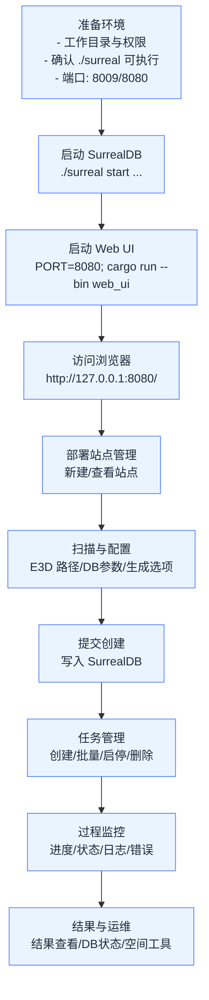
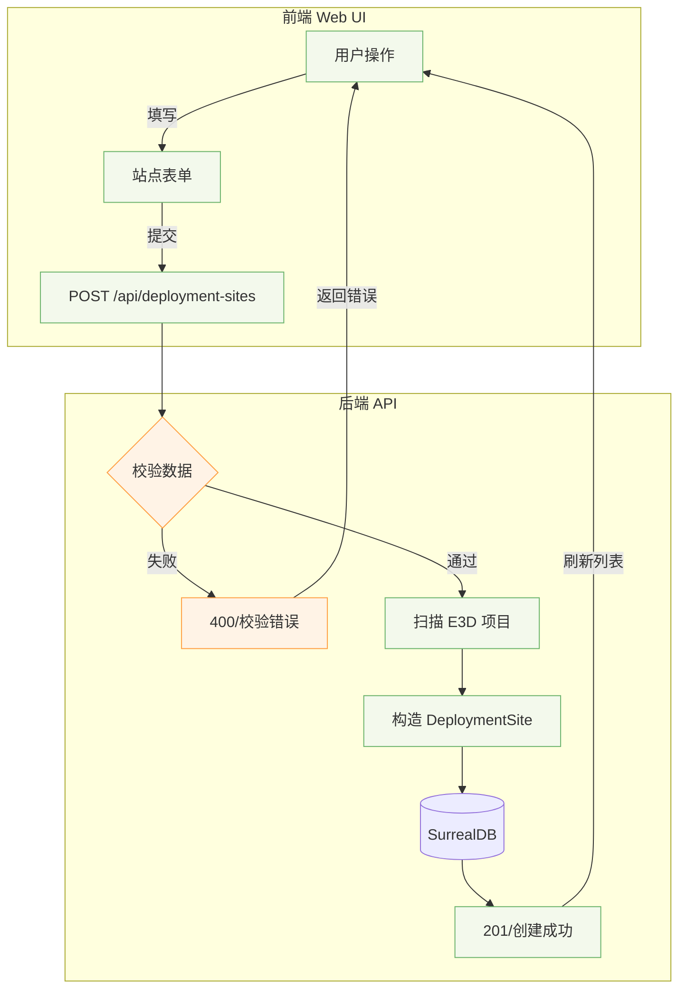

# Web UI 部署管理平台｜开发文档（单机部署、无 Docker）

> 适用场景：单机服务器，SurrealDB 二进制与服务与 Web UI 同一工作目录；Rust 调试模式运行（cargo run），不启用 release；默认端口 SurrealDB=8009，Web UI=8080。

---

## 1. 背景与目标
- 为团队提供一份在服务器单机环境下，快速、稳定地部署与使用 Web UI 的开发指南
- 与 GitHub Issue 兼容的 Markdown，便于讨论、跟踪与更新
- 内容覆盖：运行环境、快速开始、使用流程图、功能模块说明、常见操作 SOP、故障排查、附录速查

---

## 2. 运行环境与前置条件
- OS：Linux/macOS（建议 Linux server）
- Rust 工具链：cargo、rustc 已安装
- 工作目录：设为 /opt/gen-model（或你的实际路径），以下命令均在该目录执行
- SurrealDB：二进制在当前目录 `./surreal`，可执行（`chmod +x ./surreal`）
- 端口未被占用：8009（SurrealDB）、8080（Web UI）

> 若命令找不到，可用 `brew info <name>` 定位安装路径，然后用绝对路径执行

---

## 3. 快速开始（单机）

### 3.1 启动 SurrealDB（同目录）
```bash
./surreal start --user root --pass root --bind 127.0.0.1:8009 rocksdb://ams-8009-test.db
```

### 3.2 启动 Web UI（调试模式）
```bash
export PORT=8080 RUST_LOG=info
cargo run --bin web_ui
```

### 3.3 访问与验证
- 浏览器访问：`http://127.0.0.1:8080/`
- SurrealDB CLI（示例，命名空间与DB按项目实际）：
```bash
./surreal sql --conn ws://127.0.0.1:8009 --user root --pass root --ns 1516 --db AvevaMarineSample
```

> 参考号格式示例：`24383_86525`（下划线替换斜杠），可查询 `pe` 表、`ATT_NAMED` 表，沿 `owner` 字段查询层级关系

---

## 4. 使用流程（Mermaid 流程图）

### 4.1 整体使用流程


### 4.2 创建部署站点


### 4.3 站点任务创建与执行
```mermaid
graph TD
    A[选择部署站点] --> B[创建任务]
    B --> C[选择类型\nFull/Data/Spatial/Mesh]
    C --> D[可选覆盖配置\nDB 列表/容差/关键字]
    D --> E[提交任务\nPOST /api/deployment-sites/{id}/tasks]
    E --> TM[TaskManager 入队\n状态=Pending]
    TM --> X[开始执行\n状态=Running]
    X --> L[实时日志/进度]
    X -->|成功| S[状态=Completed]
    X -->|失败| F[状态=Failed\n错误详情]
    S --> U[查看结果/下载]
    F --> U
    classDef node fill:#eef7ff,stroke:#5aa0ff
    class A,B,C,D,E,TM,X,L,S,F,U node
```

---

## 5. Web UI 功能模块说明（主要页面）
- 首页（`/`）：平台入口与导航，快速进入核心功能
- 仪表盘（`/dashboard`）：系统状态与最近任务概览（CPU/内存/任务趋势/资源使用）
- 配置管理（`/config`）：配置模板、参数配置（数据库编号、生成选项、网格参数等）、预览与保存
- 任务管理（`/tasks`，`/tasks/:id/logs`）：任务创建、启停/删除、实时进度条、日志与错误详情
- 批量任务（`/batch-tasks`）：一次性批量创建多条任务
- 数据库状态与部署站点（`/db-status`）：站点列表、站点健康/状态、SurrealDB 连接状态与检查
- 部署向导（`/wizard`）：引导式创建站点（E3D 路径、DB 参数、生成选项）
- 空间工具（`/space-tools`）：空间拟合、相对关系、距离与跨度等分析工具
- SQLite 空间分析（`/sqlite-spatial`）：基于 SQLite/R-Tree 的空间检测与分析
- 桥架支撑检测（`/tray-supports`）：专题检测页面与 API（`/api/sqlite-tray-supports/detect`）
- SCTN 测试流程（`/sctn-test`）：后台任务 + 进度 + 结果（`/api/sctn-test/*`）
- 数据库连接（`/database-connection`）：查看/配置数据库连接信息
- 静态资源（`/static`）：前端静态文件（Tailwind、Alpine.js、Chart.js、图标等）

> 后端基于 Axum，已注册丰富 REST API；内置 SurrealDB 启动/探测与任务调度（含 auto_update_scheduler、projects_health_scheduler）。

---

## 6. 常见操作 SOP（单机）
### 6.1 启停
```bash
# 启动 SurrealDB（同目录）
./surreal start --user root --pass root --bind 127.0.0.1:8009 rocksdb://ams-8009-test.db

# 启动 Web UI（调试模式）
export PORT=8080; cargo run --bin web_ui
```

### 6.2 日志
```bash
# Web UI（journald 或终端输出）
journalctl -u web-ui -f  # 若已服务化

# 仓库日志（如有）
tail -f web_ui.log
```

### 6.3 升级/回滚
```bash
# 升级
git pull && systemctl restart web-ui  # 若服务化

# 回滚到指定提交/标签
git checkout <commit|tag> && systemctl restart web-ui
```

### 6.4 故障排查
- 端口占用：`lsof -i :8080` / `lsof -i :8009`
- SurrealDB 启动失败：确认 `./surreal` 可执行与数据路径存在
- 命令找不到：`brew info surrealdb` / `brew info rust` 定位路径后用绝对路径执行

---

## 7. 故障排除（FAQ）
- Q: 访问 8080 无响应？
  - A: 确认 Web UI 正在运行，防火墙开放，`curl -I http://127.0.0.1:8080/` 返回 200
- Q: Web UI 报数据库连接失败？
  - A: 确认 SurrealDB 在本机 8009 端口运行，账号/密码正确；CLI 可连通
- Q: 任务卡在 Pending？
  - A: 查看后台日志；确认依赖资源可用；必要时重启任务或 Web UI
- Q: Mermaid 不显示？
  - A: GitHub Issue 支持 Mermaid（已全量开放）；若本地查看，请使用支持 Mermaid 的阅读器

---

## 8. 附录：端口与环境变量、命令速查
- 端口
  - SurrealDB：`ws://127.0.0.1:8009`
  - Web UI：`http://127.0.0.1:8080`
- 环境变量
  - `PORT=8080`（Web UI 监听端口）
  - `RUST_LOG=info`（日志级别）
- 命令速查
```bash
# 启 SurrealDB
./surreal start --user root --pass root --bind 127.0.0.1:8009 rocksdb://ams-8009-test.db

# 启 Web UI
export PORT=8080; cargo run --bin web_ui

# SurrealDB CLI（示例）
./surreal sql --conn ws://127.0.0.1:8009 --user root --pass root --ns 1516 --db AvevaMarineSample
```

---

## 9. Issue 使用建议
- 标题建议：【开发文档】Web UI 部署管理平台（单机部署｜无 Docker）
- 标签建议：`documentation` `deployment` `web-ui`
- 模板建议：
  - 描述（背景/目标）
  - 运行环境（OS/路径/端口）
  - 快速开始（命令）
  - 使用流程（Mermaid）
  - 功能模块
  - SOP / 故障排查
  - 附录（端口/环境/速查）
  - 变更记录（后续补充）

---

> 维护：建议由使用者每次变更部署方式/端口/依赖后，在本 Issue 下追加评论或编辑文档，保持与实际一致。

