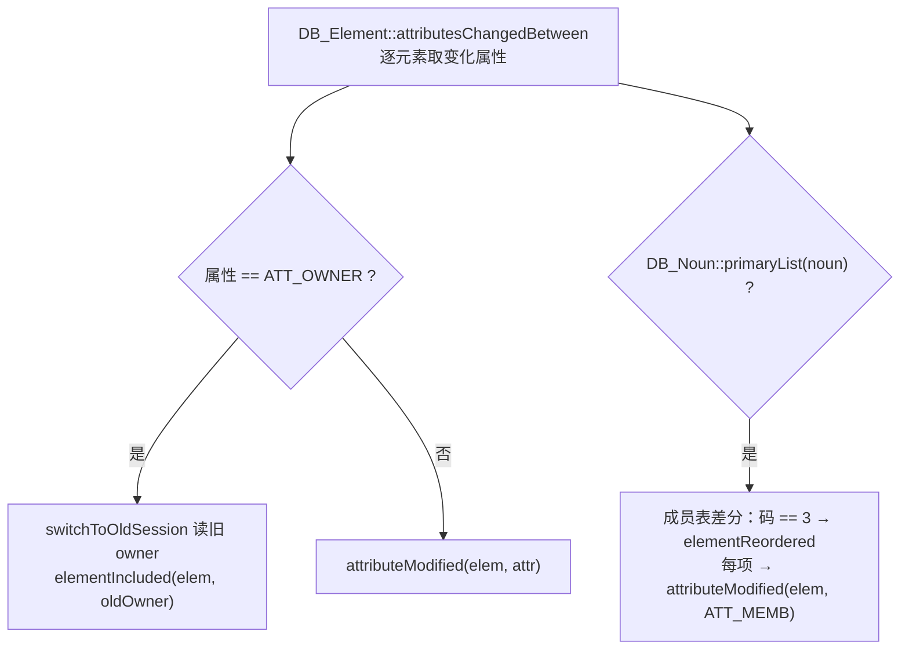

# 案例 01 · OWNER 变更是「搬迁」，不是属性修改

族 A 变化语义 · High · 已修 · 证据层 A（core.dll 反编译）+ B（单测）

## 一句话

把 `OWNER` 当成一个普通属性来处理，会让「元素从 A 搬到 B」只刷新 B 一侧——A 那边的旧几何原样留在三维里。

## 现象

搬迁一个子元件（例如把某个元件从一根 `BRAN` 移到另一根），更新完成后：

- 新位置的几何正确出现；
- **旧位置的几何还在**，因为旧 owner 从来没进过本次的重生成根集合。

## 证据

`DB_DB::elementsChangedSince(dbnum, sesno, out)`（`0x5900230`）转发到
`elementsChangedBetween`（`0x58ffc50`）——这是会话区间差分在内核里的本体。逐属性遍历时它有一个专门分支：

`DB_UserChanges` 的六个变化桶按对象偏移排列，写入规则全部有反汇编取证：

| 偏移 | 桶 | 谁往里写 |
|---:|---|---|
| +0 | Created | `elementCreated`（`0x5987a90`） |
| +8 | Deleted | `elementDeleted`（`0x5987b70`） |
| +16 | Moved | `elementIncluded`（`0x5987ea0`） |
| +24 | MemberChanged | `elementCreated` 写**其 owner**；`elementIncluded` 写**旧、新两个 owner**；`elementReordered` 写 owner |
| +32 | Reordered | `elementReordered`（`0x5988040`） |
| +40 | Modified | `attributeModified`（`0x5987090`） |

- `elementIncluded` 的双写取证：`0x5987f27` 的 `lea ecx,[edi+18h]`、`0x5987f3c` 的 `lea ecx,[edi+10h]`、`0x5987f6b` 的 `lea ecx,[edi+18h]`。
- 成员表差分**仅当** `DB_Noun::primaryList(noun)`（`0x58da260`）为真才执行，顺序变化码固定为 `3`。
- 出处：[`../../docs/2026-07-25_test-plan-core-dll-model-update-complete-matrix-v2.md`](../../docs/2026-07-25_test-plan-core-dll-model-update-complete-matrix-v2.md) §1.1、§1.2。

## 根因

v1 的测试计划把 `OWNER` 归进 `StructuralMembership` 这类普通属性，并把 `elementIncluded` 判为
「在线 UI 语义、离线不适用」记为 N/A。两条都被二进制推翻了：

1. `OWNER` 变化**根本不产生** `attributeModified` 事件；
2. `elementIncluded` 就是会话区间差分里表达搬迁的**唯一**手段，离线必须实现。

按普通属性处理时，变更集里只有「元素自己」这一个 refno。经生成根归一后得到的是**新** owner 侧的根，
旧 owner 从头到尾没有任何入口能进来——这不是漏了一行代码，是模型建错了。

## 修法

[`ADR-009`](../../docs/adr/ADR-009-owner-change-is-moved-not-attribute-modified.md)，实现在
[`../../src/data_interface/model_impact.rs`](../../src/data_interface/model_impact.rs)：

1. 新增 `ChangeBucket` 六桶与纯函数 `user_change_buckets`，按内核写入语义建模：
   - `Modified` 含 OWNER → `Moved(elem)` + `MemberChanged(旧 owner)` + `MemberChanged(新 owner)`；
     纯 OWNER 变化**不**记 `Modified` 桶（缺口 G1）。
   - `Add` → `Created(elem)` + `MemberChanged(owner)`（缺口 G2）——新建元素也必须让 owner 进桶，
     否则新建在非交付单元 owner 下时父根不刷新。
   - 成员 / 顺序差分经 `classify_children_delta_gated` 按 `primaryList` 门控（缺口 G3）：
     同集合换序 → `Reordered`，集合增删 → `MemberChanged`；两者都触发父根重生成，但事件类型必须可区分。
2. `primaryList` **不在**普通 dabacon 属性字典里；core 走
   `db_get_element_info(hash, 297853135)` 并以 `value == 1` 判真。2026-08-18 已从 live
   core.dll 同一入口冻结 1931 noun：1879 resolved 使用真值，52 unknown 显式列账并
   保守为 true。B-EVT-03 同时验证 resolved true / false 与 unknown 三种路径。
3. 「本窗口内新建后又搬迁 = 净 Created 而非 Moved」（对齐 `elementIncluded` 的 `isElementCreated` 分支）
   放在窗口层的 `manual_update::fold_net_op` 处理，不在单操作层。

## 验证

批次 B 的 B-EVT-01…07（`model_impact.rs` 单测），逐条对齐 `.ida_scratch/analysis/db_userchanges.c` 的取证：

- B-EVT-01：OWNER 变化 → 元素记 moved，**旧、新 owner 都记 member-changed**；
- B-EVT-02：新建元素时其 owner 记 member-changed；
- B-EVT-03：成员差分只对 `primaryList` 类型执行；
- B-EVT-04：换序判 Reordered、增删判 MemberChanged；
- B-EVT-05：差分顺序为 修改 → 删除 → 新建，同窗口先删后建净结果为 Added；
- B-EVT-06：搬进「本窗口新建的 owner」时元素改记 Created。

端到端（C 层）仍缺：真实 E3D 里跨交付单元移动子树的前后三维截图，见
[`../../docs/2026-07-24_test-core-dll-incremental-alignment-report.md`](../../docs/2026-07-24_test-core-dll-incremental-alignment-report.md) §7 第 2 条。

## 规律

**结构关系的变化天生是双端事件。** 判断「这次变更要刷新几个根」时，不能只看变更元素自己带了什么属性——
凡是改动了「谁属于谁」的操作（搬迁、新建、删除、重排），都要同时把**关系的另一端**加进变更集。
内核用六个桶把这件事显式化，离线实现如果只有「属性变了」一种事件类型，就一定会漏掉另一端。

## 关联

- [`ADR-009`](../../docs/adr/ADR-009-owner-change-is-moved-not-attribute-modified.md) · [`ADR-002`](../../docs/adr/ADR-002-core-dll-authority-scope.md)
- 案例 [04 生成根归一](case-04-generation-root-must-be-one-rule.md)（搬迁的两个根都要经同一套归一）
- [`../learning-records/0002-core-dll-model-update-logic.md`](../learning-records/0002-core-dll-model-update-logic.md)
