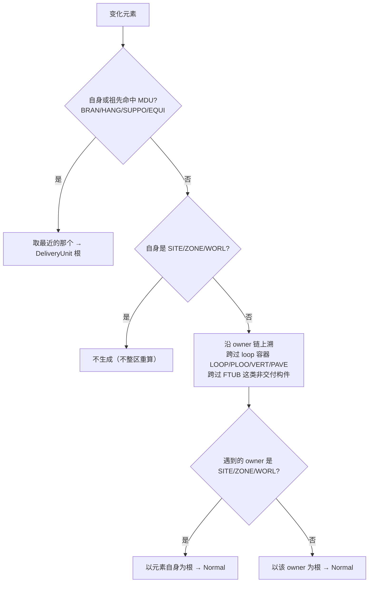

# 案例 04 · 生成根归一：主路径 / 兜底 / 补偿必须同一套口径

<sub>族 A 变化语义 · High · 已修 · 证据层 B（单测）+ C（实库）</sub>

## 一句话

同一个变更集，主路径算出「重生成这个 EQUI」，补偿路径算出「跳过」——失败重试之后模型永远不会被补上。

## 现象

`EQUI` 直属于 `ZONE` 是最常见的布置形态（7997 里 813 个 EQUI）。当它的一次刷新失败进了补偿队列后：

- 主路径 `conservative_regen` 用 Significant Owner 归一：owner 是 ZONE（太粗）→ **以元素自身为根**，正确重生成；
- 兜底 `owner_regen` 与补偿重试 `compensate_owners` 却写着
  `if pe.noun == "SITE" || "ZONE" { continue }` ——**直接跳过**，任务被消费掉但什么都没生成。

结果：一次偶发失败之后，这个 EQUI 的几何永久陈旧，且队列显示「已处理」。

## 证据

- 缺陷登记：[`../../docs/specs/incr-gen-fixes/spec.md`](../../docs/specs/incr-gen-fixes/spec.md) **F3**（High）。
  根因位置 `src/data_interface/model_refresh.rs` 的 `compensate_owners`，被 `side_effect_pending.rs` 的补偿重试调用。
- 归一规则的权威定义在 [`../../CONTEXT.md`](../../CONTEXT.md)：**生成根 / 最小交付单元 / 正常颗粒 / Significant Owner**。
- 现行实现 [`../../src/data_interface/generation_root.rs`](../../src/data_interface/generation_root.rs)：

```rust
pub const DEFAULT_DELIVERY_UNIT_TYPES: &[&str] = &["BRAN", "HANG", "SUPPO", "EQUI"];
pub const COARSE_HIERARCHY_NOUNS: &[&str]      = &["WORL", "WORLD", "SITE", "ZONE"];
pub const NON_DELIVERY_UNIT_NOUNS: &[&str]     = &["FTUB"];
pub const MAX_ANCESTOR_DEPTH: usize            = 32;   // 只防环，不是深度截断
```

`resolve_element_generation_root`（`:207`）的四条规则：



- MDU 集合是**项目配置而非编译期常量**：`DbOption.toml` 的 `delivery_unit_types` 整体替换默认集合，
  `append_delivery_unit_types` 在默认集合上追加；层级容器与 `FTUB` **恒被拒绝**，配置里写了也不生效。
- `TUBI` 属于 dabacon 字典的**伪类型**（`defined == 4`，10 个之一：
  `ALLP DESEL DRAEL INSU PADEL PRMF PRTYPE ROD TRAC TUBI`）。这为「`BRAN` 下的 `TUBI`/`FTUB` 不是独立交付单元」
  提供了字典级依据，而不只是经验规则。

## 根因

同一个概念（「这次变更该从哪个根重新生成」）在仓库里有**两份实现**：一份精确（Significant Owner），
一份粗糙（`noun == SITE || ZONE` 就跳过）。两份实现服务于不同调用路径，于是同一个变更在
主路径和补偿路径上得到不同答案——而补偿路径恰恰是「主路径已经失败了」才会走的那条。

## 修法

F3 的四个任务（[`tasks.md`](../../docs/specs/incr-gen-fixes/tasks.md) T301–T306）：

1. **复用**权威 `resolve_significant_owner` 作为单一实现；
2. `owner_regen` / `compensate_owners` 改用它，**删除** `noun == SITE || ZONE { continue }` 的粗跳过；
3. 只有元素**自身**就是 `SITE/ZONE/WORL` 时才跳过（与 Significant Owner 定义一致，不整区重算）；
4. 补偿路径同步补上 deleted 清理（`cleanup_deleted_by_pe_state`，按 `pe.deleted` 反推）。

后续 `5f0ddb19` 更进一步：删除无调用方的 refresh 链，**根解析只留 `generation_root` 一处**。

[`ADR-008`](../../docs/adr/ADR-008-catalog-reverse-propagation.md) 把这条固化为决策：
「生成根统一由 `generation_root` 决定：最近 MDU 优先，否则使用 Normal Granularity 的 significant owner。
自动、手动和补偿路径共享相同根规则；移动仍同时覆盖旧根和新根。」

## 验证

- 对拍单测：主路径与补偿路径对同一变更集算出的生成根集合一致（T305）。
- 实库（2026-07-26）：`live_zone_owned_equi_pending_is_actually_regenerated` 确认
  `EQUI 24381/100677` 直属 ZONE，经 durable pending drain 后任务清空且子树**实际生成 17 个模型实例**。
- `BRAN` 归一的实库证据：`BRAN 24381/100817`（session 81）重建时其下 `TUBI`/`FTUB`
  不产生独立交付结果，`rs-plant-3d` 已加载更新后的管道模型。

## 规律

**同一个概念只能有一份实现，尤其是在「失败之后才走」的那条路径上。** 补偿 / 兜底路径天生缺乏测试，
它们与主路径的分叉不会在正常流程里暴露，只会在出错之后——也就是最需要它正确的时候——静默生效。

一条可操作的检查：凡是代码里出现第二处「判断该从哪儿开始重算」的逻辑，先问它能不能直接调用第一处；
不能的话，至少要有一条对拍测试把两者的输出钉在一起。

## 关联

- [`ADR-008`](../../docs/adr/ADR-008-catalog-reverse-propagation.md) · [`CONTEXT.md`](../../CONTEXT.md) 术语表
- 案例 [01 OWNER 搬迁](case-01-owner-change-is-a-move.md)（搬迁产出旧、新两个根，都要过这套归一）
- 案例 [12 drain 失败隔离](case-12-drain-failure-isolation.md)、[13 mesh panic](case-13-mesh-panic-kills-the-watchdog.md)（补偿路径为什么会被走到）
