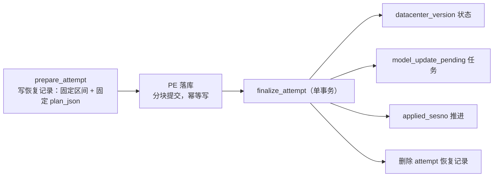

# 案例 11 · 水位三段式：prepare → PE 落库 → finalize

族 D 水位与重放 · High · 已修 · 证据层 B（单测）+ C（实库崩溃注入）

## 一句话

「数据已应用、模型任务未登记」这个窗口一旦存在，进程在里面退出就会**永久丢掉**那批模型更新——
所以水位、模型工作、交付状态必须在同一个事务里收口。

## 现象（修复前的三种坏结果）

1. **水位提前**：水位从两张表取最大 `sesno`（`dbnum_watermark` 与 `dbnum_info_table`），
   而后者是按 `ref_0` 的元素统计、粒度根本不是 dbnum。批次没完整成功时统计先变，取最大值就会
   **跳过后续增量**。
2. **模型任务丢失**：`applied_sesno` 已推进、但持久化模型任务还没写入的窗口里进程退出 →
   数据在库里、模型永远不会被生成，且没有任何东西记得要生成。
3. **交付状态成孤儿**：`datacenter_version` 的状态更新脱离 finalize 事务、失败只记 warning，
   于是可能出现「datacenter 已标 Modify/Delete、水位仍是旧值、pending 任务未落库」的三不一致。

## 证据

- 决策：[`ADR-001`](../../docs/adr/ADR-001-dbnum-update-state.md)——
  以 `dbnum_watermark:{dbnum}` 作为**唯一权威 DBNUM 状态记录**，不新增第二张同粒度表。
- 第三条（A3）由 Oracle 审核报出，本仓复核后**降级为 Medium**：
  `update_datacenter_version` 发的是 `UPDATE ... SET status`，只命中已发布的交付记录、**幂等**，
  崩溃后同窗口重放会收敛；且即使全链路成功，datacenter 标记本来也**早于**几何重生成。
  真正的残留风险只剩一种：该文件在崩溃后被 `Rollback`/`Duplicate` 判定阻断、永远不再重放，
  此时标记就成了孤儿。出处
  [`../../docs/2026-07-26_increment-update-chain-audit-report.md`](../../docs/2026-07-26_increment-update-chain-audit-report.md) 第三节。

## 修法

**一、水位语义收敛到一处**（ADR-001）。`dbnum_watermark` 一行一个 dbnum，字段含
`file_latest_sesno`（扫描观察值）与 `applied_sesno`（已应用水位），两者严格区分、互不替代：

- 预览扫描只能更新文件身份、`file_latest_sesno`、`scanned_at`；
- 只有对应数据批次**成功持久化后**才能推进 `applied_sesno`；
- 数据批次失败、文件异常、模型生成失败**都不能**回退或虚增水位；
- 逻辑增量窗口 `(applied_sesno, file_latest_sesno]`，实际读取从不小于 `applied_sesno + 1` 的
  首个可用会话开始——**不假设会话号连续**。

**二、三段式恢复状态机**：

三处关键设计：

- `prepare_attempt` 写在**任何 PE 变更之前**，存的是**固定 plan**（`plan_json`）而不是重算依据。
  恢复路径直接复用 `attempt.plan`——绝不在一个可能半写的库上重算 owner 图。
- `render_finalize_transaction`（`model_update_pending.rs:236`）把
  `window_statements`（当前就是本窗口的 datacenter 状态更新）+ 模型工作 upsert +
  `UPSERT dbnum_watermark … applied_sesno = math::max(…)` + `DELETE attempt` 拼进
  **一个 `BEGIN/COMMIT`**。A3 的修法就是把 datacenter 并进这里：
  单独提交会让交付状态写失败而水位照样越过它，**后面没有任何窗口会来修**。
- finalize 失败时 attempt 原样留着，整个固定区间可安全重放。

**三、失败不回滚数据**。模型执行采用 at-least-once：模型失败不回滚数据或水位，任务保留重试
（[`ADR-008`](../../docs/adr/ADR-008-catalog-reverse-propagation.md)）。这条与 ADR-001 配套——
「水位后的进程崩溃只会留下可消费任务，不会丢失模型更新」。

## 验证

- Oracle 审核逐条核实：`applied_sesno` 没有提前推进的路径；水位推进、pending 写入、attempt 删除
  三者在同一 `BEGIN/COMMIT` 内；attempt 恢复用固定 plan；pending `record_id` 已按 dbnum 隔离
  （`dbnum + action + target_refno`）；SurrealQL 插值统一走 `escape_surql_str`。
- 实库（2026-07-26）`live_generation_failure_keeps_pending_and_watermark`：连续注入批量与逐根生成失败，
  断言进程不崩、根任务 `status=failed/attempts=1`、`applied_sesno` **保持 42 不动**。
- 仍缺：在水位推进后、pending 建立前强制杀进程的**崩溃注入**用例（矩阵 D-14）。

## 注意：单事务只到 chunk 边界

主数据落库**不是**整窗口单事务。`persist_latest_main_data` 按 `TX_CHUNK = 500` 分块提交
（`increment_pipeline.rs:716`），因为 SurrealDB ws 通道有上限、amssys 冷启动窗口会撑爆它。
真实语义是「**每 500 条一块原子，跨块非原子**」。

这个前提很重要——案例 [14](case-14-replay-must-converge.md) 的幂等要求正是建立在它之上。
审核 A2 报的就是两处旧注释还在宣称「整窗口单事务、要么整体回滚」，与实现直接矛盾；
现已改成陈述分块语义。**注释漂移在这里不是洁癖问题**：下一个读代码的人（或下一次 AI 审核）
会据此得出错误的安全性结论。

## 规律

**事务边界应该按「谁必须与谁共命运」来画，而不是按「哪些语句挨着写」。**
判据是一个反问：如果 A 成功而 B 失败，有没有后续机制会来修？没有的话，A 和 B 必须同一个事务。
datacenter 状态与水位就是这种关系——水位越过去之后，再没有窗口会重发那条状态更新。

**恢复要基于快照，不要基于重算。** 崩溃恢复时数据库处于半写状态，此时重算出来的 owner 图
可能与崩溃前完全不同。`prepare_attempt` 存固定 plan 的意义就在这里：重放的是同一件事，而不是
「对当前状态重新想一遍该做什么」。

## 关联

- [`ADR-001`](../../docs/adr/ADR-001-dbnum-update-state.md) · [`ADR-008`](../../docs/adr/ADR-008-catalog-reverse-propagation.md)
- 案例 [14 同窗口重放必须收敛](case-14-replay-must-converge.md)（分块提交的直接后果）
- 案例 [15 文件身份守卫](case-15-file-identity-guard.md)（`file_latest_sesno` 那一侧）
