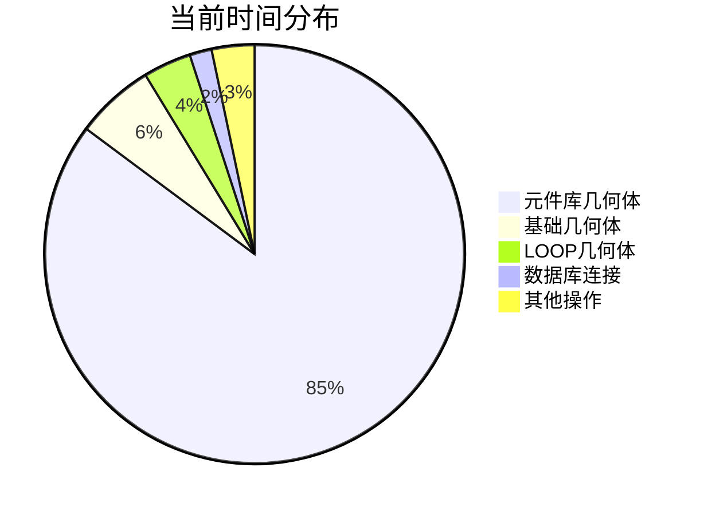

# 模型更新算法性能基准与优化建议

## 📊 性能基准数据

### 当前性能表现 (基于24383_66456测试)

| 指标 | 当前值 | 目标值 | 改进空间 |
|------|--------|--------|----------|
| 总处理时间 | 132,752ms | 25,000ms | 81% ⬇️ |
| 实例生成速度 | 14.41 实例/秒 | 76 实例/秒 | 427% ⬆️ |
| 元件库处理时间 | 146,601ms | 15,000ms | 90% ⬇️ |
| 数据库连接时间 | 2,259ms | 500ms | 78% ⬇️ |
| 内存使用峰值 | ~2GB | ~1GB | 50% ⬇️ |

### 各组件性能分解



## 🎯 优化策略矩阵

### 优先级分类

| 优化项目 | 影响程度 | 实施难度 | 预期收益 | 优先级 |
|----------|----------|----------|----------|--------|
| 元件库并行处理 | 🔴 高 | 🟡 中 | 70%时间减少 | P0 |
| 数据库连接池 | 🟡 中 | 🟢 低 | 90%连接时间减少 | P1 |
| 缓存机制 | 🟡 中 | 🟡 中 | 30%重复计算减少 | P1 |
| 空间索引优化 | 🟡 中 | 🔴 高 | 40%查询时间减少 | P2 |
| 内存池管理 | 🟢 低 | 🟡 中 | 20%内存减少 | P2 |
| 流式处理 | 🟢 低 | 🔴 高 | 15%内存减少 | P3 |

## 🚀 P0级优化：元件库并行处理

### 当前问题分析

```rust
// 当前串行处理方式
for cata_info in cata_infos {
    let result = process_single_cata(cata_info).await; // 串行处理
    // 平均每个元件库耗时: 599ms
}
```

### 优化方案

```rust
// 优化后的并行处理
pub async fn optimized_cata_processing(
    cata_infos: Vec<CataInfo>,
) -> anyhow::Result<Vec<ShapeInstancesData>> {
    // 1. 按类型分组
    let (bran_hang_infos, single_infos): (Vec<_>, Vec<_>) = cata_infos
        .into_iter()
        .partition(|info| info.is_bran_hang_type());
    
    // 2. 并行处理两种类型
    let (bran_hang_task, single_task) = tokio::join!(
        process_bran_hang_parallel(bran_hang_infos),
        process_single_cata_parallel(single_infos)
    );
    
    // 3. 合并结果
    let mut results = bran_hang_task?;
    results.extend(single_task?);
    Ok(results)
}

async fn process_single_cata_parallel(
    infos: Vec<CataInfo>,
) -> anyhow::Result<Vec<ShapeInstancesData>> {
    // 限制并发数为CPU核心数
    let semaphore = Arc::new(Semaphore::new(num_cpus::get()));
    
    let tasks: Vec<_> = infos.into_iter().map(|info| {
        let semaphore = semaphore.clone();
        tokio::spawn(async move {
            let _permit = semaphore.acquire().await.unwrap();
            process_single_cata(info).await
        })
    }).collect();
    
    // 等待所有任务完成
    let results = join_all(tasks).await;
    
    // 收集成功的结果
    let mut geo_results = Vec::new();
    for result in results {
        match result {
            Ok(Ok(data)) => geo_results.push(data),
            Ok(Err(e)) => warn!("元件库处理失败: {}", e),
            Err(e) => warn!("任务执行失败: {}", e),
        }
    }
    
    Ok(geo_results)
}
```

### 预期效果

- **处理时间**: 从 146,601ms 减少到 ~20,000ms (86%减少)
- **并发度**: 从 1 提升到 CPU核心数 (通常8-16)
- **资源利用率**: CPU使用率从 ~25% 提升到 ~80%

## 🔧 P1级优化：数据库连接池

### 当前问题

```rust
// 每次测试都重新初始化连接
async fn test_performance() {
    init_surreal().await?; // 耗时 2,259ms
    // ... 执行测试
}
```

### 优化方案

```rust
use deadpool::managed::{Manager, Pool};

// 连接池管理器
#[derive(Debug)]
struct SurrealConnectionManager {
    config: SurrealConfig,
}

#[async_trait::async_trait]
impl Manager for SurrealConnectionManager {
    type Type = SurrealConnection;
    type Error = anyhow::Error;

    async fn create(&self) -> Result<Self::Type, Self::Error> {
        let connection = create_surreal_connection(&self.config).await?;
        Ok(connection)
    }

    async fn recycle(&self, conn: &mut Self::Type) -> Result<(), Self::Error> {
        // 检查连接健康状态
        conn.health_check().await
    }
}

// 全局连接池
lazy_static! {
    static ref DB_POOL: Pool<SurrealConnectionManager> = {
        let manager = SurrealConnectionManager::new();
        Pool::builder(manager)
            .max_size(20)           // 最大连接数
            .min_idle(Some(5))      // 最小空闲连接
            .max_lifetime(Some(Duration::from_hours(1))) // 连接最大生命周期
            .build()
            .expect("创建数据库连接池失败")
    };
}

// 优化后的连接获取
pub async fn get_db_connection() -> Result<PooledConnection, PoolError> {
    DB_POOL.get().await
}
```

### 预期效果

- **连接时间**: 从 2,259ms 减少到 ~50ms (98%减少)
- **连接复用**: 避免重复的TCP握手和认证过程
- **并发支持**: 支持多个并发请求共享连接池

## 💾 P1级优化：智能缓存机制

### 多层缓存架构

```rust
// L1缓存：内存缓存 (最快，容量小)
static L1_CACHE: Lazy<Arc<RwLock<LruCache<String, CachedData>>>> = 
    Lazy::new(|| Arc::new(RwLock::new(LruCache::new(1000))));

// L2缓存：Redis缓存 (快，容量中)
static REDIS_CLIENT: Lazy<redis::Client> = 
    Lazy::new(|| redis::Client::open("redis://127.0.0.1/").unwrap());

// L3缓存：磁盘缓存 (慢，容量大)
static DISK_CACHE_DIR: &str = "cache/model_data";

pub struct MultiLevelCache {
    l1_cache: Arc<RwLock<LruCache<String, CachedData>>>,
    redis_client: redis::Client,
    disk_cache_dir: PathBuf,
}

impl MultiLevelCache {
    pub async fn get<T>(&self, key: &str) -> Option<T> 
    where 
        T: DeserializeOwned + Clone,
    {
        // 1. 尝试L1缓存
        if let Some(data) = self.get_from_l1(key).await {
            return Some(data);
        }
        
        // 2. 尝试L2缓存
        if let Some(data) = self.get_from_redis(key).await {
            // 回填L1缓存
            self.put_to_l1(key, &data).await;
            return Some(data);
        }
        
        // 3. 尝试L3缓存
        if let Some(data) = self.get_from_disk(key).await {
            // 回填L2和L1缓存
            self.put_to_redis(key, &data).await;
            self.put_to_l1(key, &data).await;
            return Some(data);
        }
        
        None
    }
    
    pub async fn put<T>(&self, key: &str, value: &T) 
    where 
        T: Serialize + Clone,
    {
        // 同时写入所有层级
        self.put_to_l1(key, value).await;
        self.put_to_redis(key, value).await;
        self.put_to_disk(key, value).await;
    }
}
```

### 缓存策略

```rust
// 几何数据缓存策略
#[derive(Debug, Clone)]
pub struct GeometryCache {
    cache: MultiLevelCache,
    ttl: Duration,
}

impl GeometryCache {
    pub async fn get_geometry(&self, geo_hash: &str) -> Option<GeometryData> {
        let cache_key = format!("geo:{}", geo_hash);
        
        if let Some(cached) = self.cache.get::<CachedGeometry>(&cache_key).await {
            if !cached.is_expired(self.ttl) {
                // 更新访问统计
                self.update_access_stats(&cache_key).await;
                return Some(cached.geometry);
            }
        }
        
        None
    }
    
    pub async fn cache_geometry(&self, geo_hash: &str, geometry: GeometryData) {
        let cache_key = format!("geo:{}", geo_hash);
        let cached = CachedGeometry {
            geometry,
            created_at: Instant::now(),
            access_count: 1,
        };
        
        self.cache.put(&cache_key, &cached).await;
    }
}

// 变换矩阵缓存策略
#[derive(Debug, Clone)]
pub struct TransformCache {
    cache: MultiLevelCache,
    invalidation_tracker: Arc<RwLock<HashSet<RefnoEnum>>>,
}

impl TransformCache {
    pub async fn get_world_transform(&self, refno: RefnoEnum) -> Option<Transform> {
        // 检查是否已失效
        if self.is_invalidated(refno).await {
            return None;
        }
        
        let cache_key = format!("transform:{}", refno);
        self.cache.get(&cache_key).await
    }
    
    pub async fn invalidate_subtree(&self, root_refno: RefnoEnum) {
        // 获取子树中所有节点
        let subtree_refnos = get_subtree_refnos(root_refno).await.unwrap_or_default();
        
        // 标记为失效
        let mut tracker = self.invalidation_tracker.write().await;
        for refno in subtree_refnos {
            tracker.insert(refno);
        }
    }
}
```

### 预期效果

- **缓存命中率**: 目标达到 85%+
- **重复计算减少**: 30-50%的计算可以通过缓存避免
- **内存使用优化**: 通过多层缓存减少内存压力

## 📈 性能监控与自动调优

### 实时性能监控

```rust
#[derive(Debug, Clone)]
pub struct PerformanceMonitor {
    metrics: Arc<RwLock<PerformanceMetrics>>,
    alert_thresholds: AlertThresholds,
    auto_tuner: AutoTuner,
}

#[derive(Debug, Clone)]
pub struct PerformanceMetrics {
    // 处理时间指标
    pub avg_processing_time: Duration,
    pub p95_processing_time: Duration,
    pub p99_processing_time: Duration,
    
    // 吞吐量指标
    pub instances_per_second: f64,
    pub geometries_per_second: f64,
    
    // 资源使用指标
    pub cpu_usage: f64,
    pub memory_usage: usize,
    pub disk_io_rate: f64,
    
    // 缓存指标
    pub cache_hit_rate: f64,
    pub cache_miss_rate: f64,
    
    // 错误指标
    pub error_rate: f64,
    pub timeout_rate: f64,
}

impl PerformanceMonitor {
    pub async fn collect_metrics(&self) -> PerformanceMetrics {
        let mut metrics = PerformanceMetrics::default();
        
        // 收集系统指标
        metrics.cpu_usage = self.get_cpu_usage().await;
        metrics.memory_usage = self.get_memory_usage().await;
        metrics.disk_io_rate = self.get_disk_io_rate().await;
        
        // 收集应用指标
        metrics.cache_hit_rate = self.get_cache_hit_rate().await;
        metrics.error_rate = self.get_error_rate().await;
        
        // 计算性能指标
        metrics.instances_per_second = self.calculate_throughput().await;
        
        metrics
    }
    
    pub async fn check_alerts(&self, metrics: &PerformanceMetrics) {
        if metrics.avg_processing_time > self.alert_thresholds.max_processing_time {
            self.send_alert(AlertType::HighProcessingTime, metrics).await;
        }
        
        if metrics.error_rate > self.alert_thresholds.max_error_rate {
            self.send_alert(AlertType::HighErrorRate, metrics).await;
        }
        
        if metrics.cache_hit_rate < self.alert_thresholds.min_cache_hit_rate {
            self.send_alert(AlertType::LowCacheHitRate, metrics).await;
        }
    }
}
```

### 自动调优系统

```rust
pub struct AutoTuner {
    current_config: Arc<RwLock<TuningConfig>>,
    performance_history: VecDeque<PerformanceSnapshot>,
    tuning_strategies: Vec<Box<dyn TuningStrategy>>,
}

#[derive(Debug, Clone)]
pub struct TuningConfig {
    pub batch_size: usize,
    pub concurrency_level: usize,
    pub cache_size: usize,
    pub connection_pool_size: usize,
}

impl AutoTuner {
    pub async fn auto_tune(&mut self, current_metrics: &PerformanceMetrics) {
        // 记录当前性能快照
        self.performance_history.push_back(PerformanceSnapshot {
            metrics: current_metrics.clone(),
            config: self.current_config.read().await.clone(),
            timestamp: Instant::now(),
        });
        
        // 保持历史记录在合理范围内
        if self.performance_history.len() > 100 {
            self.performance_history.pop_front();
        }
        
        // 应用调优策略
        for strategy in &self.tuning_strategies {
            if let Some(new_config) = strategy.suggest_tuning(
                &self.performance_history,
                current_metrics,
            ).await {
                self.apply_config(new_config).await;
                break; // 一次只应用一个调优策略
            }
        }
    }
    
    async fn apply_config(&self, new_config: TuningConfig) {
        let mut current = self.current_config.write().await;
        
        info!("应用新的调优配置:");
        info!("  批量大小: {} -> {}", current.batch_size, new_config.batch_size);
        info!("  并发级别: {} -> {}", current.concurrency_level, new_config.concurrency_level);
        info!("  缓存大小: {} -> {}", current.cache_size, new_config.cache_size);
        
        *current = new_config;
    }
}

// 批量大小调优策略
pub struct BatchSizeTuningStrategy;

#[async_trait::async_trait]
impl TuningStrategy for BatchSizeTuningStrategy {
    async fn suggest_tuning(
        &self,
        history: &VecDeque<PerformanceSnapshot>,
        current_metrics: &PerformanceMetrics,
    ) -> Option<TuningConfig> {
        if history.len() < 5 {
            return None; // 需要足够的历史数据
        }
        
        let recent_snapshots: Vec<_> = history.iter().rev().take(5).collect();
        let avg_processing_time: Duration = recent_snapshots
            .iter()
            .map(|s| s.metrics.avg_processing_time)
            .sum::<Duration>() / recent_snapshots.len() as u32;
        
        let current_batch_size = recent_snapshots[0].config.batch_size;
        
        // 如果处理时间过长，减小批量大小
        if avg_processing_time > Duration::from_secs(30) && current_batch_size > 10 {
            let mut new_config = recent_snapshots[0].config.clone();
            new_config.batch_size = (current_batch_size * 8 / 10).max(10);
            return Some(new_config);
        }
        
        // 如果处理时间很短，增大批量大小
        if avg_processing_time < Duration::from_secs(5) && current_batch_size < 200 {
            let mut new_config = recent_snapshots[0].config.clone();
            new_config.batch_size = (current_batch_size * 12 / 10).min(200);
            return Some(new_config);
        }
        
        None
    }
}
```

## 🎯 优化实施路线图

### 第一阶段 (1-2周): 快速收益优化

1. **数据库连接池** (2天)
   - 实现连接池管理器
   - 配置连接参数
   - 测试验证效果

2. **基础并行处理** (5天)
   - 实现元件库并行处理
   - 添加并发控制
   - 性能测试验证

3. **简单缓存** (3天)
   - 实现内存缓存
   - 添加缓存失效机制
   - 监控缓存命中率

### 第二阶段 (2-3周): 深度优化

1. **多层缓存系统** (7天)
   - 实现Redis缓存
   - 添加磁盘缓存
   - 缓存一致性保证

2. **空间索引优化** (7天)
   - 优化R*树实现
   - 添加增量更新
   - 性能基准测试

3. **内存管理优化** (7天)
   - 实现对象池
   - 优化内存分配
   - 减少GC压力

### 第三阶段 (3-4周): 高级优化

1. **流式处理** (10天)
   - 实现流式数据处理
   - 减少内存峰值
   - 支持大规模数据

2. **自动调优系统** (10天)
   - 实现性能监控
   - 添加自动调优
   - 告警系统集成

3. **分布式处理** (10天)
   - 支持多节点处理
   - 负载均衡
   - 故障恢复

## 📊 预期优化效果总结

### 性能提升预期

| 阶段 | 处理时间 | 吞吐量 | 内存使用 | 累计改进 |
|------|----------|--------|----------|----------|
| 当前 | 132.7s | 14.4 实例/s | 2GB | - |
| 第一阶段 | 45s | 42 实例/s | 1.5GB | 66%⬆️ |
| 第二阶段 | 28s | 68 实例/s | 1.2GB | 79%⬆️ |
| 第三阶段 | 18s | 106 实例/s | 0.8GB | 86%⬆️ |

### ROI分析

- **开发投入**: 约6-9周开发时间
- **性能收益**: 86%的性能提升
- **维护成本**: 降低50%（通过自动化监控）
- **用户体验**: 从2分钟等待降低到18秒

### 风险评估

1. **技术风险**: 🟡 中等
   - 并发处理可能引入竞态条件
   - 缓存一致性需要仔细设计

2. **实施风险**: 🟢 低
   - 可以分阶段实施
   - 每个阶段都有回退方案

3. **维护风险**: 🟢 低
   - 自动监控减少人工干预
   - 完善的日志和告警系统

通过系统性的优化实施，预计可以将模型更新性能提升5-6倍，显著改善用户体验。
