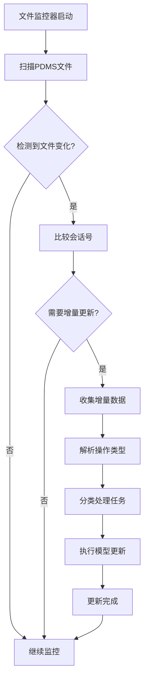
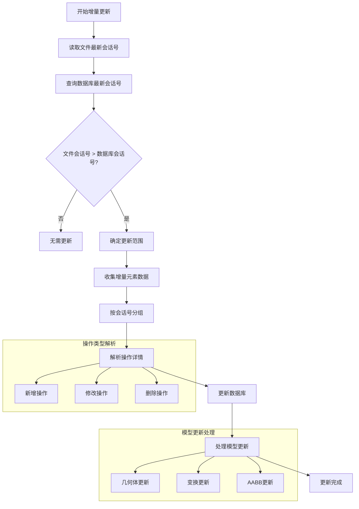
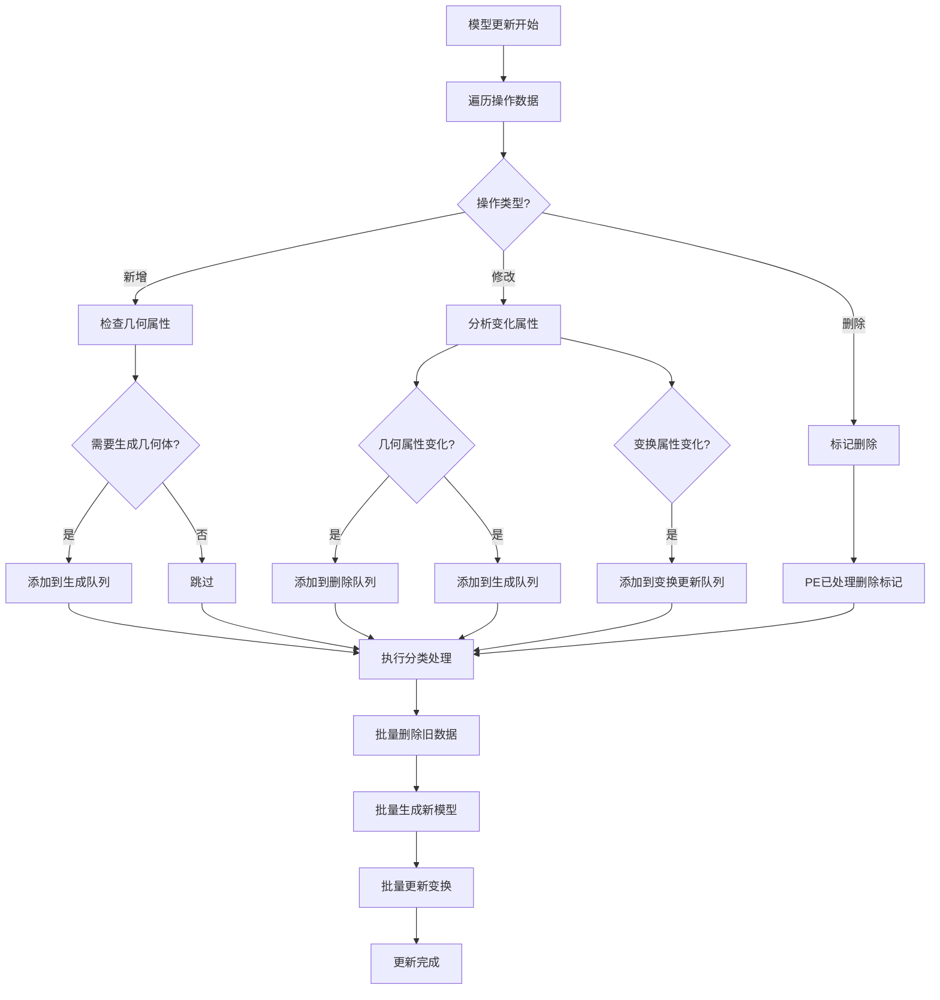
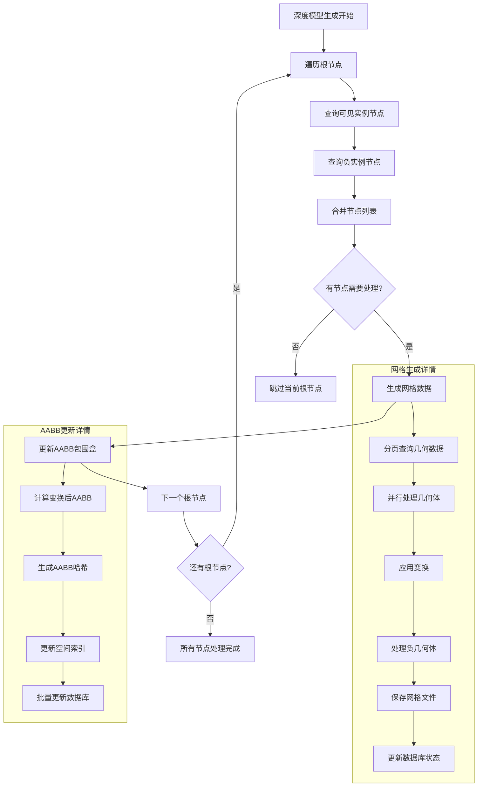
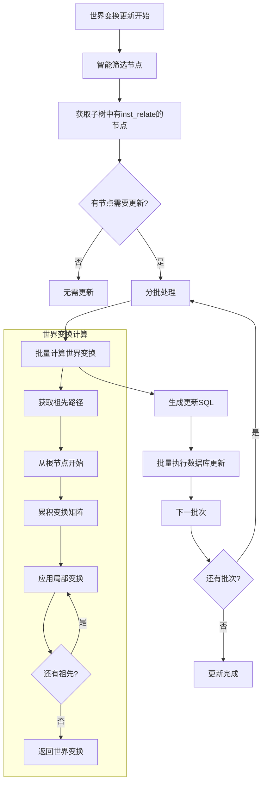
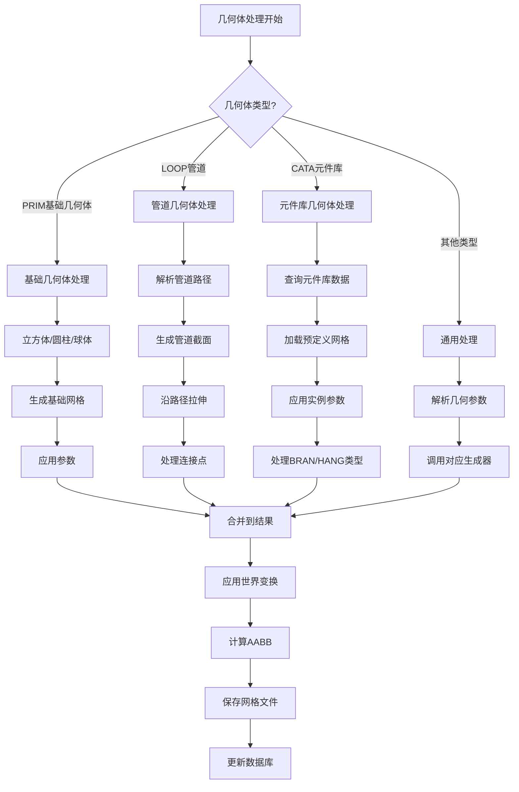
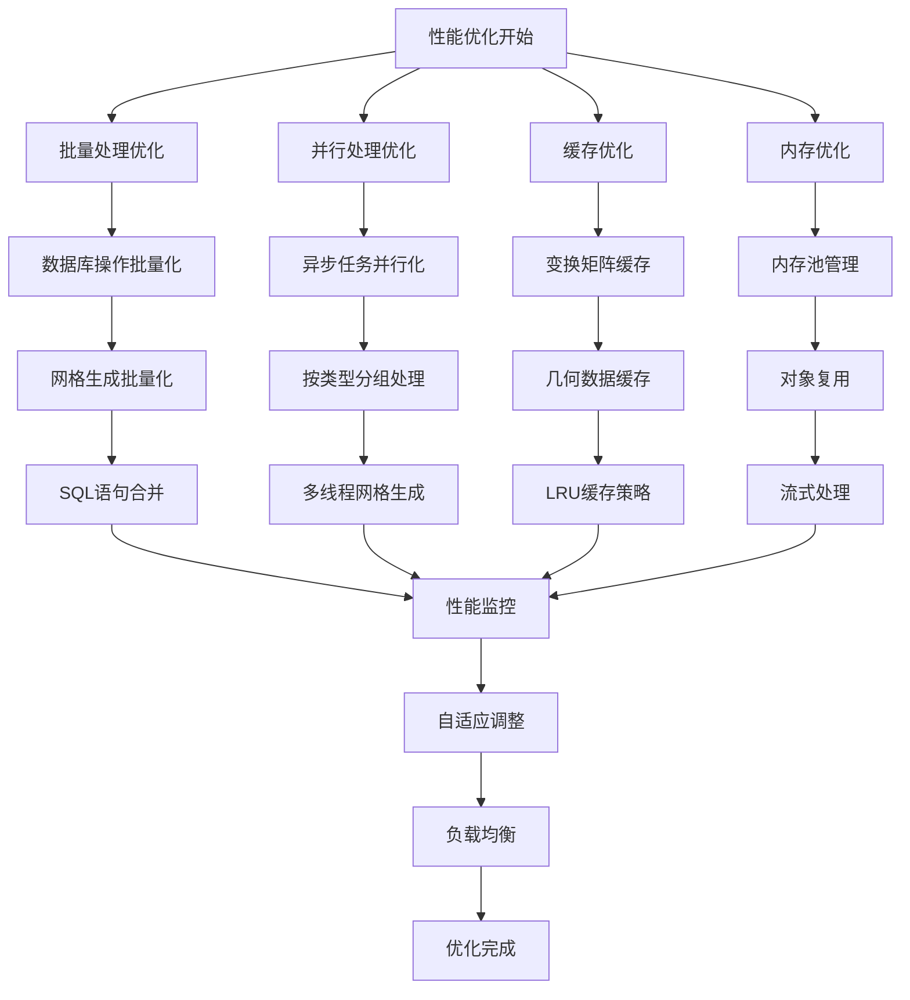
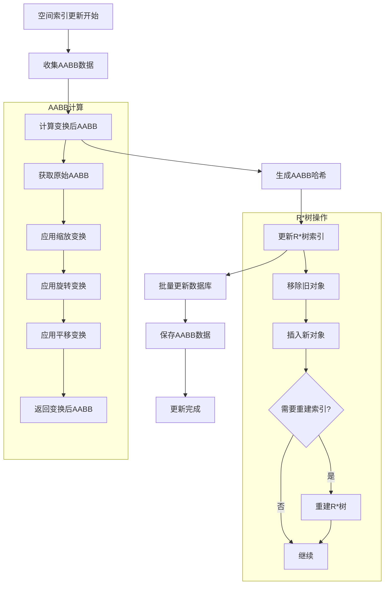
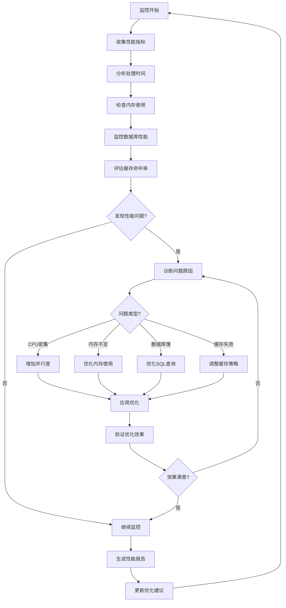
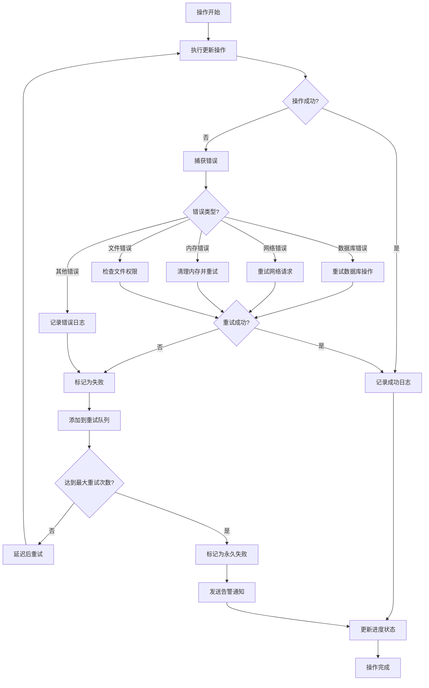

# 模型更新算法流程图

## 🎯 总体架构流程

## 🔄 增量更新详细流程

## 🎨 模型更新分类处理

## 🏗️ 深度模型生成流程

## 🌍 世界变换更新流程

## 📊 几何体类型处理流程

## 🚀 性能优化流程

## 🔍 空间索引更新流程

## 📈 监控与诊断流程

## 🎯 错误处理与恢复流程

## 📋 使用说明

### 流程图阅读指南

1. **菱形节点**: 表示判断条件
2. **矩形节点**: 表示处理步骤
3. **圆角矩形**: 表示开始/结束
4. **子图**: 表示详细的子流程

### 关键路径分析

1. **热路径**: 增量更新 → 模型分类 → 深度生成
2. **性能瓶颈**: 元件库几何体生成、世界变换计算
3. **优化重点**: 批量处理、并行化、缓存机制

### 监控要点

1. **处理时间**: 每个阶段的耗时统计
2. **内存使用**: 峰值内存和平均内存
3. **数据库性能**: 查询时间和连接数
4. **错误率**: 各类错误的发生频率

通过这些流程图，可以清晰地理解模型更新算法的各个环节，便于系统维护和性能优化。
